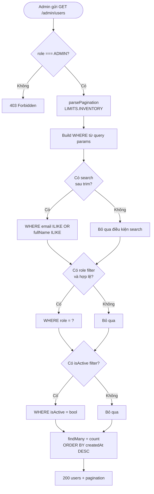
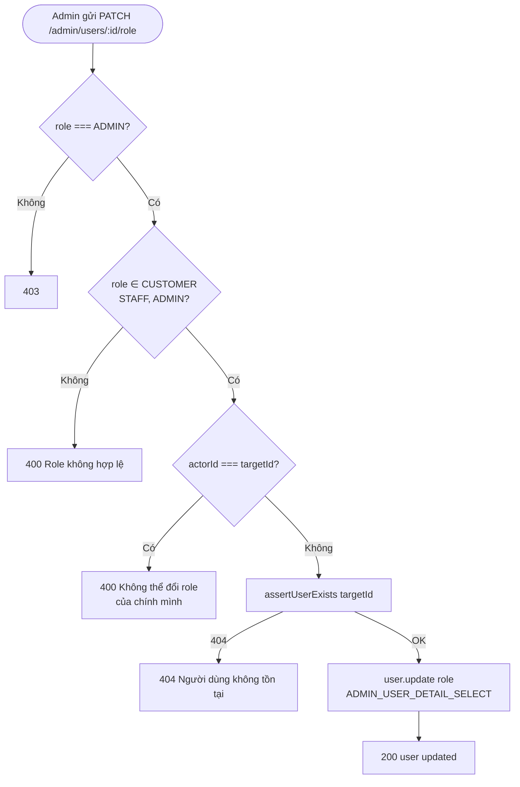
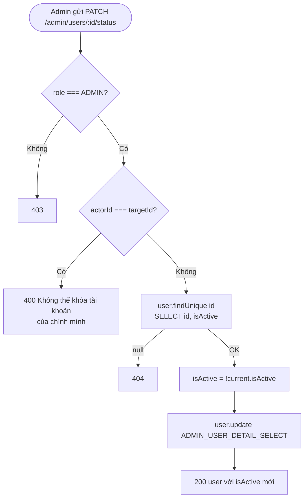
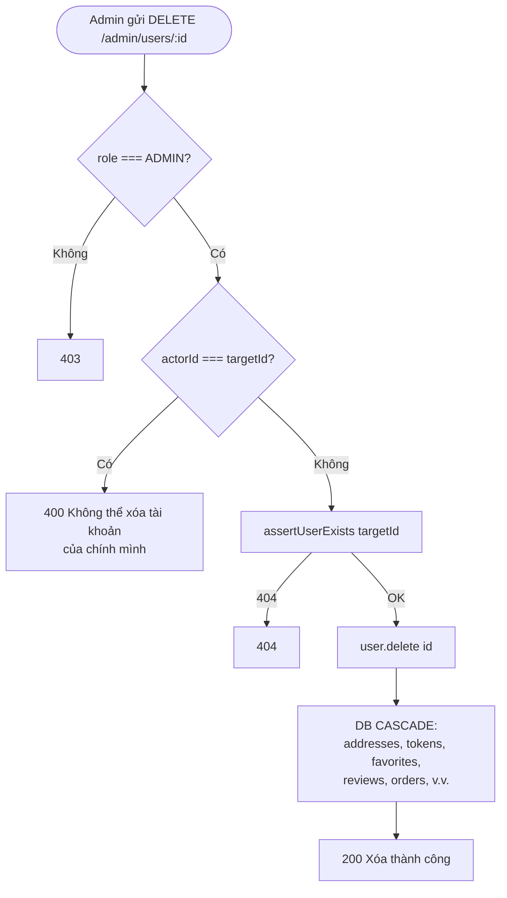
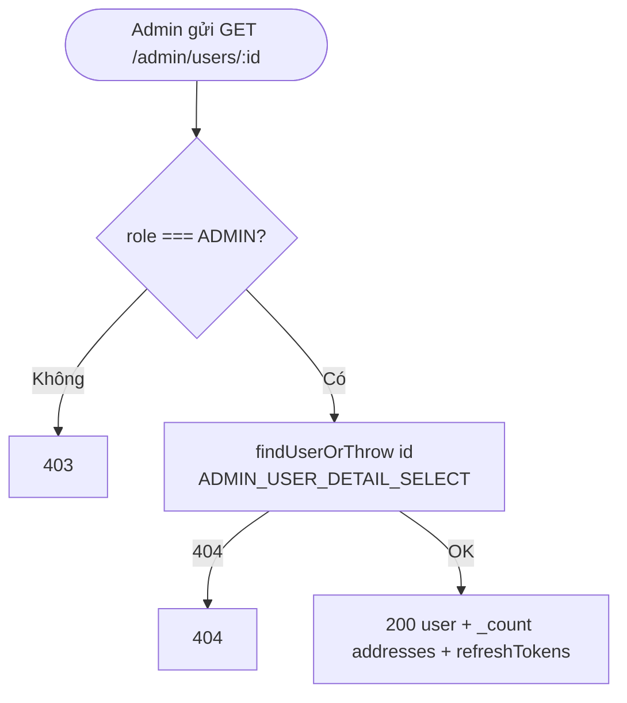

# Activity Diagram
## Module: Admin (Quản lý người dùng)
### Dự án: Mobivexa E-Commerce Platform

> **Phiên bản:** 1.0 | **Ngày:** 2026-08-22

---

## AD-01: Danh sách người dùng

---

## AD-02: Thay đổi role người dùng

---

## AD-03: Khóa / Mở tài khoản

---

## AD-04: Xóa người dùng

---

## AD-05: Xem chi tiết người dùng

