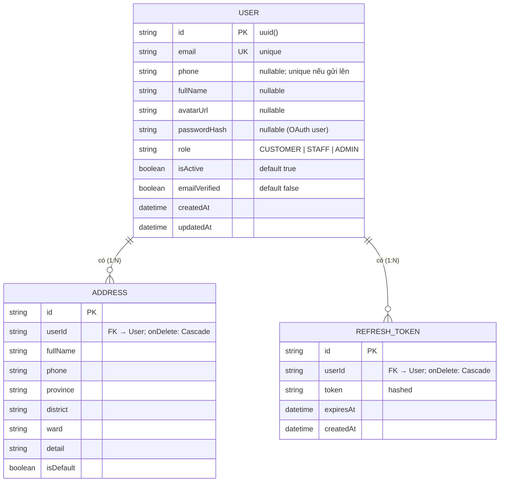

# ERD — Entity Relationship Diagram
## Module: Admin (Quản lý người dùng)
### Dự án: Mobivexa E-Commerce Platform

> **Phiên bản:** 1.0 | **Ngày:** 2026-08-22

---

## 1. Sơ đồ ERD



---

## 2. Quan hệ User với toàn hệ thống

```
User
 ├── Address          (onDelete: Cascade) — địa chỉ giao hàng
 ├── RefreshToken     (onDelete: Cascade) — phiên đăng nhập
 ├── Favorite         (onDelete: Cascade) — sản phẩm yêu thích
 ├── Cart             (onDelete: Cascade) — giỏ hàng
 ├── Order            (onDelete: SetNull / Restrict) — đơn hàng
 ├── Review           (onDelete: Cascade) — đánh giá
 ├── CouponUsage      (onDelete: Cascade) — lịch sử dùng mã
 └── ReviewHelpful    (onDelete: Cascade) — đánh dấu hữu ích
```

Admin module chỉ đọc/sửa/xóa bảng `User`. Cascade xử lý toàn bộ bảng liên quan khi xóa.

---

## 3. Mô tả chi tiết User

| Trường | Kiểu DB | Nullable | Unique | Ghi chú |
|---|---|---|---|---|
| `id` | VARCHAR(uuid) | No | PK | Auto |
| `email` | VARCHAR | No | Yes | Đăng nhập |
| `phone` | VARCHAR | Yes | Partial | Unique khi có |
| `fullName` | VARCHAR | Yes | No | |
| `avatarUrl` | VARCHAR | Yes | No | Cloudinary URL |
| `passwordHash` | VARCHAR | Yes | No | null với OAuth user |
| `role` | ENUM | No | No | CUSTOMER/STAFF/ADMIN |
| `isActive` | BOOLEAN | No | No | Default true |
| `emailVerified` | BOOLEAN | No | No | Default false |
| `createdAt` | TIMESTAMPTZ | No | No | |
| `updatedAt` | TIMESTAMPTZ | No | No | Auto update |

---

## 4. Enum `UserRole`

```
CUSTOMER   — khách hàng thông thường
STAFF      — nhân viên (STAFF_ROLES: ADMIN + STAFF)
ADMIN      — quản trị viên cấp cao
```

---

## 5. ADMIN_USER_DETAIL_SELECT vs USER_PUBLIC_SELECT

| Field | PUBLIC_SELECT (list) | DETAIL_SELECT (chi tiết) |
|---|---|---|
| id, email, phone, fullName | ✅ | ✅ |
| avatarUrl, role, isActive | ✅ | ✅ |
| emailVerified, createdAt, updatedAt | ✅ | ✅ |
| `_count.addresses` | ❌ | ✅ |
| `_count.refreshTokens` | ❌ | ✅ |

> List bỏ `_count` để tránh COUNT subquery trên mỗi row khi danh sách lớn.

---

## 6. Index

| Index | Trường | Mục đích |
|---|---|---|
| PK | `id` | Tra cứu theo id |
| UK | `email` | Đăng nhập + tránh trùng |
| IDX | `createdAt` | Order BY createdAt DESC |
