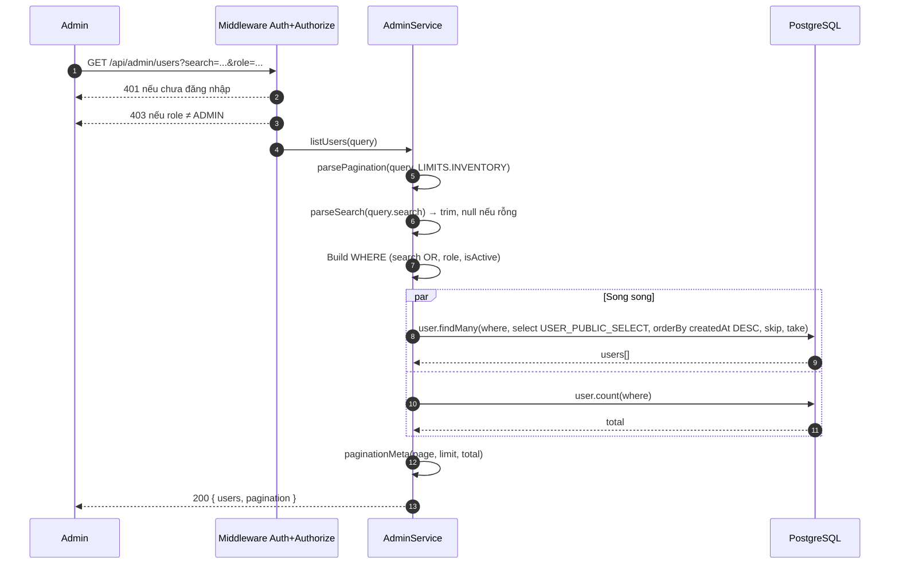
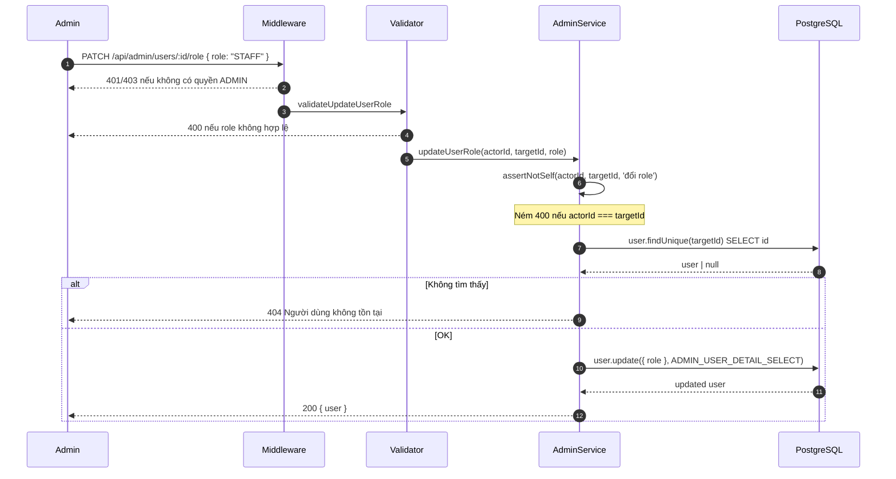
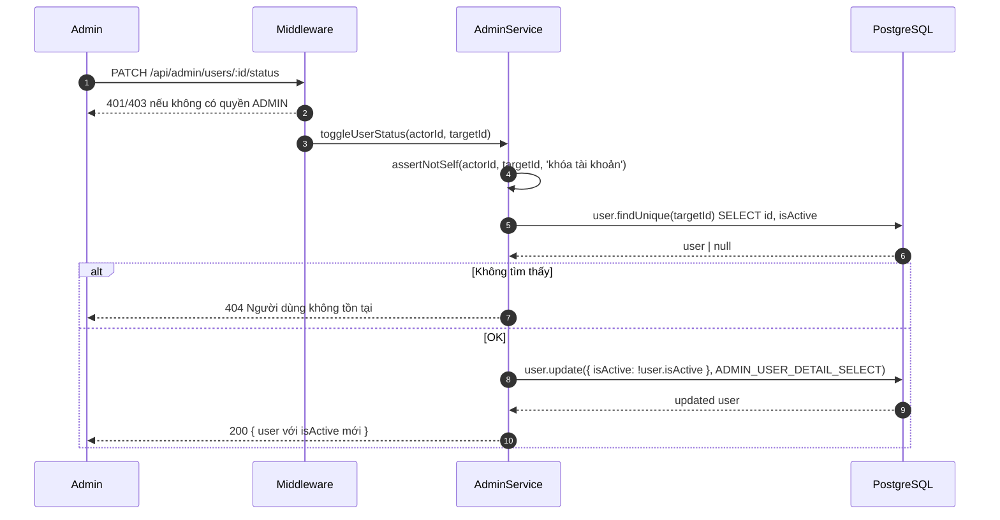
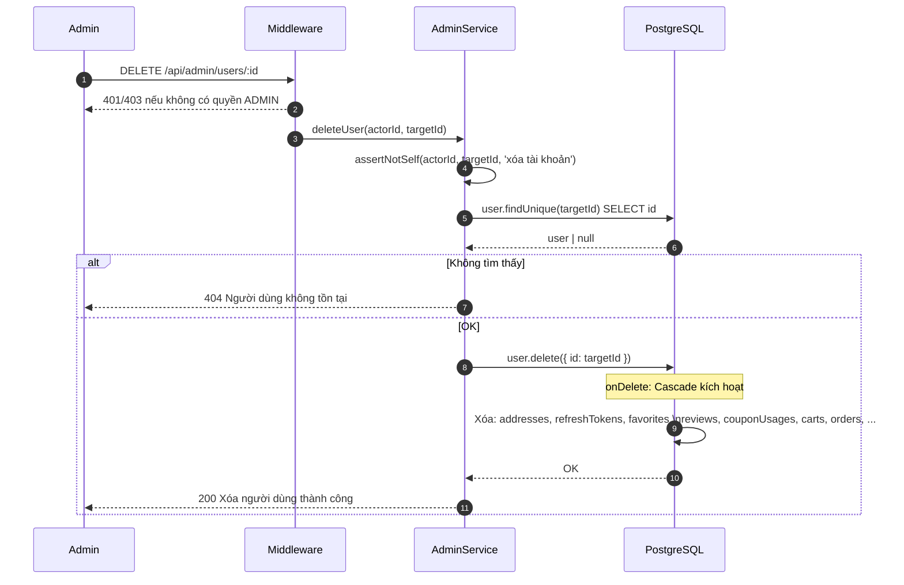
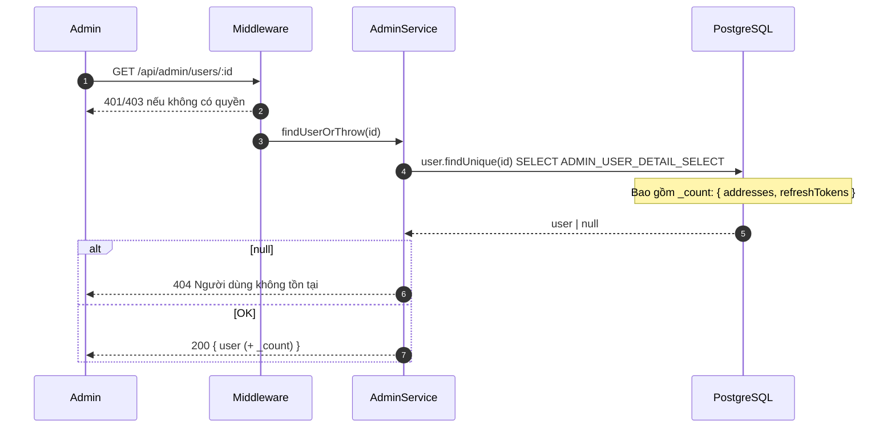

# Sequence Diagram — Luồng API
## Module: Admin (Quản lý người dùng)
### Dự án: Mobivexa E-Commerce Platform

> **Phiên bản:** 1.0 | **Ngày:** 2026-08-22

---

## SD-01: Danh sách người dùng

---

## SD-02: Thay đổi role

---

## SD-03: Khóa / Mở tài khoản

---

## SD-04: Xóa người dùng

---

## SD-05: Xem chi tiết người dùng

