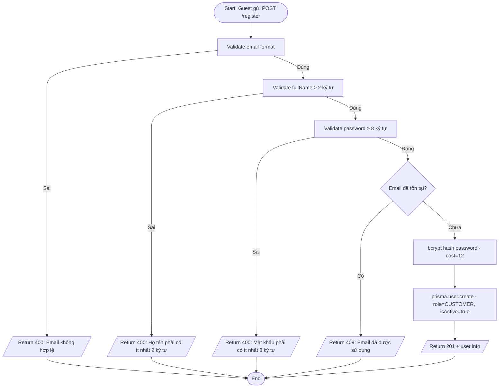
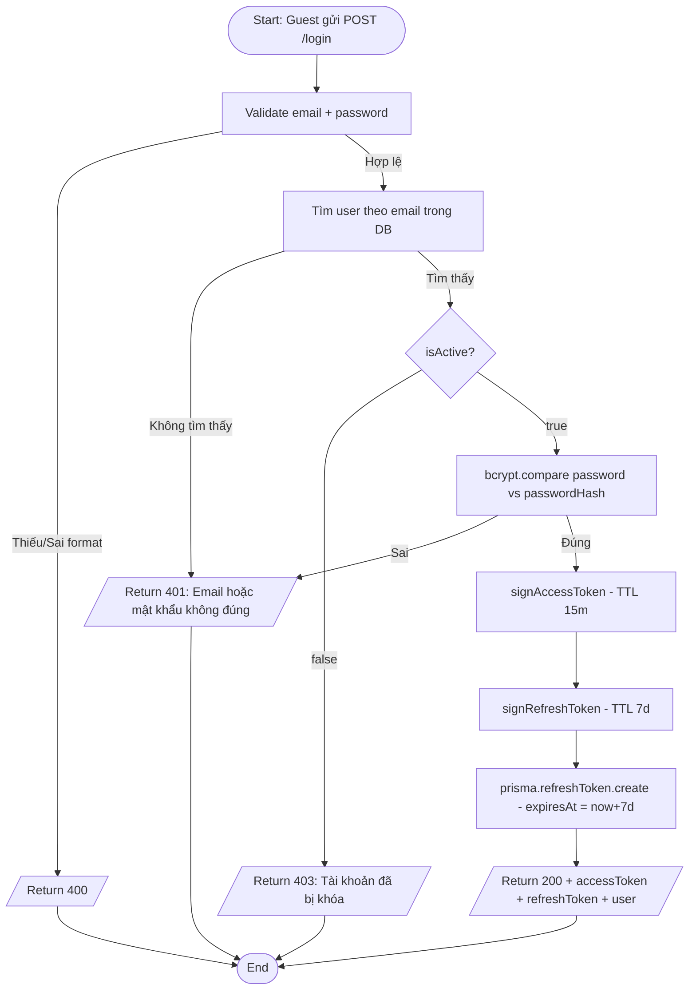
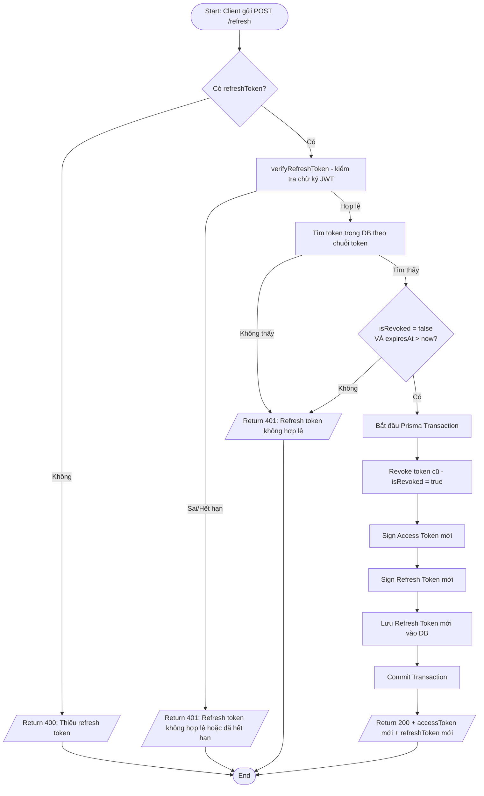
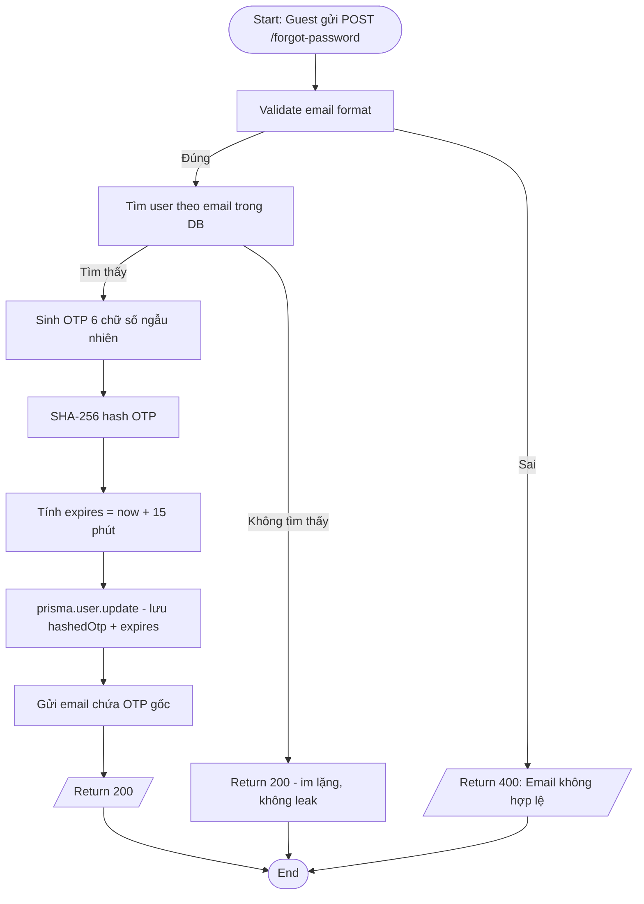
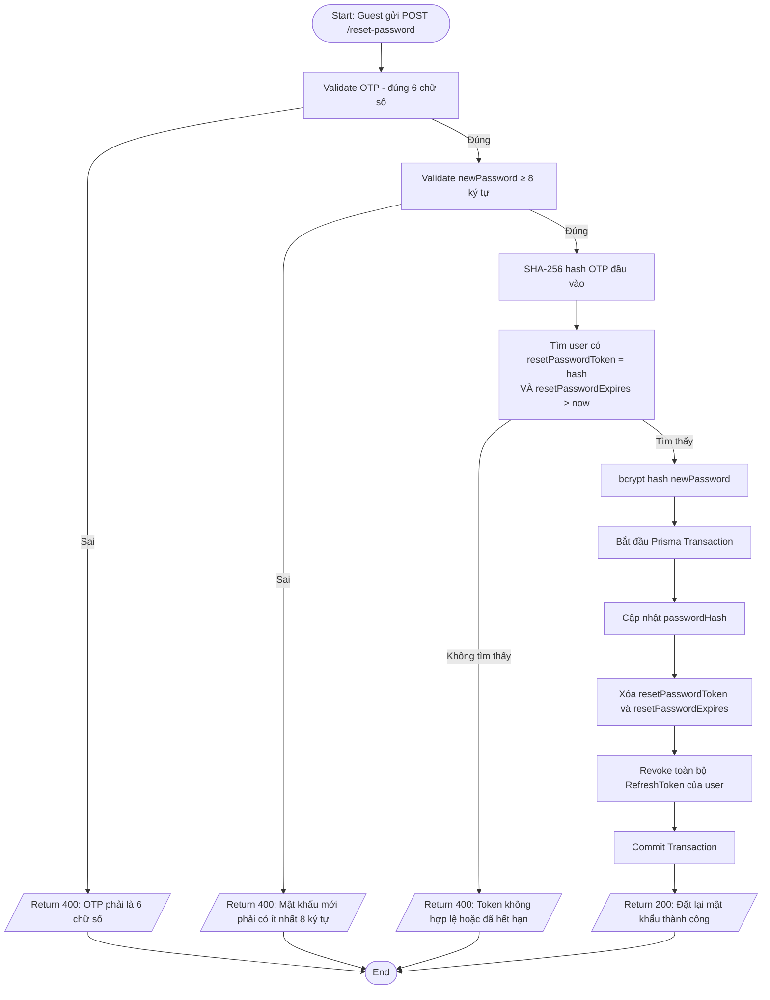
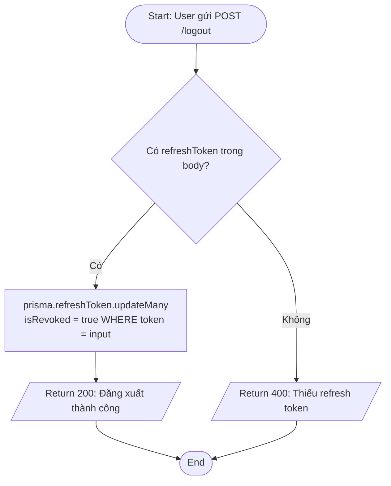
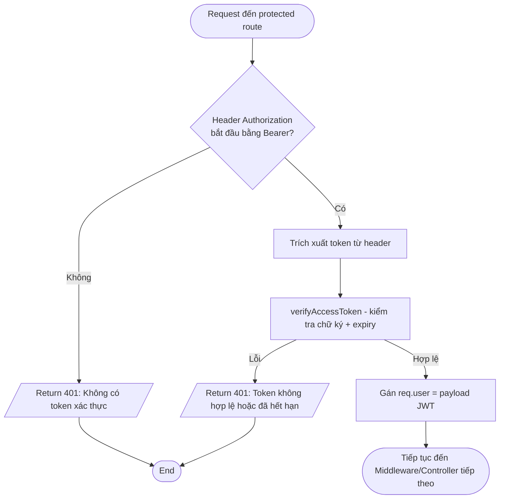
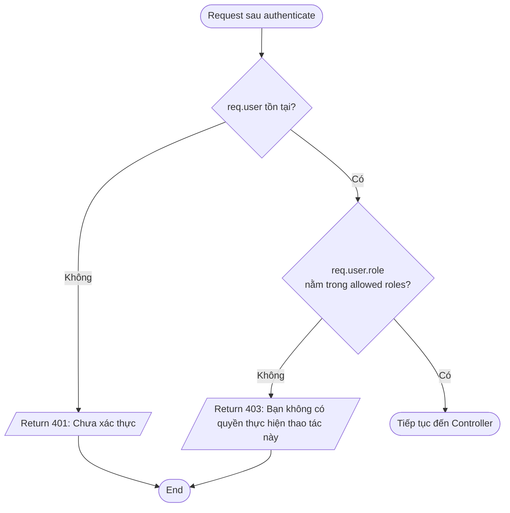

# Activity Diagram — Luồng xử lý
## Module: Authentication
### Dự án: Mobivexa E-Commerce Platform

> **Phiên bản:** 1.0  
> **Ngày:** 2026-06-19  
> **Ghi chú:** Sử dụng cú pháp Mermaid — render trên GitHub, GitLab, Obsidian, VSCode (Markdown Preview Mermaid)

---

## AD-01: Đăng ký tài khoản

---

## AD-02: Đăng nhập

---

## AD-03: Làm mới phiên đăng nhập (Refresh Token Rotation)

---

## AD-04: Quên mật khẩu

---

## AD-05: Đặt lại mật khẩu

---

## AD-06: Đăng xuất

> **Ghi chú:** Access Token không được vô hiệu hóa — hết hạn tự nhiên sau ≤ 15 phút.

---

## AD-07: Xác thực request (Middleware Authenticate)

---

## AD-08: Phân quyền theo Role (Middleware Authorize)

