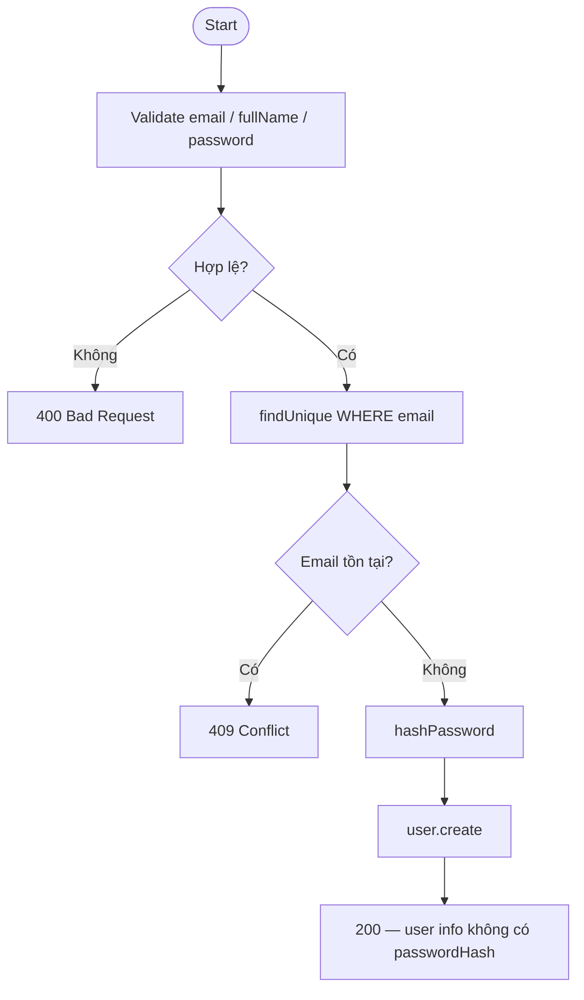
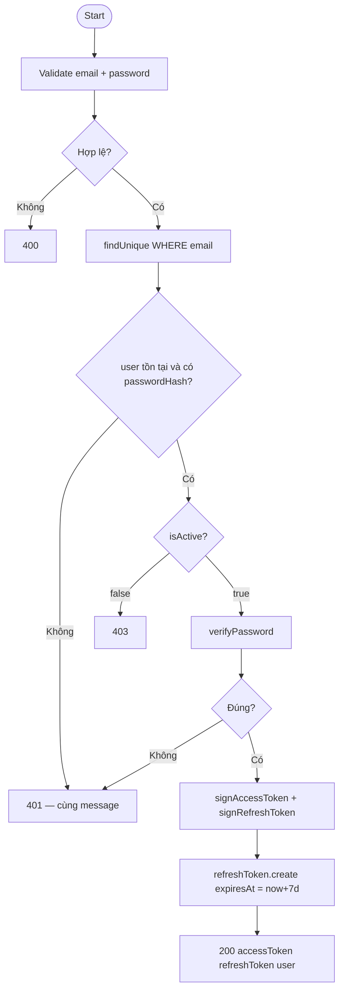
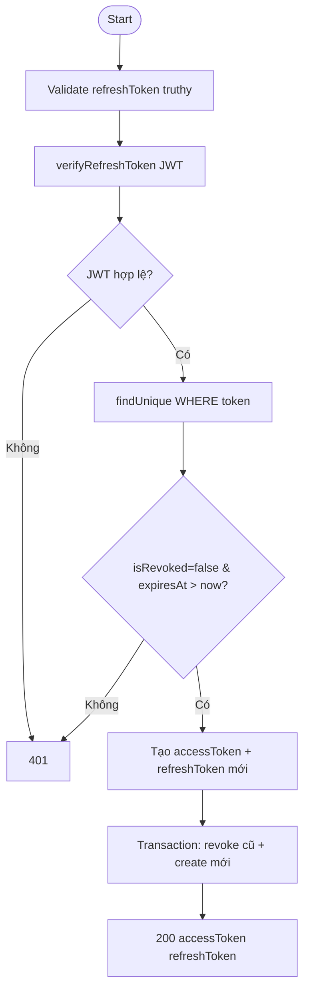
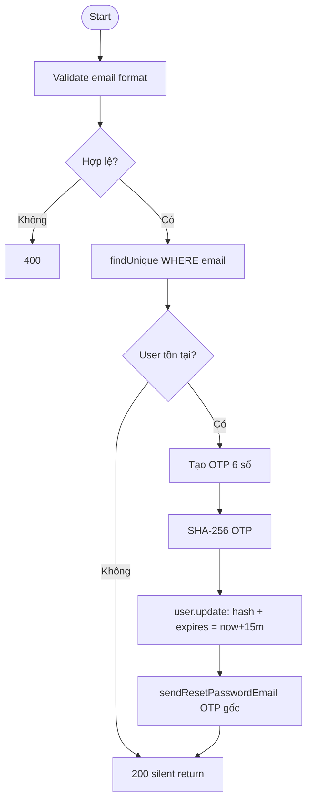
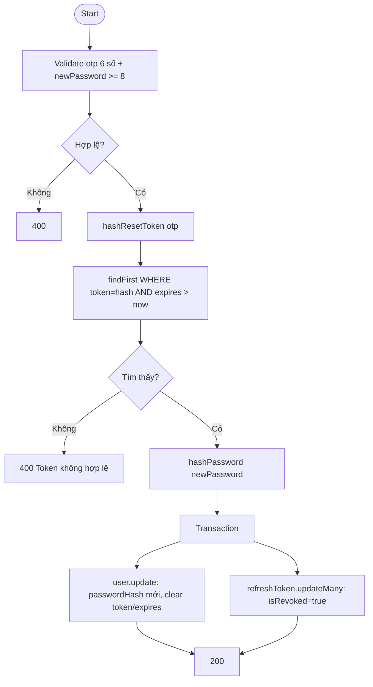
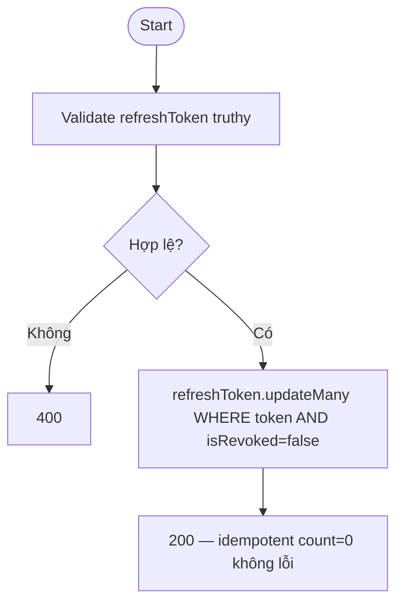
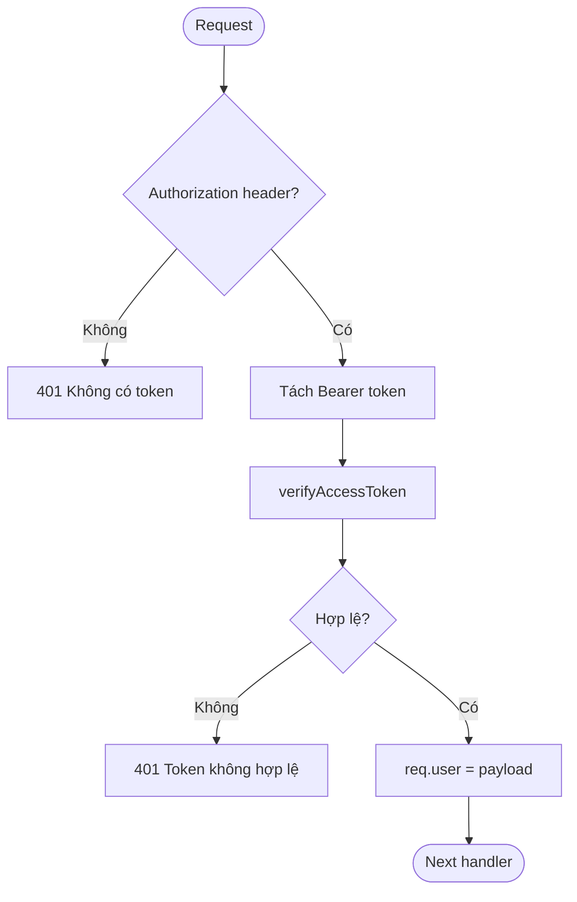

# Activity Diagram — Luồng xử lý
## Module: Auth
### Dự án: Mobivexa E-Commerce Platform

> **Phiên bản:** 2.0 | **Ngày:** 2026-08-22

---

## 1. Đăng ký (register)

---

## 2. Đăng nhập (login)

---

## 3. Refresh Token (rotation)

---

## 4. Quên mật khẩu (forgotPassword)

---

## 5. Đặt lại mật khẩu (resetPassword)

---

## 6. Đăng xuất (logout)

---

## 7. authenticate Middleware

