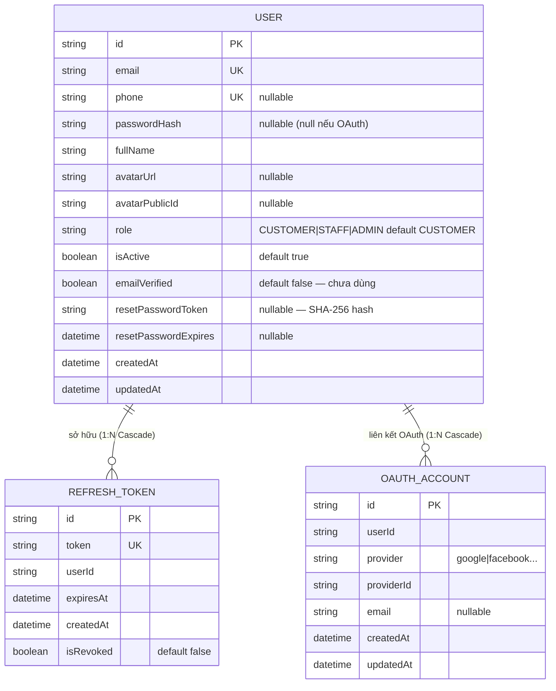

# ERD — Entity Relationship Diagram
## Module: Auth
### Dự án: Mobivexa E-Commerce Platform

> **Phiên bản:** 2.0 | **Ngày:** 2026-08-22

---

## 1. Sơ đồ ERD



---

## 2. Mô tả model

### User

| Cột | Ghi chú |
|---|---|
| `email` | UNIQUE; dùng để login |
| `phone` | UNIQUE; nullable; chưa dùng trong auth flow |
| `passwordHash` | nullable — null nếu user chỉ đăng nhập OAuth |
| `role` | `CUSTOMER` (default), `STAFF`, `ADMIN` |
| `isActive` | `false` → 403 khi login |
| `emailVerified` | field tồn tại nhưng chưa có flow xác thực email |
| `resetPasswordToken` | SHA-256 hash của OTP 6 số; null sau khi reset thành công |
| `resetPasswordExpires` | `now + 15 phút`; null sau khi reset thành công |

Index: `@@index([role])`, `@@index([isActive])`, `@@index([createdAt])`

---

### RefreshToken

| Cột | Ghi chú |
|---|---|
| `token` | UNIQUE; giá trị JWT |
| `userId` | FK → User; `onDelete: Cascade` |
| `expiresAt` | `now + REFRESH_TOKEN_EXPIRES_MS` (7 ngày) |
| `isRevoked` | Tắt token: logout / rotation / reset password |

**Lưu ý cleanup:**
- Xóa khi `expiresAt < now` (đã hết hạn)
- Xóa khi `isRevoked = true AND createdAt < now - 7 ngày`

Index: `@@index([userId])`, `@@index([expiresAt])`

---

### OAuthAccount

| Cột | Ghi chú |
|---|---|
| `provider` | `"google"`, `"facebook"`, ... |
| `providerId` | ID từ provider |
| `userId` | FK → User; `onDelete: Cascade` |

> Model tồn tại trong schema nhưng **chưa có routes** trong codebase hiện tại.

---

## 3. Token Flow

```
Login / Register
    └─► User record
    └─► RefreshToken (token, userId, expiresAt, isRevoked=false)

Refresh
    └─► RefreshToken cũ: isRevoked = true
    └─► RefreshToken mới: create

Logout / Reset Password
    └─► RefreshToken.updateMany SET isRevoked=true WHERE userId (reset)
    └─► RefreshToken.updateMany SET isRevoked=true WHERE token (logout)
```
