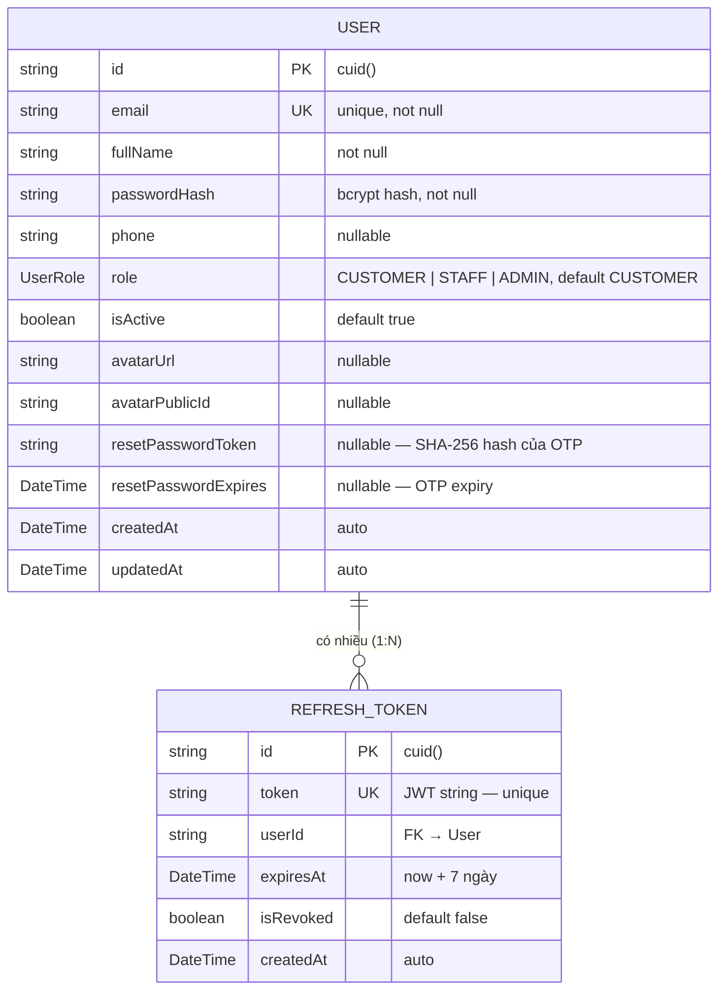

# ERD — Entity Relationship Diagram
## Module: Authentication
### Dự án: Mobivexa E-Commerce Platform

> **Phiên bản:** 1.0  
> **Ngày:** 2026-06-19  
> **Nguồn:** `src/generated/prisma/` — Prisma schema

---

## 1. Sơ đồ ERD (Mermaid)



---

## 2. Mô tả chi tiết các Entity

### 2.1 Entity: User

| Trường | Kiểu DB | Nullable | Mô tả |
|---|---|---|---|
| `id` | `VARCHAR` (cuid) | No | Primary Key, tự sinh |
| `email` | `VARCHAR` | No | Unique — định danh đăng nhập |
| `fullName` | `VARCHAR` | No | Tên hiển thị |
| `passwordHash` | `TEXT` | No | bcrypt hash, cost=12 |
| `phone` | `VARCHAR` | Yes | Tùy chọn khi đăng ký |
| `role` | `ENUM` | No | `CUSTOMER` / `STAFF` / `ADMIN` — default `CUSTOMER` |
| `isActive` | `BOOLEAN` | No | `true` = hoạt động; `false` = bị khóa — default `true` |
| `avatarUrl` | `TEXT` | Yes | URL ảnh đại diện (Cloudinary) — không thuộc auth nhưng cùng bảng |
| `avatarPublicId` | `VARCHAR` | Yes | Cloudinary public_id — không thuộc auth |
| `resetPasswordToken` | `TEXT` | Yes | SHA-256(OTP) — null sau khi reset thành công |
| `resetPasswordExpires` | `TIMESTAMPTZ` | Yes | OTP hết hạn — null sau khi reset thành công |
| `createdAt` | `TIMESTAMPTZ` | No | Tự gán khi insert |
| `updatedAt` | `TIMESTAMPTZ` | No | Tự cập nhật khi update |

**Indexes:**
- `PRIMARY KEY (id)`
- `UNIQUE (email)`

---

### 2.2 Entity: RefreshToken

| Trường | Kiểu DB | Nullable | Mô tả |
|---|---|---|---|
| `id` | `VARCHAR` (cuid) | No | Primary Key |
| `token` | `TEXT` | No | Chuỗi JWT đầy đủ — unique |
| `userId` | `VARCHAR` | No | FK → `User.id`, cascade delete |
| `expiresAt` | `TIMESTAMPTZ` | No | Thời điểm hết hạn = now + 7 ngày |
| `isRevoked` | `BOOLEAN` | No | `false` = hợp lệ; `true` = đã thu hồi — default `false` |
| `createdAt` | `TIMESTAMPTZ` | No | Tự gán khi insert |

**Indexes:**
- `PRIMARY KEY (id)`
- `UNIQUE (token)`
- `INDEX (userId)` — tra cứu nhanh theo user

**Cascade:**
- Khi xóa `User` → toàn bộ `RefreshToken` của user bị xóa theo (cascade delete)

---

## 3. Quan hệ giữa các Entity

| Từ | Đến | Kiểu quan hệ | Mô tả |
|---|---|---|---|
| `User` | `RefreshToken` | 1 : N | 1 user có thể có nhiều phiên đăng nhập (nhiều devices/tabs) |

---

## 4. Enum: UserRole

```sql
CREATE TYPE "UserRole" AS ENUM ('CUSTOMER', 'STAFF', 'ADMIN');
```

| Giá trị | Mô tả |
|---|---|
| `CUSTOMER` | Khách hàng mua hàng — role mặc định khi đăng ký |
| `STAFF` | Nhân viên quản trị nội dung và đơn hàng |
| `ADMIN` | Quản trị viên toàn quyền |

---

## 5. Dữ liệu nhạy cảm và bảo vệ

| Trường | Cách bảo vệ |
|---|---|
| `passwordHash` | bcrypt hash — không bao giờ select trong response |
| `resetPasswordToken` | SHA-256 hash — không trả về client |
| `resetPasswordExpires` | Không trả về client |
| `token` (RefreshToken) | JWT có chữ ký — cần secret để verify |

**Response an toàn:** `registerService` và `loginService` dùng `select` hoặc destructure để loại bỏ `passwordHash`, `resetPasswordToken`, `resetPasswordExpires` trước khi trả về client.

---

## 6. Chiến lược vệ sinh dữ liệu (Data Cleanup)

Hàm `cleanupExpiredTokens()` chạy định kỳ (cron job) để xóa:

```sql
DELETE FROM "RefreshToken"
WHERE expiresAt < NOW()
   OR (isRevoked = true AND createdAt < NOW() - INTERVAL '7 days')
```

Mục đích: giữ bảng `RefreshToken` gọn nhẹ, tránh tích lũy hàng nghìn bản ghi cũ.
