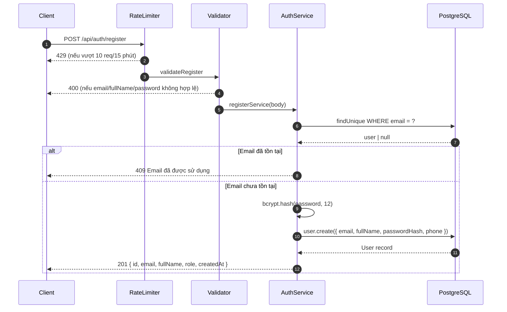
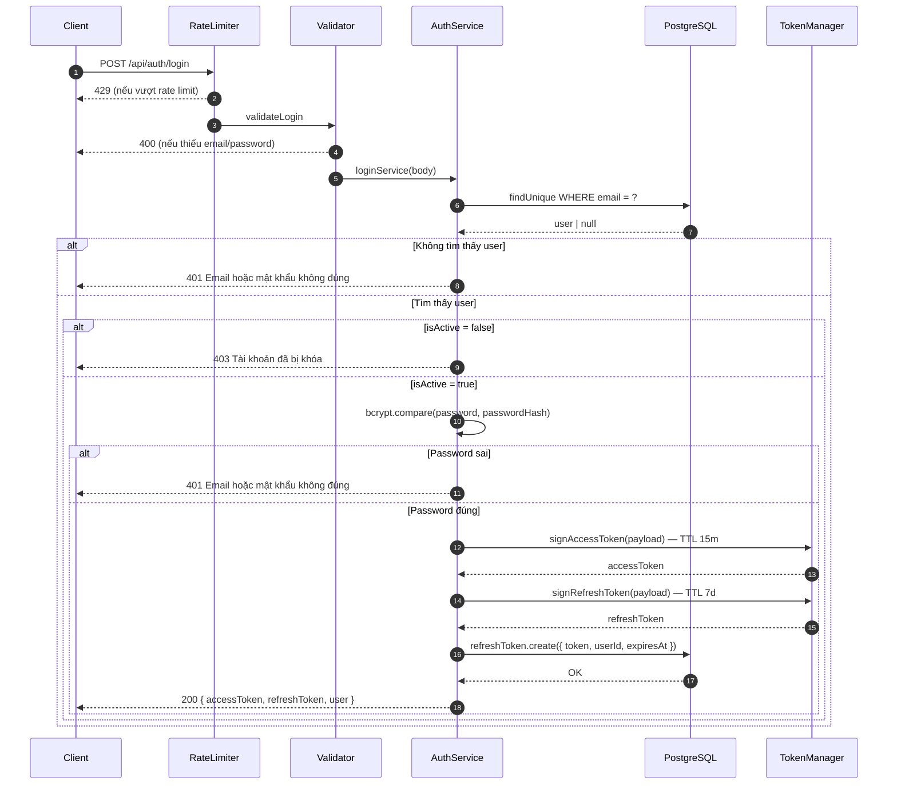
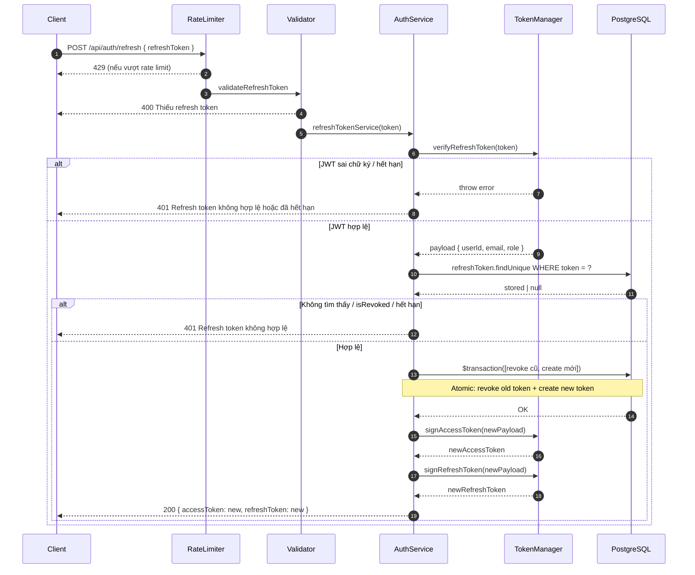
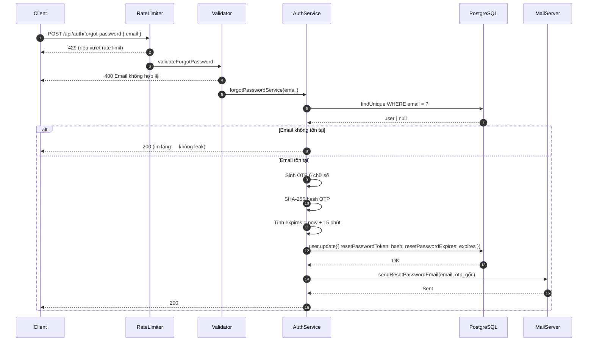
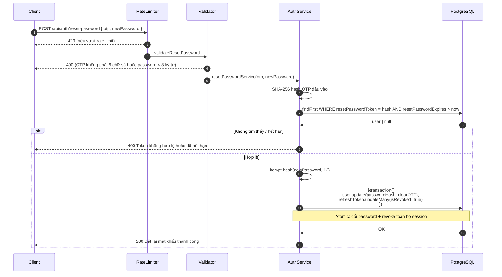
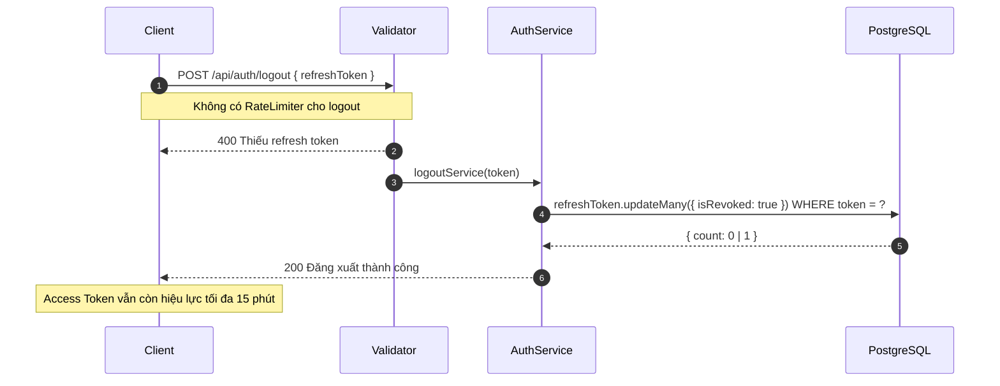
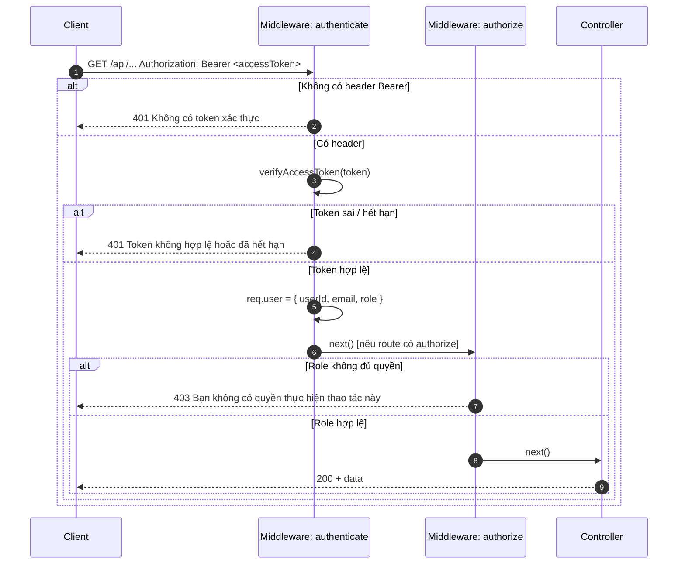
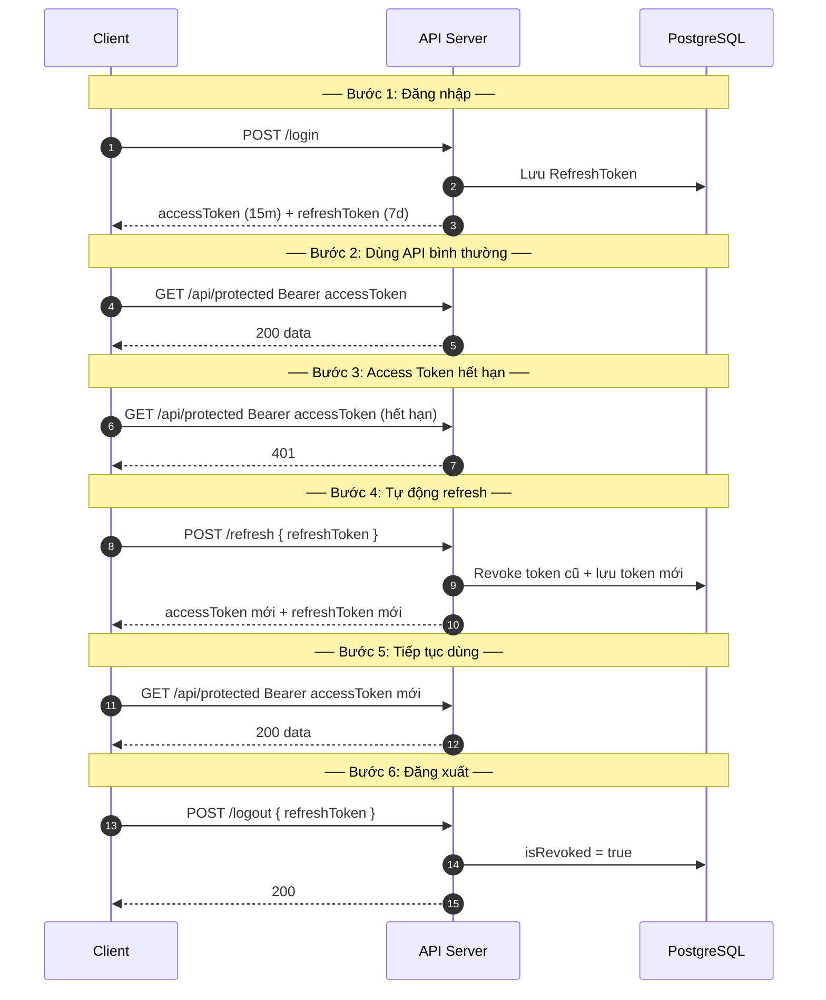

# Sequence Diagram — Luồng API
## Module: Authentication
### Dự án: Mobivexa E-Commerce Platform

> **Phiên bản:** 1.0  
> **Ngày:** 2026-06-19  
> **Ghi chú:** Sử dụng cú pháp Mermaid sequenceDiagram

---

## SD-01: Đăng ký tài khoản

---

## SD-02: Đăng nhập

---

## SD-03: Làm mới phiên đăng nhập (Refresh Token Rotation)

---

## SD-04: Quên mật khẩu

---

## SD-05: Đặt lại mật khẩu

---

## SD-06: Đăng xuất

---

## SD-07: Truy cập API bảo vệ (Protected Route)

---

## SD-08: Toàn cảnh luồng Token trong 1 phiên người dùng

