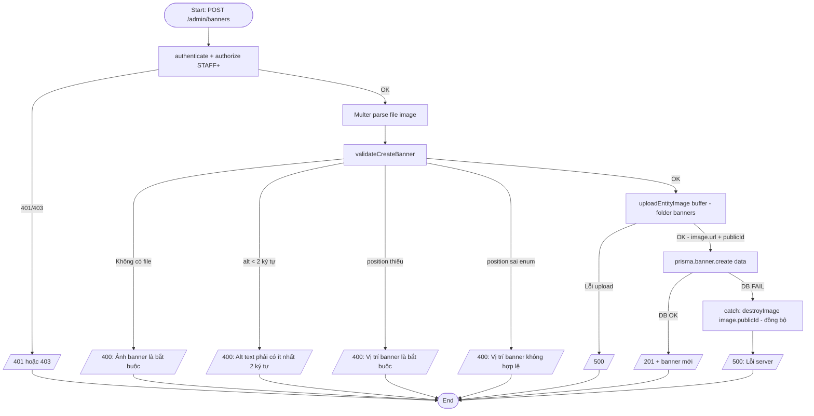
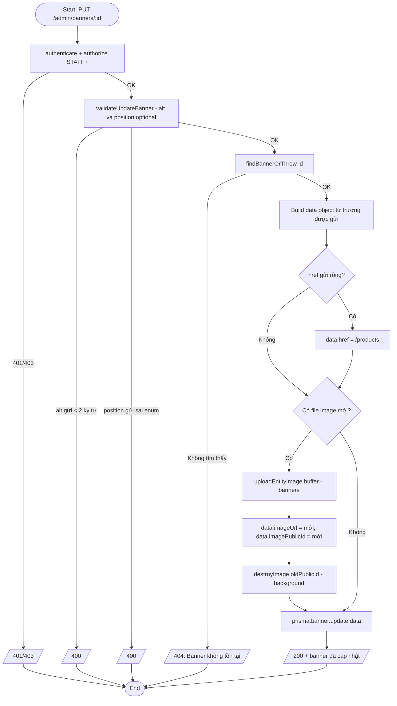
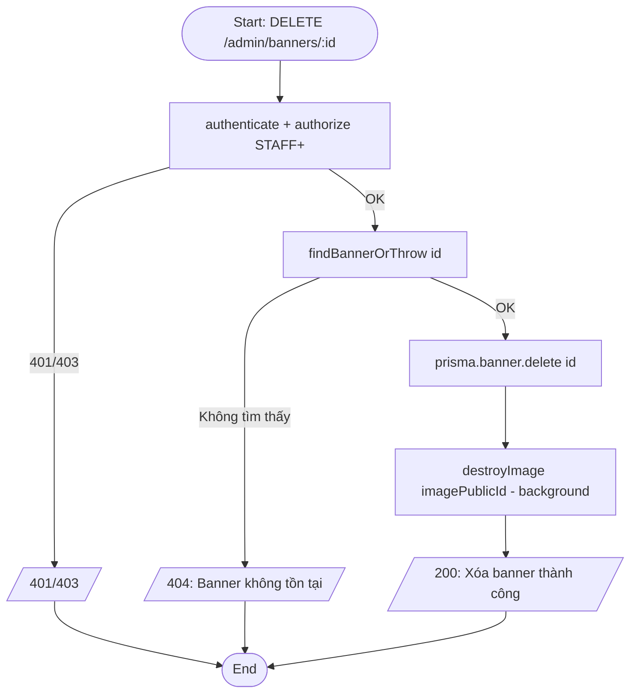
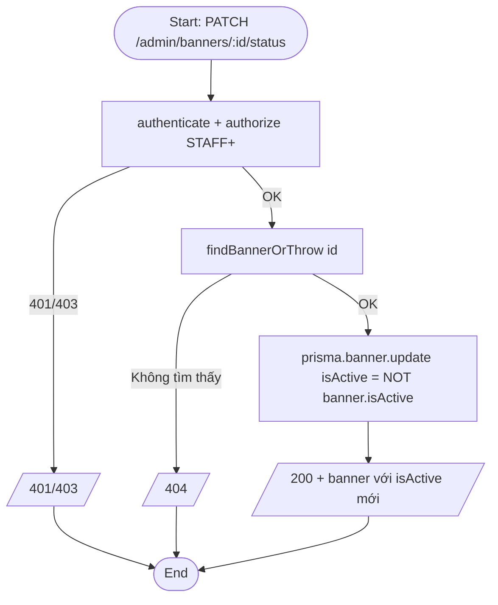
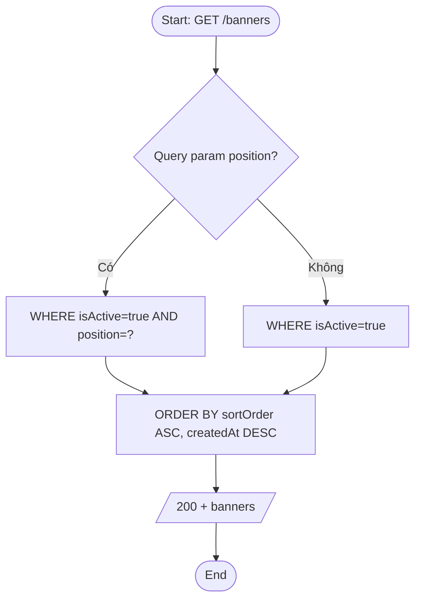
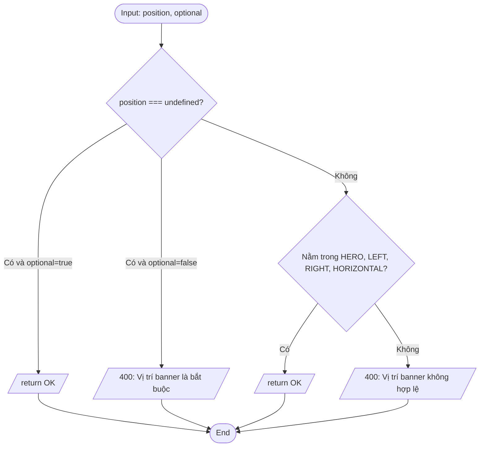

# Activity Diagram — Luồng xử lý
## Module: Banner
### Dự án: Mobivexa E-Commerce Platform

> **Phiên bản:** 1.0 | **Ngày:** 2026-06-19

---

## AD-01: Tạo banner (có rollback Cloudinary)

> Khác Brand/Category: Banner có **rollback đồng bộ** trong `catch` khi DB fail sau upload.

---

## AD-02: Cập nhật banner

---

## AD-03: Xóa banner

---

## AD-04: Toggle trạng thái

---

## AD-05: Xem danh sách banner (Public — lọc theo position)

---

## AD-06: Validate position enum

