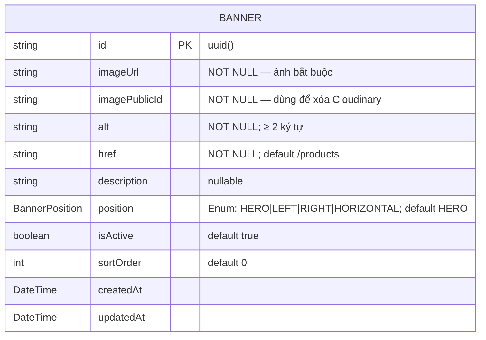

# ERD — Entity Relationship Diagram
## Module: Banner
### Dự án: Mobivexa E-Commerce Platform

> **Phiên bản:** 1.0 | **Ngày:** 2026-06-19

---

## 1. Sơ đồ ERD



> Banner là entity **độc lập** — không có FK đến bảng khác.

---

## 2. Enum BannerPosition

| Giá trị | Mô tả |
|---|---|
| `HERO` | Banner lớn full-width đầu trang (slider) |
| `LEFT` | Sidebar trái |
| `RIGHT` | Sidebar phải |
| `HORIZONTAL` | Dải ngang giữa trang |

---

## 3. Mô tả chi tiết Entity Banner

| Trường | Kiểu DB | Nullable | Ghi chú |
|---|---|---|---|
| `id` | VARCHAR (uuid) | No | PK |
| `imageUrl` | TEXT | **No** | **Bắt buộc** — Cloudinary URL |
| `imagePublicId` | TEXT | **No** | **Bắt buộc** — luôn có để destroy |
| `alt` | VARCHAR | No | Alt text ≥ 2 ký tự |
| `href` | VARCHAR | No | URL đích; default `/products` |
| `description` | TEXT | Yes | Mô tả nội bộ (admin) |
| `position` | ENUM | No | `HERO/LEFT/RIGHT/HORIZONTAL`; default `HERO` |
| `isActive` | BOOLEAN | No | Default `true` |
| `sortOrder` | INT | No | Default `0` |
| `createdAt` | TIMESTAMPTZ | No | Auto |
| `updatedAt` | TIMESTAMPTZ | No | Auto |

---

## 4. Composite Index

```sql
@@index([isActive, position, sortOrder])
```

**Mục đích:** Tối ưu query phổ biến nhất:
```sql
SELECT * FROM banners
WHERE isActive = true AND position = 'HERO'
ORDER BY sortOrder ASC, createdAt DESC
```

---

## 5. So sánh Banner vs Brand/Category (về ảnh)

| Tiêu chí | Banner | Brand | Category |
|---|---|---|---|
| Ảnh required | ✅ **Bắt buộc** | ❌ Optional | ❌ Optional |
| `imageUrl` nullable | ❌ | ✅ | ✅ |
| Rollback Cloudinary khi DB fail | ✅ | ❌ | ❌ |
| Có slug | ❌ | ✅ | ✅ |
| Có tên (name) | ❌ (chỉ có `alt`) | ✅ | ✅ |
| FK đến bảng khác | ❌ (độc lập) | ✅ (Product) | ✅ (Product) |

---

## 6. Vòng đời ảnh Banner

```
[Tạo banner]
    Upload → DB create OK  → imageUrl lưu DB
    Upload → DB create FAIL → destroyImage (rollback, đồng bộ trong catch)

[Update banner có ảnh mới]
    Upload mới → ghi URL mới vào DB → destroyImage cũ (background)

[Xóa banner]
    Delete DB → destroyImage (background)
```
