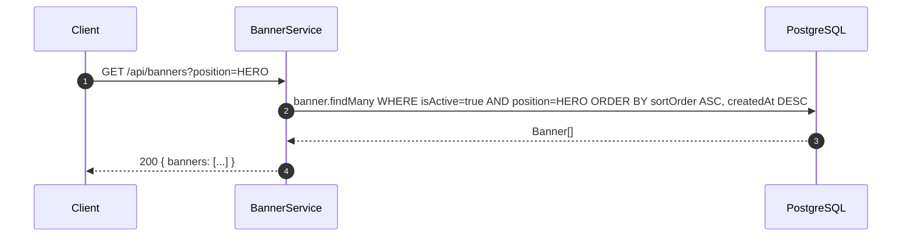
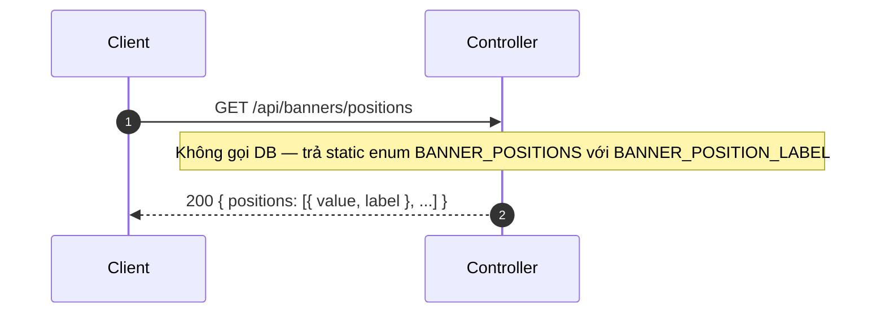
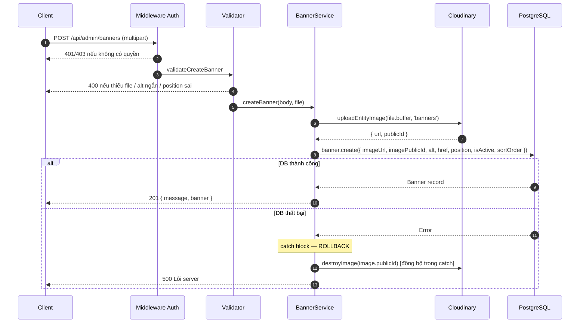
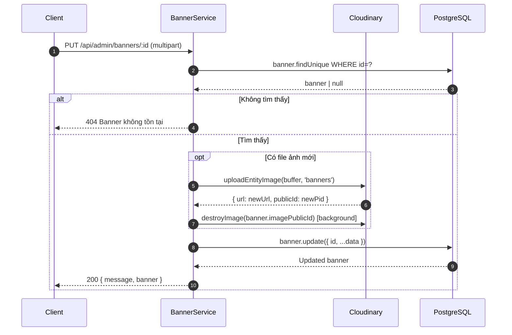
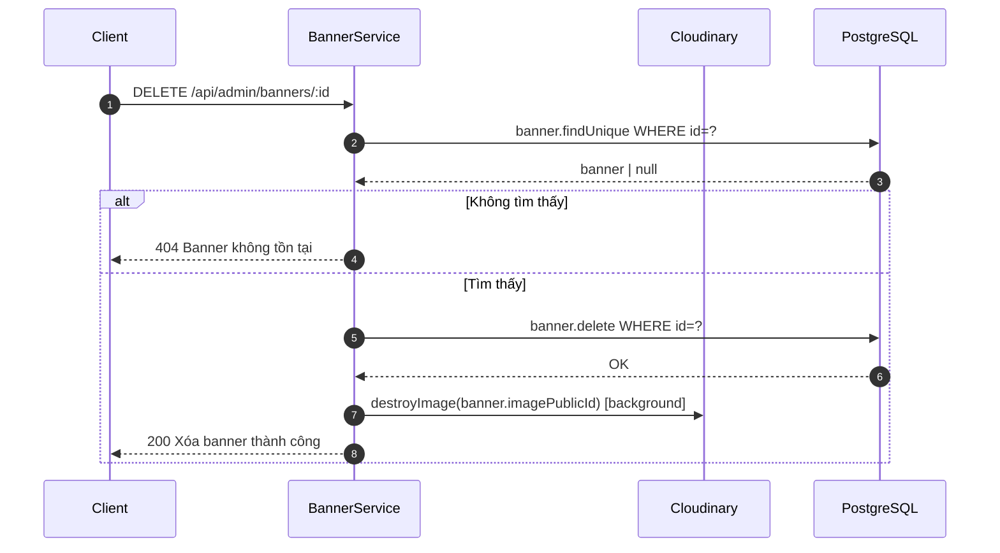
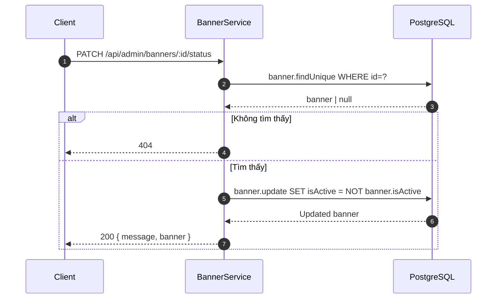

# Sequence Diagram — Luồng API
## Module: Banner
### Dự án: Mobivexa E-Commerce Platform

> **Phiên bản:** 1.0 | **Ngày:** 2026-06-19

---

## SD-01: Xem danh sách banner (Public — có filter position)

---

## SD-02: Xem danh sách vị trí (Static — không query DB)

---

## SD-03: Tạo banner (có rollback Cloudinary)

> `destroyImage` trong `catch` là **đồng bộ** — đảm bảo rollback trước khi rethrow lỗi.

---

## SD-04: Cập nhật banner (đổi ảnh)

---

## SD-05: Xóa banner

---

## SD-06: Toggle trạng thái

