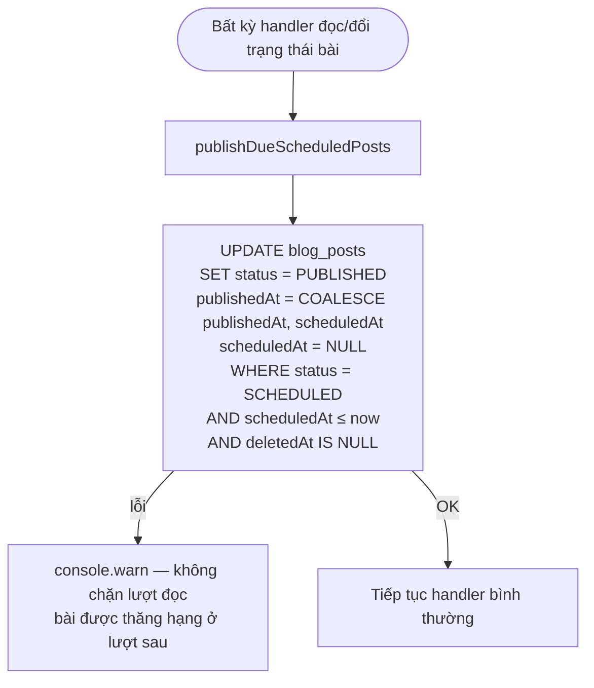
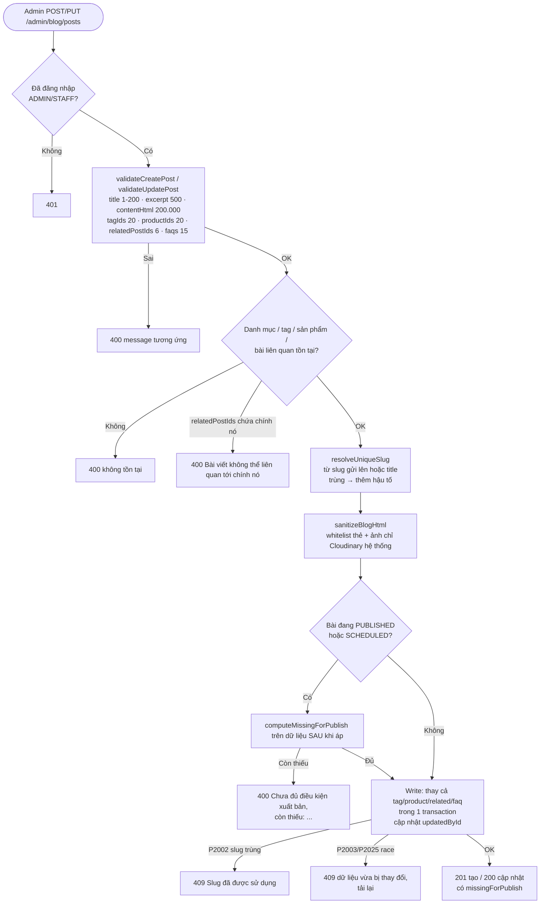
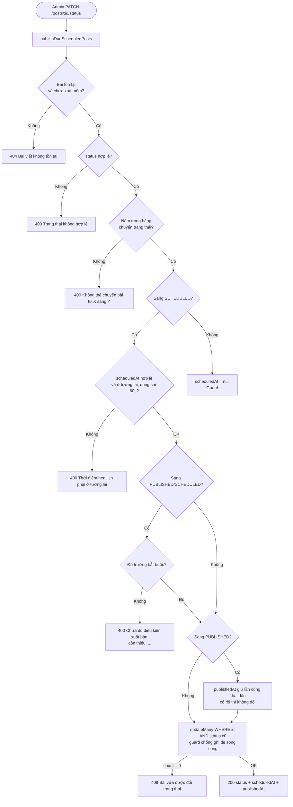
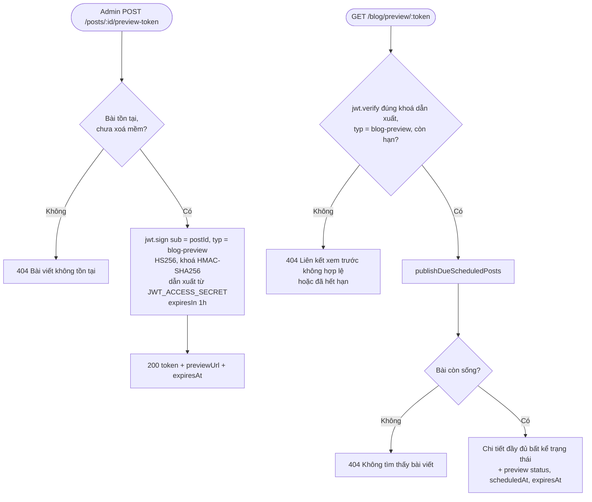
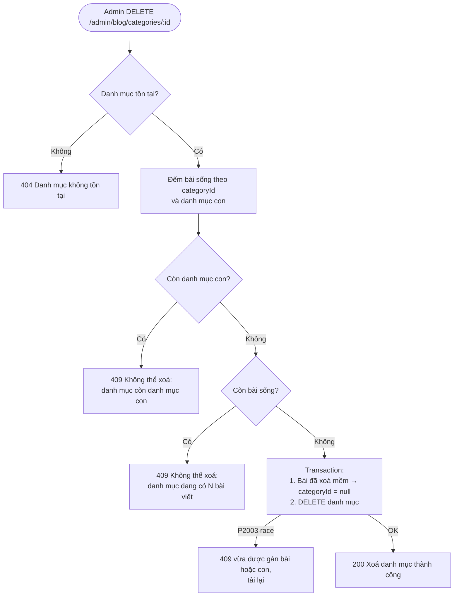

# Activity Diagram
## Module: Blog
### Dự án: Mobivexa E-Commerce Platform

> **Phiên bản:** 1.0 | **Ngày:** 2026-10-01

---

## AD-01: Lazy publish — bài hẹn lịch tự xuất bản

> Không cần cron — bài hẹn lịch được "thăng hạng" ngay ở lượt đọc đầu tiên sau giờ hẹn (promote-on-read).

---

## AD-02: Tạo / cập nhật bài viết

---

## AD-03: Đổi trạng thái bài viết

**Bảng chuyển trạng thái:**

| Từ | Cho phép sang |
|---|---|
| `DRAFT` | `SCHEDULED`, `PUBLISHED` |
| `SCHEDULED` | `DRAFT`, `SCHEDULED` (đổi giờ hẹn) |
| `PUBLISHED` | `DRAFT`, `ARCHIVED` |
| `ARCHIVED` | `DRAFT`, `PUBLISHED` |

---

## AD-04: Xem trước bằng preview token

> Khoá preview là HMAC của `JWT_ACCESS_SECRET` — token preview không dùng được như access token, access token không mở được preview.

---

## AD-05: Xoá danh mục

