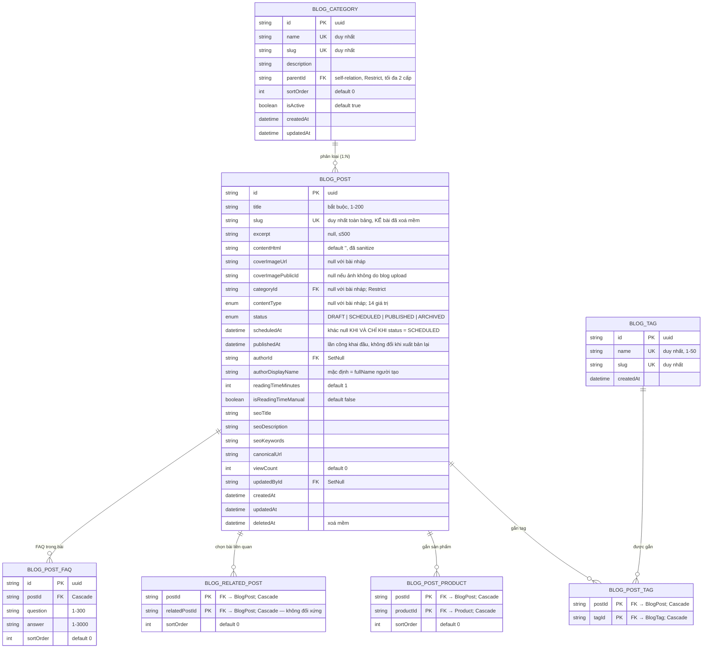

# ERD — Entity Relationship Diagram
## Module: Blog
### Dự án: Mobivexa E-Commerce Platform

> **Phiên bản:** 1.0 | **Ngày:** 2026-10-01

---

## 1. Sơ đồ ERD



> `BlogCategory` còn tự quan hệ cha–con (parent/children); `BlogPost` tham chiếu `User` qua `authorId` (người tạo) và `updatedById` (người sửa cuối) — đều `SetNull` khi tài khoản bị xoá cứng; `BlogPostProduct` tham chiếu `Product`.

---

## 2. Giải thích quan hệ

### BlogCategory → BlogPost (1:N)
Một danh mục chứa nhiều bài; một bài chỉ thuộc tối đa một danh mục.  
`onDelete: Restrict` — DB chặn xoá danh mục còn bài sống; service trả 409 trước khi tới đây. Bài đã xoá mềm được service gỡ `categoryId` trước khi xoá danh mục.

### BlogCategory → BlogCategory (cây, tối đa 2 cấp)
`parentId` tự tham chiếu, `onDelete: Restrict`. Service chặn: cha phải là danh mục gốc; danh mục đang có con không được gán cha.

### Bảng liên kết N:N — toàn bộ Cascade
| Bảng | Khoá chính | Ý nghĩa |
|---|---|---|
| `blog_post_tags` | `(postId, tagId)` | Xoá tag → tự gỡ khỏi mọi bài |
| `blog_post_products` | `(postId, productId)` | Xoá sản phẩm → gỡ liên kết, bài không hỏng |
| `blog_related_posts` | `(postId, relatedPostId)` | **Không đối xứng**: A chọn B không làm B hiện A |
| `blog_post_faqs` | `id` riêng | Thay cả danh sách trong 1 transaction khi lưu bài |

---

## 3. Bảng `blog_posts` — chi tiết trạng thái

| Trường | Ghi chú nghiệp vụ |
|---|---|
| `status` | `DRAFT` (nháp) → `SCHEDULED` (hẹn giờ) → `PUBLISHED` (đăng) → `ARCHIVED` (lưu trữ); chuyển đổi theo bảng trạng thái duy nhất ở service |
| `scheduledAt` | Khác null khi và chỉ khi `SCHEDULED`; lần đọc đầu sau giờ hẹn tự chuyển `PUBLISHED` (lazy publish) |
| `publishedAt` | Lần công khai **đầu tiên**; gỡ rồi xuất bản lại không đổi |
| `slug` | Duy nhất toàn bảng kể cả bài đã xoá mềm — slug cũ không bao giờ tái sử dụng |
| `deletedAt` | Xoá mềm: mọi query công khai và admin đều lọc `deletedAt IS NULL` |
| `viewCount` | Tăng bằng SQL nguyên tử; không đụng `updatedAt` |
| `isReadingTimeManual` | `true` = admin ghi đè thời gian đọc, sửa nội dung không tự tính lại |
| `authorDisplayName` | Tên hiển thị trên bài, độc lập với tài khoản (kế thừa khi user bị xoá) |
| `coverImagePublicId` | Dùng destroy Cloudinary; `null` khi ảnh không do blog upload (seed tái dùng URL) — không bao giờ destroy |

---

## 4. Index

| Bảng | Index | Mục đích |
|---|---|---|
| `blog_posts` | `(status, publishedAt)` | Danh sách công khai: PUBLISHED sắp publishedAt DESC |
| `blog_posts` | `(categoryId, status, publishedAt)` | Trang danh mục + tự bổ sung bài liên quan cùng danh mục |
| `blog_posts` | `(status, scheduledAt)` | Truy vấn bài hẹn giờ đã tới hạn (lazy publish) |
| `blog_posts` | `(authorId)`, `(updatedById)` | Lọc danh sách quản trị theo tác giả |
| `blog_categories` | `(parentId)` | Duyệt cây 2 cấp |
| `blog_post_tags` | `(tagId)` | Trang tag → bài |
| `blog_post_products` | `(productId)` | Sản phẩm xuất hiện ở những bài nào |
| `blog_related_posts` | `(relatedPostId)` | Tra bài liên quan |
| `blog_post_faqs` | `(postId, sortOrder)` | Đọc FAQ đúng thứ tự |

**Index `(status, publishedAt)` phục vụ câu query danh sách công khai:**
```sql
SELECT * FROM blog_posts
WHERE status = 'PUBLISHED' AND "deletedAt" IS NULL
ORDER BY "publishedAt" DESC, id DESC
LIMIT 12 OFFSET 0
```

---

## 5. Ràng buộc và hành vi xoá

| Quan hệ | `onDelete` | Hành vi |
|---|---|---|
| BlogCategory → BlogPost | Restrict | Chặn xoá danh mục còn bài sống (service 409 trước) |
| BlogCategory → BlogCategory | Restrict | Chặn xoá danh mục còn con |
| User → BlogPost (author/updatedBy) | SetNull | Xoá tài khoản không mất bài; `authorDisplayName` giữ tên hiển thị cũ |
| BlogPost → bảng liên kết | Cascade | Xoá bài (cứng) gọn tag/product/related/faq — thực tế bài chỉ xoá mềm |
| BlogTag → BlogPostTag | Cascade | Xoá tag tự gỡ khỏi mọi bài |
| Product → BlogPostProduct | Cascade | Xoá sản phẩm không làm hỏng bài |
