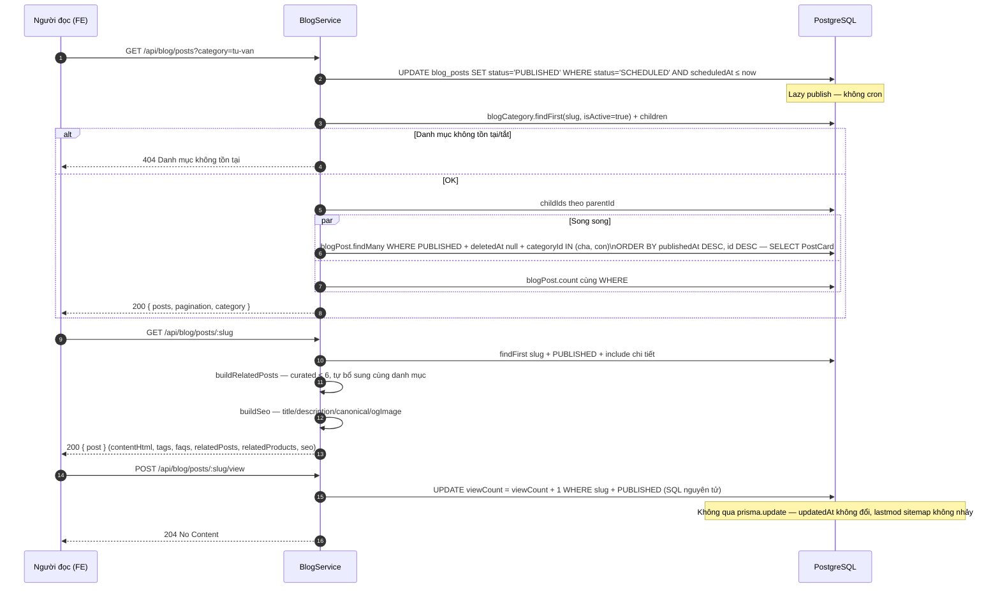
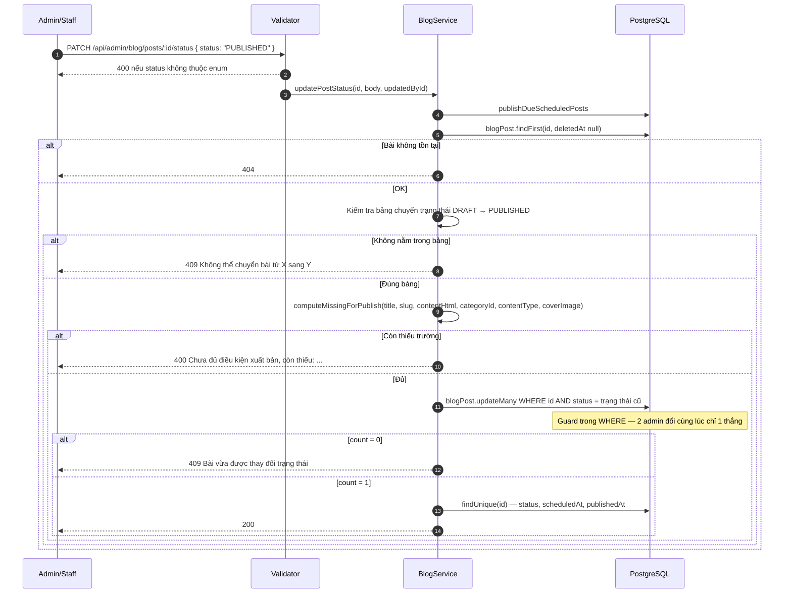
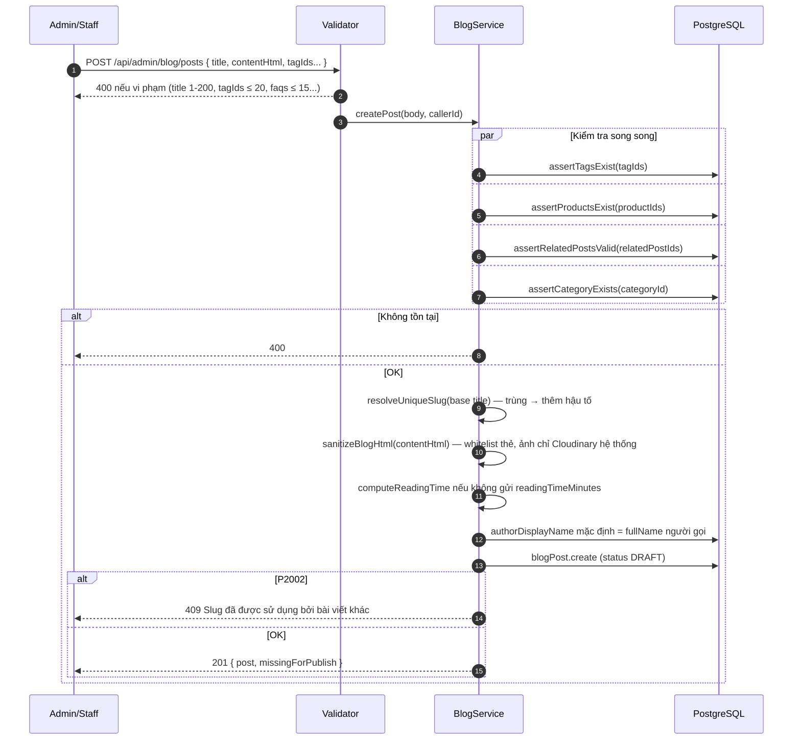
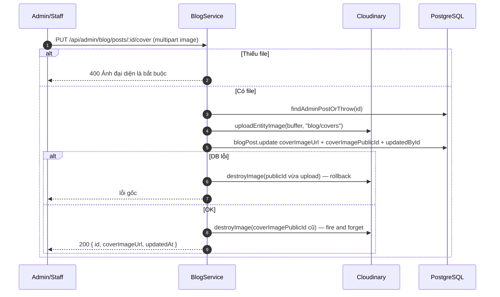
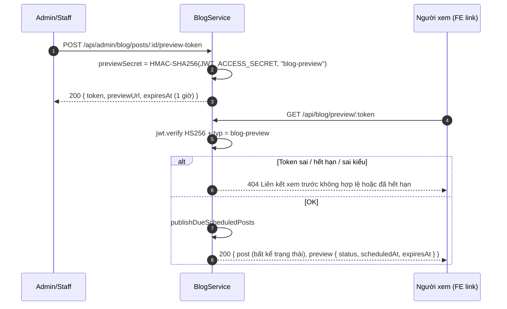
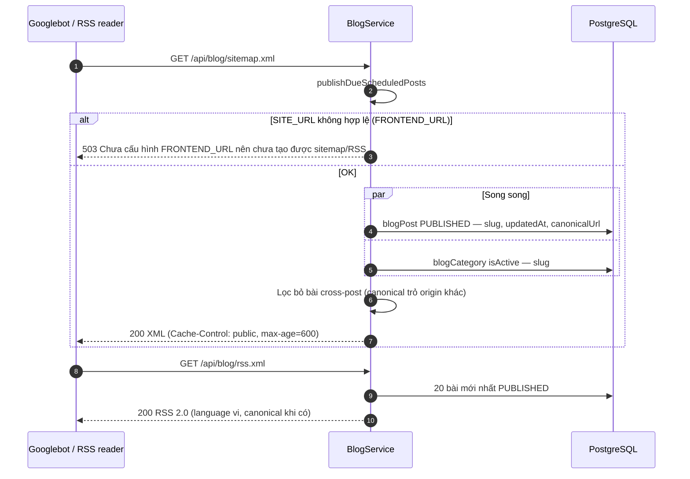

# Sequence Diagram — Luồng API
## Module: Blog
### Dự án: Mobivexa E-Commerce Platform

> **Phiên bản:** 1.0 | **Ngày:** 2026-10-01

---

## SD-01: Người đọc duyệt danh sách và đọc bài

---

## SD-02: Admin xuất bản bài — guards chống race

> `publishedAt` chỉ set lần công khai đầu (`post.publishedAt ?? new Date()`) — gỡ rồi xuất bản lại không đổi.

---

## SD-03: Tạo bài — sanitize và slug tự sinh

---

## SD-04: Upload ảnh đại diện — rollback Cloudinary

---

## SD-05: Preview token — tạo và đọc

---

## SD-06: Sitemap và RSS cho bot SEO

