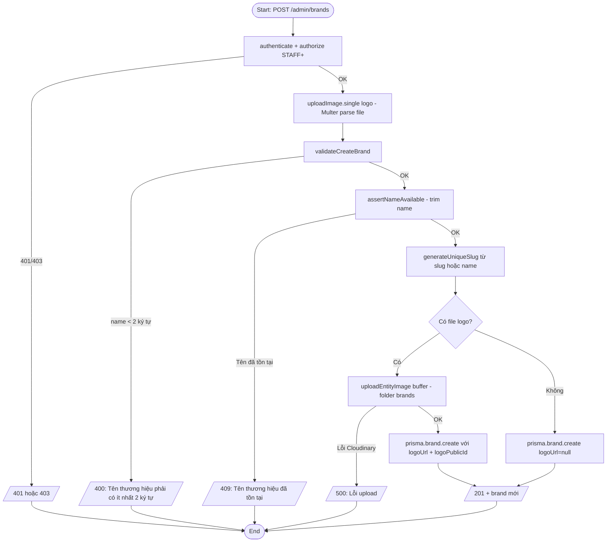
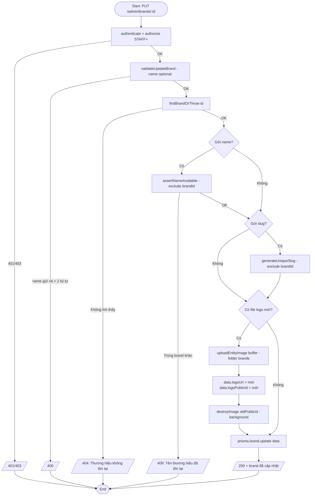
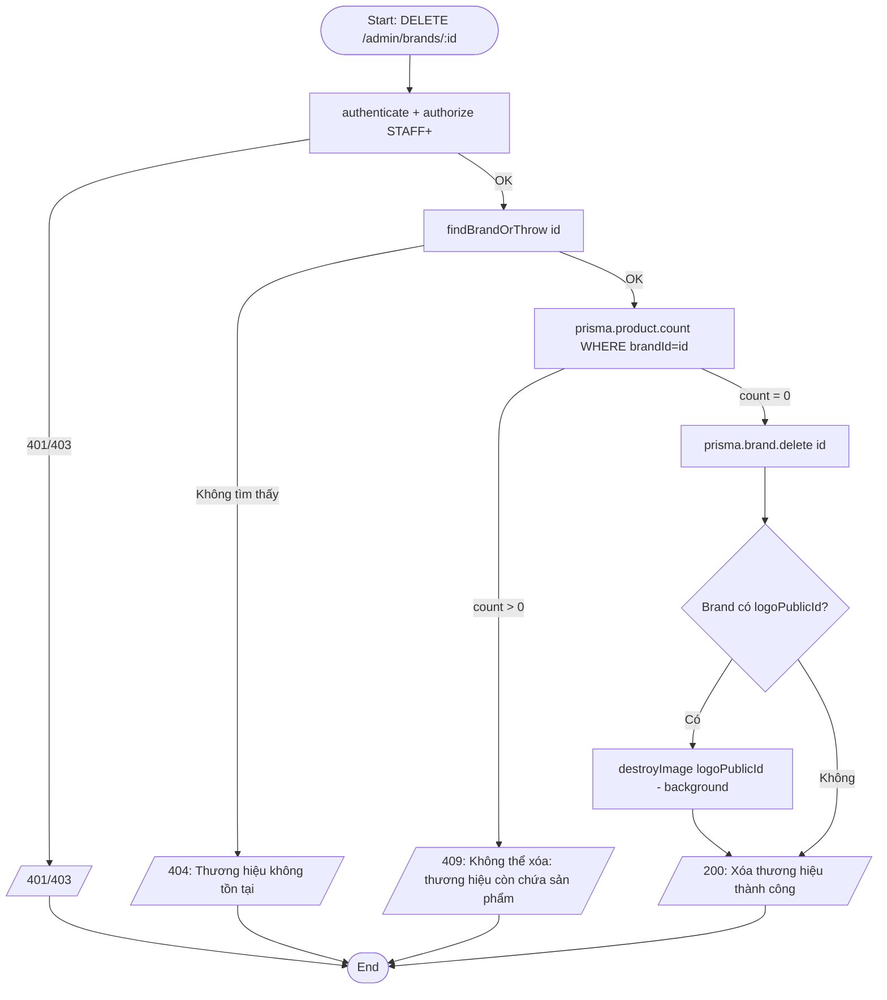
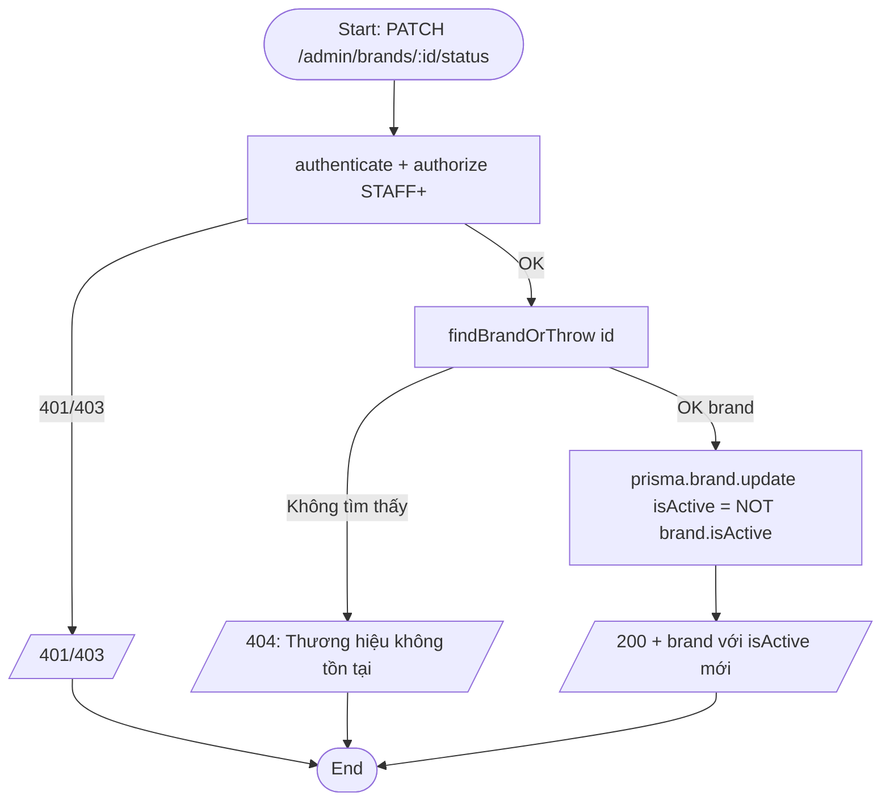
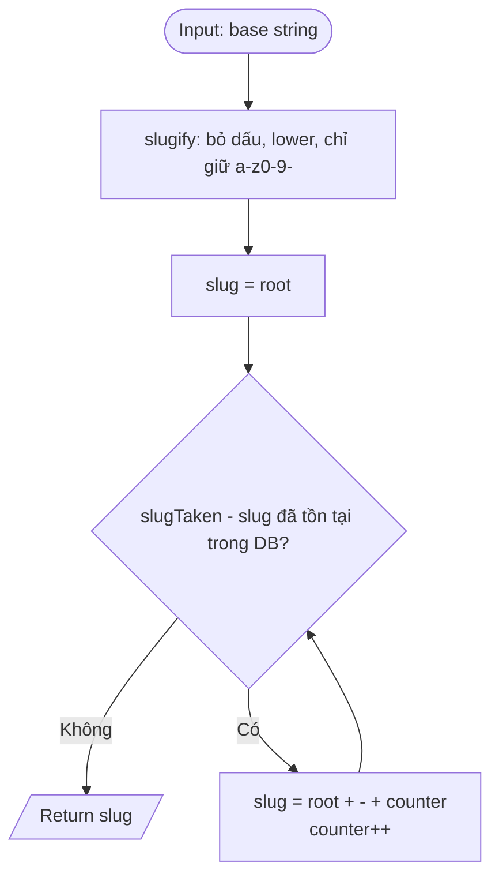

# Activity Diagram — Luồng xử lý
## Module: Brand
### Dự án: Mobivexa E-Commerce Platform

> **Phiên bản:** 1.0 | **Ngày:** 2026-06-19

---

## AD-01: Tạo thương hiệu

---

## AD-02: Cập nhật thương hiệu

---

## AD-03: Xóa thương hiệu

---

## AD-04: Toggle trạng thái

---

## AD-05: Sinh Slug duy nhất

> Vòng lặp chạy đến khi tìm được slug unique. Không có hard limit nhưng thực tế hiếm khi vượt quá 3-4 lần.
