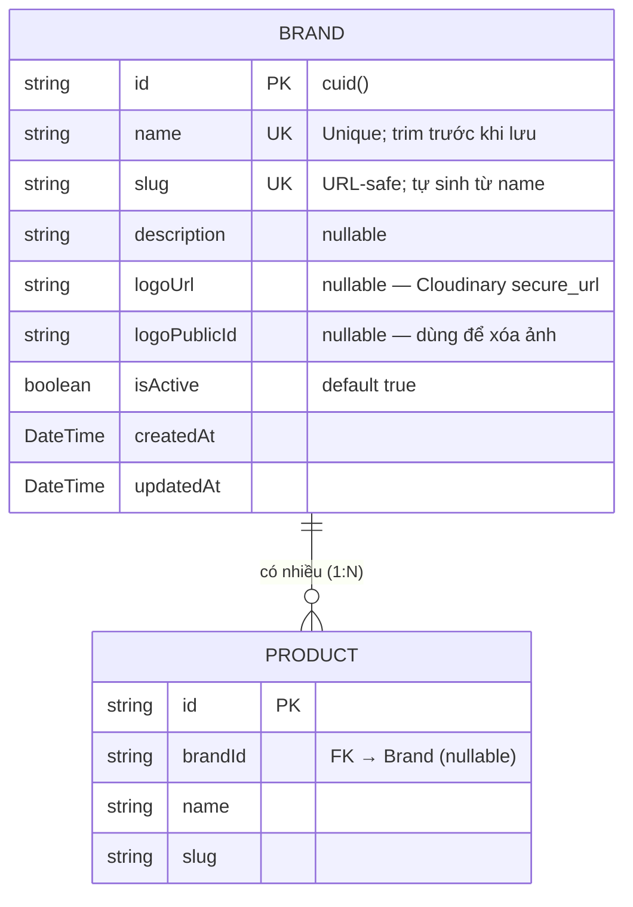

# ERD — Entity Relationship Diagram
## Module: Brand
### Dự án: Mobivexa E-Commerce Platform

> **Phiên bản:** 1.0 | **Ngày:** 2026-06-19

---

## 1. Sơ đồ ERD

---

## 2. Mô tả chi tiết Entity Brand

| Trường | Kiểu DB | Nullable | Unique | Ghi chú |
|---|---|---|---|---|
| `id` | VARCHAR (cuid) | No | PK | Auto-generated |
| `name` | VARCHAR | No | Yes | Sau trim; case-sensitive ở DB nhưng check unique sau trim ở app |
| `slug` | VARCHAR | No | Yes | Kết quả của `slugify(name)`; thêm `-N` nếu trùng |
| `description` | TEXT | Yes | No | Mô tả tự do |
| `logoUrl` | TEXT | Yes | No | Cloudinary HTTPS URL |
| `logoPublicId` | TEXT | Yes | No | Dùng khi gọi `destroyImage()` |
| `isActive` | BOOLEAN | No | No | Default `true` |
| `createdAt` | TIMESTAMPTZ | No | No | Auto |
| `updatedAt` | TIMESTAMPTZ | No | No | Auto |

---

## 3. Quan hệ

| Từ | Đến | Cardinality | Ghi chú |
|---|---|---|---|
| Brand | Product | 1 : N | `Product.brandId` FK → `Brand.id` |

**Ràng buộc xóa:** Không có `onDelete: CASCADE` — phải kiểm tra thủ công ở application level trước khi xóa Brand. Nếu Brand còn Product → `409`.

---

## 4. So sánh Brand vs Category

| Tiêu chí | Brand | Category |
|---|---|---|
| Cấu trúc | Flat (phẳng) | Tree (cây, có parentId) |
| Có logo | ✅ | ❌ |
| Có `sortOrder` | ❌ | ✅ |
| Xóa bị chặn | ✅ (còn Product) | ✅ (còn con hoặc Product) |
| Có slug | ✅ | ✅ |
| Public endpoint | GET list + GET by slug | GET tree + GET by slug |

---

## 5. Index

| Index | Trường | Loại |
|---|---|---|
| PK | `id` | Primary |
| UK | `name` | Unique |
| UK | `slug` | Unique |

---

## 6. Dữ liệu nhạy cảm

| Trường | Lý do cần chú ý |
|---|---|
| `logoPublicId` | Không cần expose cho client — chỉ dùng nội bộ để xóa Cloudinary |

> Trong response hiện tại, `logoPublicId` vẫn được trả về vì `prisma.brand.findMany()` không có `select`. Nếu cần ẩn, thêm select list hoặc transform response.
