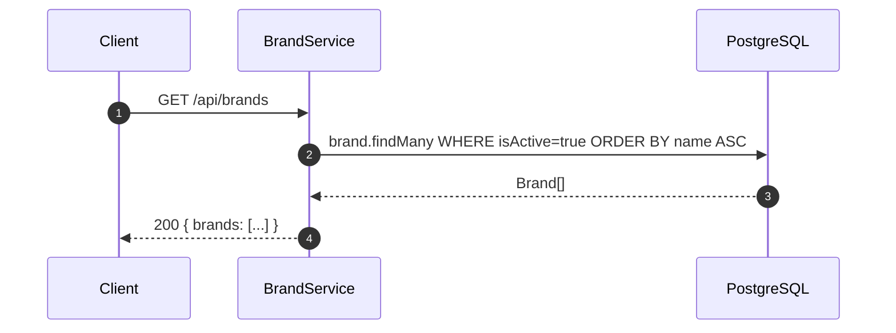
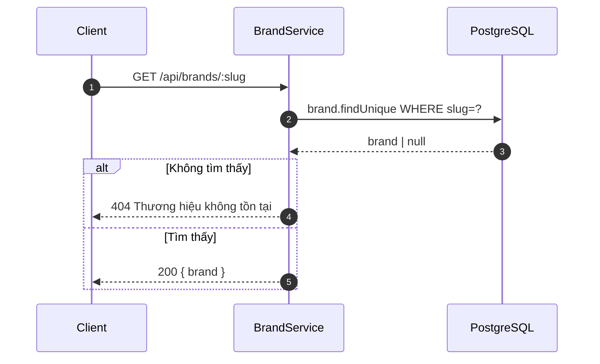
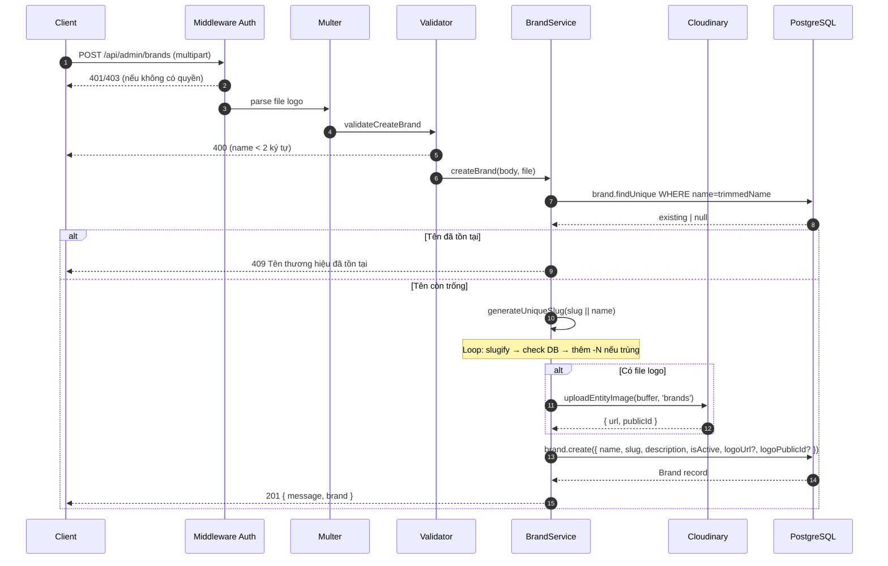
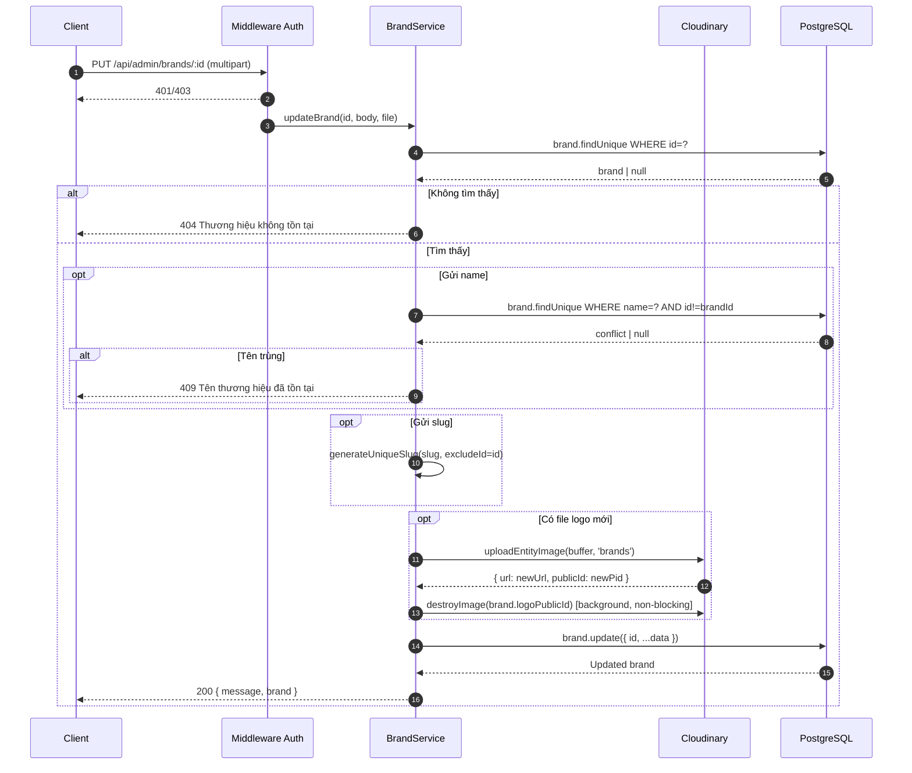
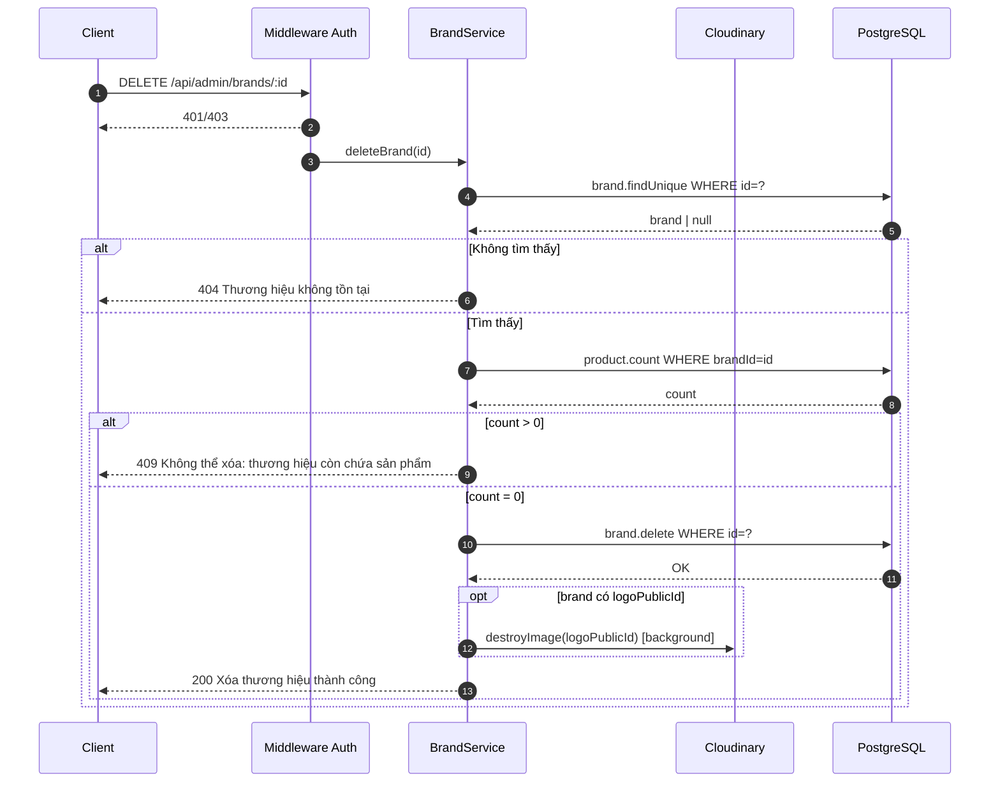
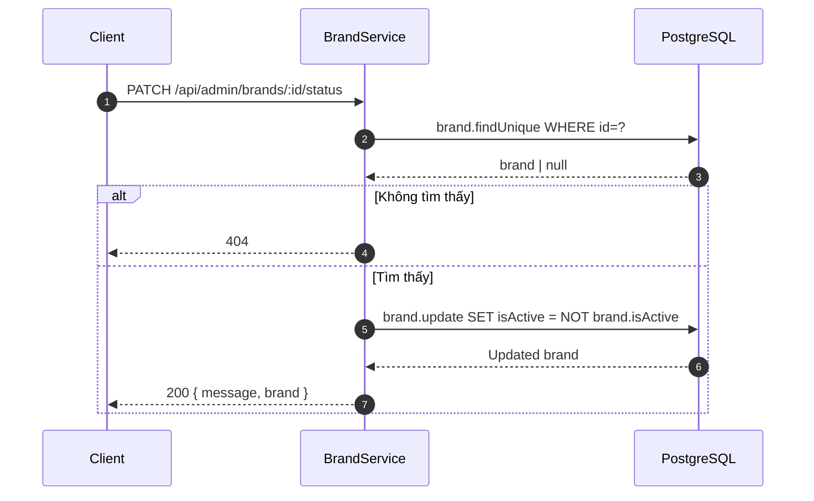

# Sequence Diagram — Luồng API
## Module: Brand
### Dự án: Mobivexa E-Commerce Platform

> **Phiên bản:** 1.0 | **Ngày:** 2026-06-19

---

## SD-01: Xem danh sách brand (Public)

---

## SD-02: Xem chi tiết brand theo slug (Public)

---

## SD-03: Tạo thương hiệu

---

## SD-04: Cập nhật thương hiệu (có logo mới)

---

## SD-05: Xóa thương hiệu

---

## SD-06: Toggle trạng thái

