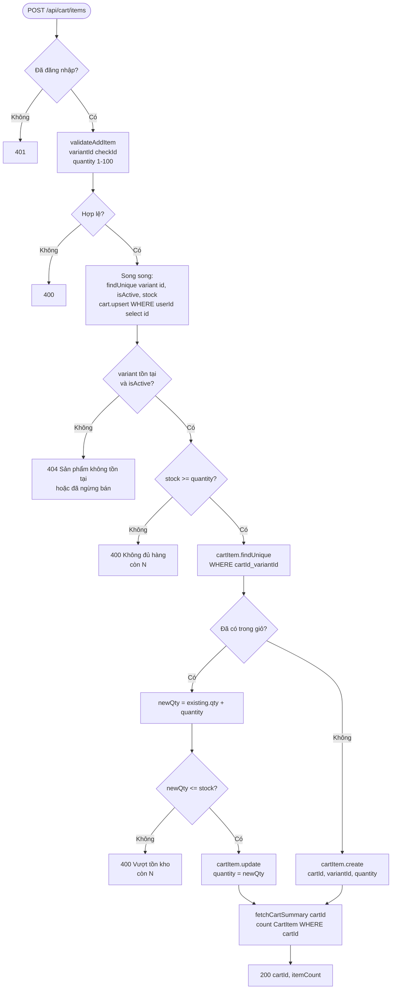
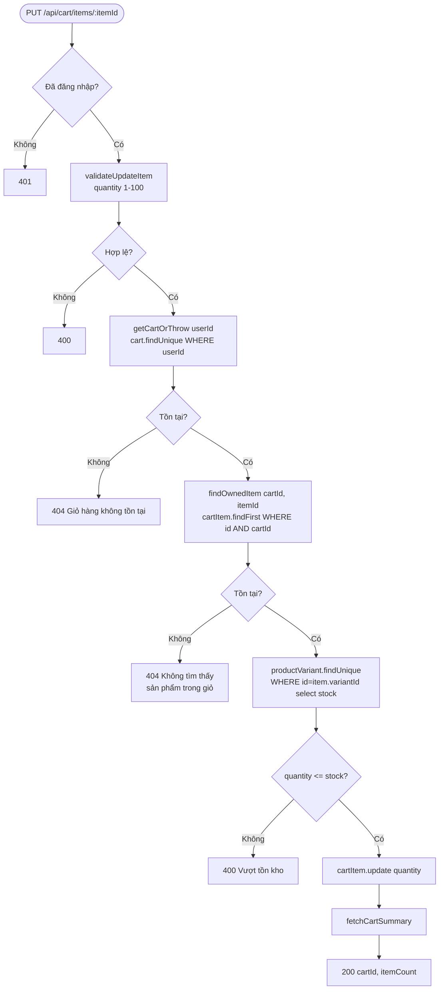
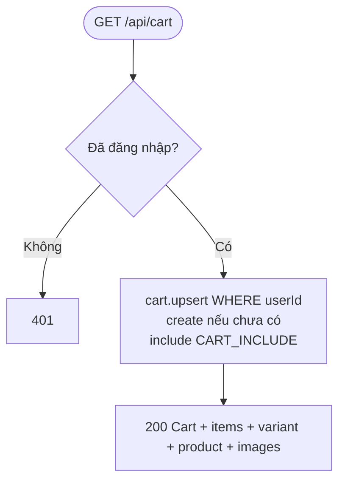

# Activity Diagram
## Module: Cart
### Dự án: Mobivexa E-Commerce Platform

> **Phiên bản:** 2.0 | **Ngày:** 2026-08-22

---

## AD-01: Thêm sản phẩm (addItem)

---

## AD-02: Cập nhật số lượng (updateItem)

---

## AD-03: Xem giỏ hàng (getCart)

