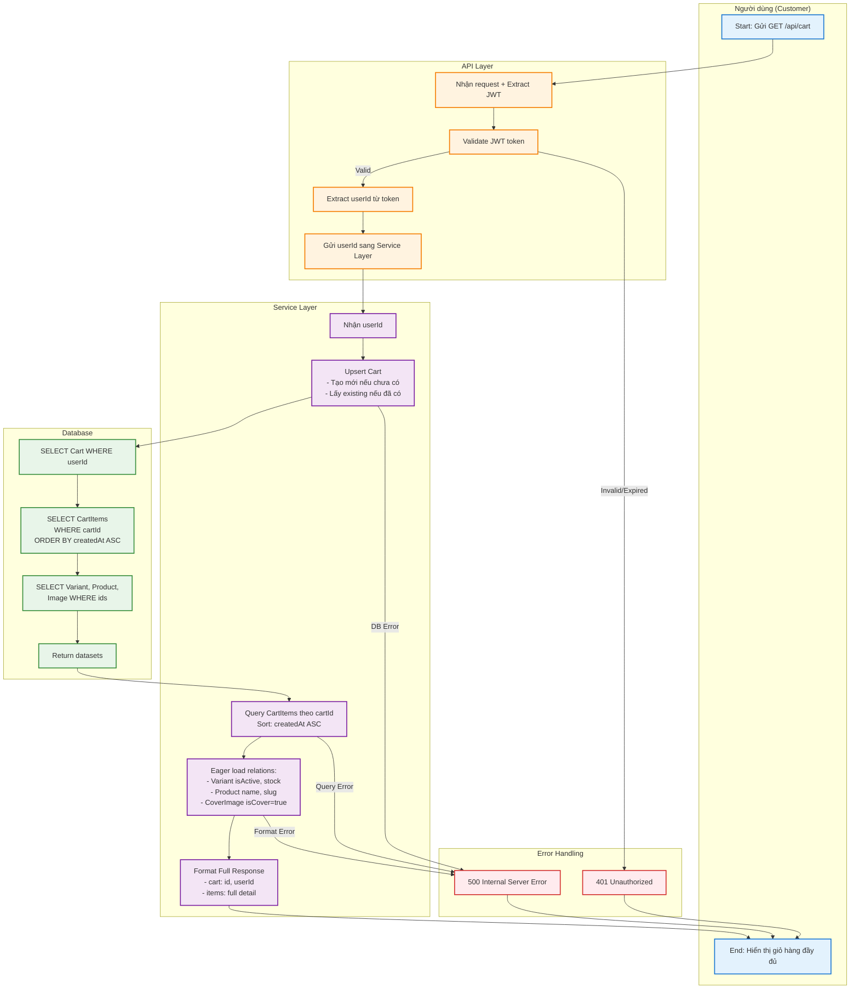
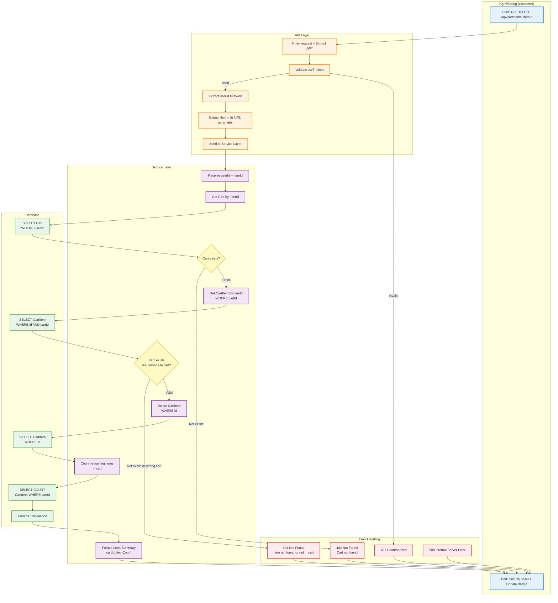
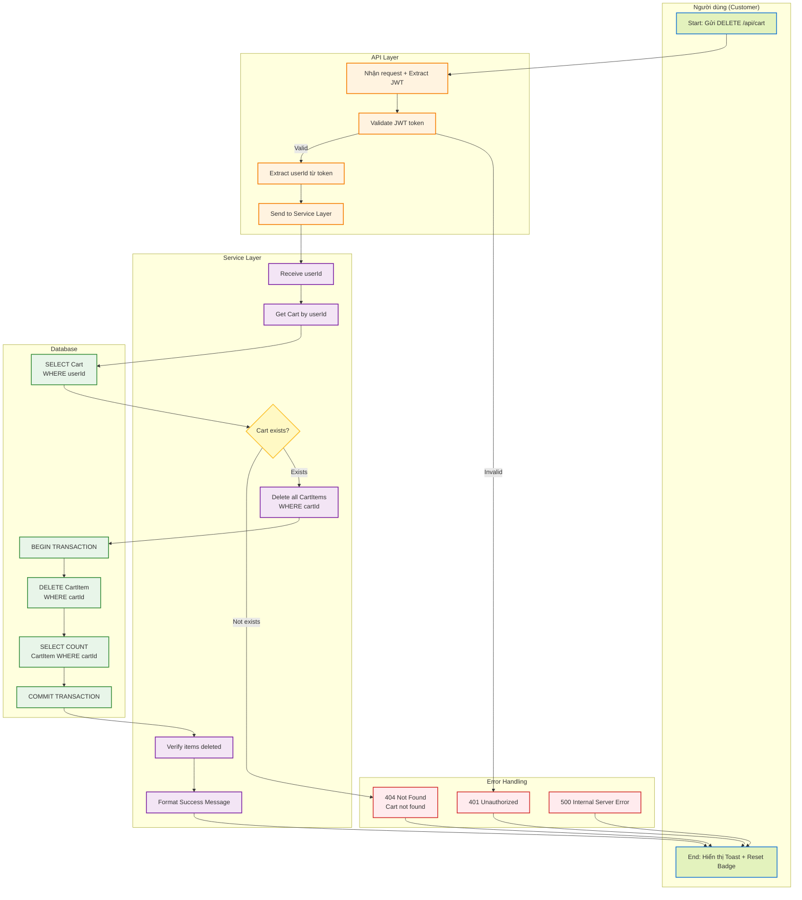
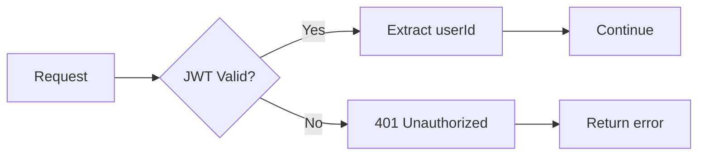
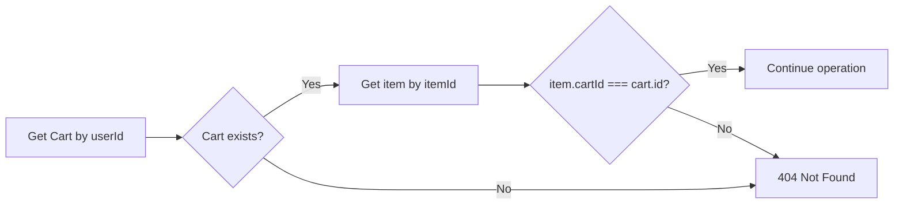
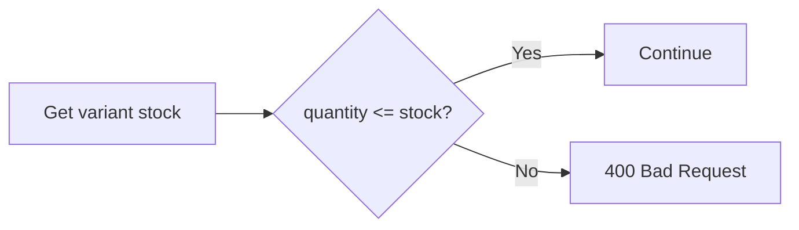

# Activity Diagram — Module Cart (Giỏ hàng)
## Dự án: Mobivexa E-Commerce Platform

> **Phiên bản:** 1.0  
> **Ngày:** 2026-06-20  
> **Tác giả:** Workflow Architect  
> **Tham chiếu:** [BRD.md](./BRD.md) | [SRS.md](./SRS.md)

---

## Table of Contents
1. [Xem Giỏ Hàng (View Cart)](#1-xem-giỏ-hàng-view-cart)
2. [Thêm Sản Phẩm Vào Giỏ (Add to Cart)](#2-thêm-sản-phẩm-vào-giỏ-add-to-cart)
3. [Cập Nhật Số Lượng (Update Quantity)](#3-cập-nhật-số-lượng-update-quantity)
4. [Xóa Item (Remove Item)](#4-xóa-item-remove-item)
5. [Xóa Toàn Bộ Giỏ Hàng (Clear Cart)](#5-xóa-toàn-bộ-giỏ-hàng-clear-cart)
6. [Tổng Hợp Các Workflow](#tổng-hợp-các-workflow)

---

## 1. Xem Giỏ Hàng (View Cart)

### 1.1 Overview

**Mô tả:** Customer lấy toàn bộ thông tin giỏ hàng bao gồm tất cả items với thông tin chi tiết về variant, sản phẩm và ảnh bìa.

**Endpoint:** `GET /api/cart`  
**Auth:** CUSTOMER+  
**Response:** 200 + Full cart object

### 1.2 Activity Diagram



### 1.3 Detailed Activity Flow

#### Happy Path (Success)
1. **Customer** gửi request `GET /api/cart` với JWT token trong header
2. **API Layer**:
   - Nhận request và extract JWT token từ Authorization header
   - Validate JWT token (signature, expiration)
   - Extract `userId` từ token payload
   - Gửi `userId` sang Service Layer
3. **Service Layer**:
   - Nhận `userId` từ API Layer
   - **Upsert Cart**: Tạo mới Cart nếu chưa có, hoặc lấy existing nếu đã tồn tại
   - Query tất cả CartItems theo `cartId`, sắp xếp theo `createdAt ASC`
   - Eager load relations:
     - Variant: `isActive`, `stock`, `salePrice`, `color`, `storage`, `ram`
     - Product: `id`, `name`, `slug`
     - Image: `url` WHERE `isCover = true`
   - Format Full Response với cấu trúc:
     ```json
     {
       "cart": {
         "id": "cart_abc123",
         "userId": "user_xyz789",
         "items": [
           {
             "id": "item_def456",
             "variantId": "var_123",
             "quantity": 2,
             "variant": { ... },
             "product": { ... },
             "coverImage": { ... }
           }
         ]
       }
     }
     ```
4. **Database**:
   - Execute SELECT queries với JOIN cho relations
   - Return datasets cho Service Layer
5. **Customer** nhận 200 OK + Full cart object

#### Error Paths
- **401 Unauthorized**: JWT token không hợp lệ hoặc hết hạn
- **500 Internal Server Error**: Lỗi database, lỗi query, hoặc lỗi format response

### 1.4 Decision Nodes

| Decision Point | Condition | True Path | False Path |
|---|---|---|---|
| JWT Validation | Token valid & not expired | Extract userId | Return 401 |
| Cart Existence | Cart exists for userId | Use existing cart | Create new cart |
| Items Existence | Cart has items | Load items | Return empty items array |
| Image Existence | Product has cover image | Include coverImage | coverImage = null |

### 1.5 Performance Requirements

- **Target**: < 300ms (p95)
- **Optimization**: Eager loading variants, products, images trong 1 query
- **No Pagination**: Giả định user có < 100 items (theo scalability requirement)

---

## 2. Thêm Sản Phẩm Vào Giỏ (Add to Cart)

### 2.1 Overview

**Mô tả:** Customer thêm sản phẩm vào giỏ hàng. Nếu item đã tồn tại, quantity được cộng dồn. Workflow này bao gồm validation logic, stock check, và accumulation logic.

**Endpoint:** `POST /api/cart/items`  
**Auth:** CUSTOMER+  
**Request Body:** `{ variantId, quantity }`  
**Response:** 201 + `{ cartId, itemCount }`

### 2.2 Activity Diagram

```mermaid
flowchart TD
    %% Swimlanes
    subgraph Customer["Người dùng (Customer)"]
        A[Start: Gửi POST /api/cart/items<br/>Body: {variantId, quantity}]
        AZ[End: Hiển thị Toast + Update Badge]
    end
    
    subgraph API_Layer["API Layer"]
        B[Nhận request + Extract JWT]
        C[Validate JWT token]
        D[Extract userId từ token]
        E[Validate request body:<br/>- variantId: string<br/>- quantity: integer]
        F[Send to Service Layer]
    end
    
    subgraph Service_Layer["Service Layer"]
        G[Receive userId + request data]
        H{Validate quantity range}
        
        %% Parallel Process
        I[Branch 1: Upsert Cart<br/>- Create if not exists<br/>- Get existing if exists]
        J[Branch 2: Get Variant<br/>- Check exists<br/>- Check isActive = true<br/>- Get stock]
        
        K{Variant exists<br/>&& isActive?}
        L{First quantity<br/>> stock?}
        M{Item exists in cart?}
        N[Calculate newQty<br/>= existingQty + quantity]
        O{newQty > stock?}
        P[Create CartItem<br/>- cartId, variantId<br/>- quantity]
        Q[Update CartItem<br/>quantity = newQty]
        R[Format Lean Summary<br/>- cartId, itemCount]
    end
    
    subgraph Database["Database"]
        S[UPSERT Cart<br/>WHERE userId]
        T[SELECT Variant<br/>WHERE id]
        U[SELECT CartItem<br/>WHERE cartId + variantId]
        V[INSERT CartItem]
        W[UPDATE CartItem]
        X[Commit Transaction]
    end
    
    subgraph Error_Handling["Error Handling"]
        Y1[400 Bad Request<br/>variantId invalid]
        Y2[400 Bad Request<br/>quantity must be 1-100]
        Y3[404 Not Found<br/>Variant not found/inactive]
        Y4[400 Bad Request<br/>Insufficient stock]
        Y5[401 Unauthorized]
        Y6[500 Internal Server Error]
    end
    
    %% Happy Path
    A --> B
    B --> C
    C -->|Valid| D
    C -->|Invalid| Y5
    D --> E
    E -->|Invalid variantId| Y1
    E -->|Invalid quantity| Y2
    E --> F
    F --> G
    G --> H
    H -->|quantity < 1 or > 100| Y2
    H -->|Valid| I & J
    
    %% Branch 1: Cart Upsert
    I --> S
    S --> I
    
    %% Branch 2: Get Variant
    J --> T
    T --> K
    
    %% Variant Validation
    K -->|Not exists or inactive| Y3
    K -->|Valid| L
    
    %% Stock Check (First Add)
    L -->|quantity > stock| Y4
    L -->|OK| M
    
    %% Item Existence Check
    M --> U
    U -->|Item exists| N
    U -->|Item not exists| P
    
    %% Accumulation Logic
    N --> O
    O -->|newQty > stock| Y4
    O -->|OK| Q
    
    %% Database Operations
    P --> V
    Q --> W
    V --> X
    W --> X
    
    %% Success Path
    X --> R
    R --> AZ
    
    %% Error Response
    Y1 --> AZ
    Y2 --> AZ
    Y3 --> AZ
    Y4 --> AZ
    Y5 --> AZ
    Y6 --> AZ
    
    %% Styling
    classDef customerStyle fill:#e3f2fd,stroke:#1976d2,stroke-width:2px
    classDef apiStyle fill:#fff3e0,stroke:#f57c00,stroke-width:2px
    classDef serviceStyle fill:#f3e5f5,stroke:#7b1fa2,stroke-width:2px
    classDef dbStyle fill:#e8f5e9,stroke:#388e3c,stroke-width:2px
    classDef errorStyle fill:#ffebee,stroke:#d32f2f,stroke-width:2px
    classDef decisionStyle fill:#fff9c4,stroke:#fbc02d,stroke-width:2px
    
    class A,AZ customerStyle
    class B,C,D,E,F apiStyle
    class G,H,I,J,K,L,M,N,O,P,Q,R serviceStyle
    class S,T,U,V,W,X dbStyle
    class Y1,Y2,Y3,Y4,Y5,Y6 errorStyle
    class H,K,L,M,O decisionStyle
```

### 2.3 Detailed Activity Flow

#### Happy Path (Success)

**Phase 1: Request Validation**
1. **Customer** gửi request:
   ```json
   {
     "variantId": "var_abc123",
     "quantity": 2
   }
   ```
2. **API Layer**:
   - Validate JWT token → extract `userId`
   - Validate request body:
     - `variantId`: phải là string hợp lệ
     - `quantity`: phải là integer ≥ 1 và ≤ 100

**Phase 2: Parallel Processing (Song song)**
3. **Service Layer** thực hiện 2 branch song song:
   - **Branch 1**: Upsert Cart cho `userId`
   - **Branch 2**: Get Variant theo `variantId`

**Phase 3: Variant Validation**
4. **Service Layer** validate Variant:
   - Check Variant exists trong database
   - Check `variant.isActive = true`
   - Get `variant.stock` hiện tại
   - Nếu fails → return 404

**Phase 4: Stock Check (Lần đầu)**
5. **Service Layer** check stock:
   - Nếu `quantity > stock` → return 400 với message `"Sản phẩm không đủ hàng (còn {stock})"`

**Phase 5: Item Existence Check**
6. **Service Layer** query CartItem theo `(cartId, variantId)`
   - Nếu **chưa có** → tạo CartItem mới
   - Nếu **đã có** → thực hiện accumulation logic

**Phase 6: Accumulation Logic**
7. **Service Layer** tính `newQty`:
   - `newQty = existingQty + quantity`
   - Validate `newQty ≤ stock`
   - Nếu `newQty > stock` → return 400 với message `"Số lượng vượt quá tồn kho (còn {stock})"`
   - Nếu OK → update CartItem.quantity = `newQty`

**Phase 7: Database Operation**
8. **Database**:
   - Case 1 (Item chưa có): INSERT CartItem
   - Case 2 (Item đã có): UPDATE CartItem
   - Commit transaction

**Phase 8: Response**
9. **Service Layer** format Lean Summary:
   ```json
   {
     "cartId": "cart_xyz789",
     "itemCount": 5
   }
   ```
10. **Customer** nhận 201 Created + update badge UI

#### Error Paths

| Error | Condition | HTTP Status | Message |
|---|---|---|---|
| Invalid variantId | variantId không phải string | 400 | `variantId không hợp lệ` |
| Invalid quantity | quantity < 1 hoặc > 100 | 400 | `Số lượng phải là số nguyên từ 1 đến 100` |
| Variant not found | Variant không tồn tại | 404 | `Sản phẩm không tồn tại hoặc đã ngừng bán` |
| Variant inactive | `isActive = false` | 404 | `Sản phẩm không tồn tại hoặc đã ngừng bán` |
| Insufficient stock (first) | `quantity > stock` | 400 | `Sản phẩm không đủ hàng (còn {stock})` |
| Insufficient stock (accumulate) | `newQty > stock` | 400 | `Số lượng vượt quá tồn kho (còn {stock})` |
| Unauthorized | JWT invalid/expired | 401 | `Unauthorized` |
| Server error | Database error, unexpected error | 500 | `Internal Server Error` |

### 2.4 Decision Nodes

| Decision Point | Condition | True Path | False Path |
|---|---|---|---|
| JWT Validation | Token valid & not expired | Extract userId | 401 Unauthorized |
| variantId Format | String hợp lệ | Continue | 400 Bad Request |
| quantity Range | 1 ≤ quantity ≤ 100 | Continue | 400 Bad Request |
| Variant Existence | Variant exists in DB | Check isActive | 404 Not Found |
| Variant Active | `isActive = true` | Check stock | 404 Not Found |
| Stock Check (First) | `quantity ≤ stock` | Check item exists | 400 Bad Request |
| Item Existence | `(cartId, variantId) exists` | Calculate newQty | Create item |
| Stock Check (Accumulate) | `newQty ≤ stock` | Update item | 400 Bad Request |

### 2.5 Parallel Processes

Workflow này sử dụng **parallel processing** để tối ưu performance:
- **Branch 1**: Upsert Cart (tạo hoặc lấy existing)
- **Branch 2**: Get Variant info

Hai branch này có thể chạy song song vì không có dependency giữa chúng.

### 2.6 Accumulation Logic Example

**Scenario 1: Thêm item mới**
- Existing cart: 0 items
- Request: `variantId = "var_A", quantity = 3`
- Action: INSERT CartItem với `quantity = 3`
- Result: Cart có 1 item

**Scenario 2: Cộng dồn quantity**
- Existing cart: 1 item (`variantId = "var_A", quantity = 3`)
- Request: `variantId = "var_A", quantity = 2`
- Action: 
  - `newQty = 3 + 2 = 5`
  - UPDATE CartItem.quantity = 5
- Result: Cart vẫn 1 item nhưng quantity = 5

**Scenario 3: Vượt quá stock khi cộng dồn**
- Existing cart: 1 item (`variantId = "var_A", quantity = 8`)
- Stock hiện tại: 10
- Request: `variantId = "var_A", quantity = 5`
- Action:
  - `newQty = 8 + 5 = 13`
  - Check `13 > 10` → FAIL
- Error: `400 Bad Request` - `"Số lượng vượt quá tồn kho (còn 10)"`

### 2.7 Performance Requirements

- **Target**: < 200ms (p95)
- **Optimization**: Parallel processing Cart upsert + Variant fetch
- **Transaction**: Database operations trong 1 transaction để đảm bảo consistency

---

## 3. Cập Nhật Số Lượng (Update Quantity)

### 3.1 Overview

**Mô tả:** Customer cập nhật số lượng của một item trong giỏ hàng. Quantity mới **thay thế trực tiếp** (không cộng dồn).

**Endpoint:** `PUT /api/cart/items/:itemId`  
**Auth:** CUSTOMER+  
**Request Body:** `{ quantity }`  
**Response:** 200 + `{ cartId, itemCount }`

### 3.2 Activity Diagram

```mermaid
flowchart TD
    %% Swimlanes
    subgraph Customer["Người dùng (Customer)"]
        A[Start: Gửi PUT /api/cart/items/:itemId<br/>Body: {quantity}]
        AZ[End: Hiển thị Toast + Update Badge]
    end
    
    subgraph API_Layer["API Layer"]
        B[Nhận request + Extract JWT]
        C[Validate JWT token]
        D[Extract userId từ token]
        E[Extract itemId từ URL parameter]
        F[Validate request body:<br/>- quantity: integer 1-100]
        G[Send to Service Layer]
    end
    
    subgraph Service_Layer["Service Layer"]
        H[Receive userId + itemId + quantity]
        I{Validate quantity range}
        J[Get Cart by userId]
        K{Cart exists?}
        L[Get CartItem by itemId<br/>WHERE cartId]
        M{Item exists<br/>&& belongs to cart?}
        N[Get Variant stock<br/>via item.variantId]
        O{quantity <= stock?}
        P[Update CartItem<br/>quantity = newQuantity]
        Q[Format Lean Summary<br/>cartId, itemCount]
    end
    
    subgraph Database["Database"]
        R[SELECT Cart<br/>WHERE userId]
        S[SELECT CartItem<br/>WHERE id AND cartId]
        T[SELECT Variant<br/>WHERE id]
        U[UPDATE CartItem<br/>SET quantity]
        V[Commit Transaction]
    end
    
    subgraph Error_Handling["Error Handling"]
        W1[400 Bad Request<br/>quantity must be 1-100]
        W2[404 Not Found<br/>Cart not found]
        W3[404 Not Found<br/>Item not found or not in cart]
        W4[400 Bad Request<br/>Insufficient stock]
        W5[401 Unauthorized]
        W6[500 Internal Server Error]
    end
    
    %% Happy Path
    A --> B
    B --> C
    C -->|Valid| D
    C -->|Invalid| W5
    D --> E
    E --> F
    F -->|Invalid quantity| W1
    F --> G
    G --> H
    H --> I
    I -->|quantity < 1 or > 100| W1
    I -->|Valid| J
    J --> R
    R --> K
    K -->|Not exists| W2
    K -->|Exists| L
    L --> S
    S --> M
    M -->|Not exists or wrong cart| W3
    M -->|Valid| N
    N --> T
    T --> O
    O -->|quantity > stock| W4
    O -->|OK| P
    P --> U
    U --> V
    V --> Q
    Q --> AZ
    
    %% Error Response
    W1 --> AZ
    W2 --> AZ
    W3 --> AZ
    W4 --> AZ
    W5 --> AZ
    W6 --> AZ
    
    %% Styling
    classDef customerStyle fill:#e3f2fd,stroke:#1976d2,stroke-width:2px
    classDef apiStyle fill:#fff3e0,stroke:#f57c00,stroke-width:2px
    classDef serviceStyle fill:#f3e5f5,stroke:#7b1fa2,stroke-width:2px
    classDef dbStyle fill:#e8f5e9,stroke:#388e3c,stroke-width:2px
    classDef errorStyle fill:#ffebee,stroke:#d32f2f,stroke-width:2px
    classDef decisionStyle fill:#fff9c4,stroke:#fbc02d,stroke-width:2px
    
    class A,AZ customerStyle
    class B,C,D,E,F,G apiStyle
    class H,I,J,K,L,M,N,O,P,Q serviceStyle
    class R,S,T,U,V dbStyle
    class W1,W2,W3,W4,W5,W6 errorStyle
    class I,K,M,O decisionStyle
```

### 3.3 Detailed Activity Flow

#### Happy Path (Success)

**Phase 1: Request Validation**
1. **Customer** gửi request:
   ```
   PUT /api/cart/items/item_abc123
   Body: { "quantity": 5 }
   ```
2. **API Layer**:
   - Validate JWT token → extract `userId`
   - Extract `itemId` từ URL parameter
   - Validate request body:
     - `quantity`: integer ≥ 1 và ≤ 100

**Phase 2: Ownership Validation**
3. **Service Layer**:
   - Get Cart theo `userId`
   - Check Cart exists → nếu không → 404
   - Get CartItem theo `itemId` WHERE `cartId` = user's cart
   - Check Item exists và thuộc về user's cart → nếu không → 404

**Phase 3: Stock Check**
4. **Service Layer**:
   - Get Variant info qua `item.variantId`
   - Lấy `variant.stock` hiện tại
   - Validate `quantity ≤ stock` → nếu không → 400

**Phase 4: Update Operation**
5. **Database**:
   - UPDATE CartItem SET `quantity` = newQuantity WHERE `id` = itemId
   - Commit transaction

**Phase 5: Response**
6. **Service Layer** format Lean Summary:
   ```json
   {
     "cartId": "cart_xyz789",
     "itemCount": 3
   }
   ```
7. **Customer** nhận 200 OK + update badge UI

#### Error Paths

| Error | Condition | HTTP Status | Message |
|---|---|---|---|
| Invalid quantity | quantity < 1 hoặc > 100 | 400 | `Số lượng phải là số nguyên từ 1 đến 100` |
| Cart not found | Cart không tồn tại cho userId | 404 | `Giỏ hàng không tồn tại` |
| Item not found | Item không tồn tại hoặc không thuộc cart | 404 | `Không tìm thấy sản phẩm trong giỏ hàng` |
| Ownership violation | `item.cartId !== user.cartId` | 404 | `Không tìm thấy sản phẩm trong giỏ hàng` |
| Insufficient stock | `quantity > stock` | 400 | `Số lượng vượt quá tồn kho (còn {stock})` |
| Unauthorized | JWT invalid/expired | 401 | `Unauthorized` |
| Server error | Database error | 500 | `Internal Server Error` |

### 3.4 Decision Nodes

| Decision Point | Condition | True Path | False Path |
|---|---|---|---|
| JWT Validation | Token valid & not expired | Extract userId | 401 Unauthorized |
| quantity Range | 1 ≤ quantity ≤ 100 | Continue | 400 Bad Request |
| Cart Existence | Cart exists for userId | Get item | 404 Not Found |
| Item Existence | Item exists in cart | Check stock | 404 Not Found |
| Ownership Check | `item.cartId === cart.id` | Check stock | 404 Not Found |
| Stock Check | `quantity ≤ stock` | Update item | 400 Bad Request |

### 3.5 Ownership Validation Logic

**Important:** Workflow này có **ownership check** để đảm bảo user chỉ có thể update item trong giỏ hàng của chính mình.

**Validation Steps:**
1. Get Cart theo `userId` → đảm bảo cart exists
2. Get CartItem theo `itemId` WHERE `cartId` → đảm bảo item thuộc về cart đó
3. Nếu CartItem không tồn tại hoặc `cartId` không khớp → return 404

**Security Rationale:**
- Prevent user A from updating user B's cart items
- Use same 404 message để không lộ information về existence

### 3.6 Difference vs Add to Cart

| Feature | Add to Cart | Update Quantity |
|---|---|---|---|
| Quantity behavior | **Cộng dồn** (`newQty = existing + input`) | **Thay thế** (`quantity = input`) |
| Item existence check | Tạo mới nếu chưa có | Bắt buộc phải tồn tại |
| Ownership check | Không cần (cart is user's) | Cần (`item.cartId === cart.id`) |
| Stock check | Check 2 lần (first + accumulate) | Check 1 lần |

### 3.7 Performance Requirements

- **Target**: < 150ms (p95)
- **Optimization**: Direct query bằng primary key (itemId)
- **Transaction**: Single UPDATE transaction

---

## 4. Xóa Item (Remove Item)

### 4.1 Overview

**Mô tả:** Customer xóa một item cụ thể khỏi giỏ hàng. Workflow này bao gồm ownership validation và DELETE operation.

**Endpoint:** `DELETE /api/cart/items/:itemId`  
**Auth:** CUSTOMER+  
**Response:** 200 + `{ cartId, itemCount }`

### 4.2 Activity Diagram



### 4.3 Detailed Activity Flow

#### Happy Path (Success)

**Phase 1: Request Processing**
1. **Customer** gửi request:
   ```
   DELETE /api/cart/items/item_abc123
   ```
2. **API Layer**:
   - Validate JWT token → extract `userId`
   - Extract `itemId` từ URL parameter

**Phase 2: Ownership Validation**
3. **Service Layer**:
   - Get Cart theo `userId`
   - Check Cart exists → nếu không → 404
   - Get CartItem theo `itemId` WHERE `cartId` = user's cart
   - Check Item exists và thuộc về user's cart → nếu không → 404

**Phase 3: Delete Operation**
4. **Database**:
   - DELETE CartItem WHERE `id` = itemId
   - Count remaining items: `SELECT COUNT(*) FROM CartItem WHERE cartId`
   - Commit transaction

**Phase 4: Response**
5. **Service Layer** format Lean Summary:
   ```json
   {
     "cartId": "cart_xyz789",
     "itemCount": 2
   }
   ```
6. **Customer** nhận 200 OK + update badge UI

#### Error Paths

| Error | Condition | HTTP Status | Message |
|---|---|---|---|
| Cart not found | Cart không tồn tại cho userId | 404 | `Giỏ hàng không tồn tại` |
| Item not found | Item không tồn tại hoặc không thuộc cart | 404 | `Không tìm thấy sản phẩm trong giỏ hàng` |
| Ownership violation | `item.cartId !== cart.id` | 404 | `Không tìm thấy sản phẩm trong giỏ hàng` |
| Unauthorized | JWT invalid/expired | 401 | `Unauthorized` |
| Server error | Database error | 500 | `Internal Server Error` |

### 4.4 Decision Nodes

| Decision Point | Condition | True Path | False Path |
|---|---|---|---|
| JWT Validation | Token valid & not expired | Extract userId | 401 Unauthorized |
| Cart Existence | Cart exists for userId | Get item | 404 Not Found |
| Item Existence | Item exists in cart | Delete item | 404 Not Found |
| Ownership Check | `item.cartId === cart.id` | Delete item | 404 Not Found |

### 4.5 Cascade Delete Behavior

**Important:** Workflow này **không trigger cascade delete** cho Cart entity.

**Behavior:**
- Chỉ xóa CartItem (DELETE row trong bảng CartItem)
- Cart entity **vẫn tồn tại** (không bị xóa)
- Nếu xóa item cuối cùng → Cart rỗng (0 items) nhưng Cart row vẫn tồn tại

**Rationale:**
- Cart được tạo 1 lần cho user, tồn tại vĩnh viễn
- Clear items != Delete cart
- Dễ dàng khôi phục bằng cách thêm lại items

### 4.6 Performance Requirements

- **Target**: < 100ms (p95)
- **Optimization**: 
  - DELETE bằng primary key (itemId)
  - COUNT operation đơn giản
- **Transaction**: Single DELETE + SELECT COUNT transaction

---

## 5. Xóa Toàn Bộ Giỏ Hàng (Clear Cart)

### 5.1 Overview

**Mô tả:** Customer xóa toàn bộ items khỏi giỏ hàng. Workflow này **không xóa** Cart entity, chỉ xóa tất cả CartItems.

**Endpoint:** `DELETE /api/cart`  
**Auth:** CUSTOMER+  
**Response:** 200 + `{ message }`

### 5.2 Activity Diagram



### 5.3 Detailed Activity Flow

#### Happy Path (Success)

**Phase 1: Request Processing**
1. **Customer** gửi request:
   ```
   DELETE /api/cart
   ```
2. **API Layer**:
   - Validate JWT token → extract `userId`

**Phase 2: Cart Validation**
3. **Service Layer**:
   - Get Cart theo `userId`
   - Check Cart exists → nếu không → 404

**Phase 3: Clear Items Operation**
4. **Database**:
   - BEGIN TRANSACTION
   - DELETE FROM CartItem WHERE `cartId` = user's cartId
   - Verify: `SELECT COUNT(*) FROM CartItem WHERE cartId` → must be 0
   - COMMIT TRANSACTION

**Phase 4: Response**
5. **Service Layer** format success message:
   ```json
   {
     "message": "Đã xóa toàn bộ giỏ hàng"
   }
   ```
6. **Customer** nhận 200 OK + reset badge về 0

#### Error Paths

| Error | Condition | HTTP Status | Message |
|---|---|---|---|
| Cart not found | Cart không tồn tại cho userId | 404 | `Giỏ hàng không tồn tại` |
| Unauthorized | JWT invalid/expired | 401 | `Unauthorized` |
| Server error | Database error, transaction fail | 500 | `Internal Server Error` |

### 5.4 Decision Nodes

| Decision Point | Condition | True Path | False Path |
|---|---|---|---|
| JWT Validation | Token valid & not expired | Extract userId | 401 Unauthorized |
| Cart Existence | Cart exists for userId | Clear items | 404 Not Found |

### 5.5 Clear vs Delete Behavior

**Critical Distinction:**

| Operation | Cart Entity | CartItems | Use Case |
|---|---|---|---|
| **Clear Cart** | **Không xóa** | Xóa tất cả | User muốn xóa toàn bộ items nhưng giữ cart |
| **Delete Cart** | Xóa | Cascade delete all | Admin xóa user → Cart bị cascade delete |

**Behavior Difference:**
```sql
-- Clear Cart (workflow này)
DELETE FROM CartItem WHERE cartId = 'cart_abc';
-- Cart row still EXISTS

-- Delete Cart (không phải workflow này)
DELETE FROM Cart WHERE id = 'cart_abc';
-- CartItems automatically CASCADE deleted
```

### 5.6 Use Cases

**Common Scenarios:**
1. **User manually clears cart** → Click "Xóa toàn bộ giỏ hàng" button
2. **After successful order** → Order service calls `clearCart(userId)` sau khi đặt hàng thành công
3. **Cart abandonment timeout** → (Future) Batch job clear carts sau X ngày không hoạt động

### 5.7 Performance Requirements

- **Target**: < 100ms (p95)
- **Optimization**: 
  - Single DELETE query với WHERE clause
  - No iteration needed
- **Transaction**: Single DELETE transaction
- **Impact**: Giữ Cart row → không affect cascade behavior

---

## Tổng Hợp Các Workflow

### Comparison Table

| Workflow | Endpoint | Auth | Response | Target Time | Key Logic |
|---|---|---|---|---|---|
| **View Cart** | GET /api/cart | CUSTOMER+ | 200 + Full cart | < 300ms | Eager load relations |
| **Add to Cart** | POST /api/cart/items | CUSTOMER+ | 201 + Lean summary | < 200ms | Accumulation + Stock check |
| **Update Quantity** | PUT /api/cart/items/:itemId | CUSTOMER+ | 200 + Lean summary | < 150ms | Replace + Ownership check |
| **Remove Item** | DELETE /api/cart/items/:itemId | CUSTOMER+ | 200 + Lean summary | < 100ms | Ownership check |
| **Clear Cart** | DELETE /api/cart | CUSTOMER+ | 200 + Message | < 100ms | Delete all items |

### Common Patterns

#### Pattern 1: JWT Validation (Tất cả workflows)


#### Pattern 2: Ownership Check (Update, Remove, Clear)


#### Pattern 3: Stock Check (Add, Update)


### Error Handling Matrix

| Workflow | 400 | 401 | 404 | 500 |
|---|---|---|---|---|
| **View Cart** | - | Invalid JWT | - | DB Error |
| **Add to Cart** | Invalid quantity, Insufficient stock | Invalid JWT | Variant not found/inactive | DB Error |
| **Update Quantity** | Invalid quantity, Insufficient stock | Invalid JWT | Cart/Item not found | DB Error |
| **Remove Item** | - | Invalid JWT | Cart/Item not found | DB Error |
| **Clear Cart** | - | Invalid JWT | Cart not found | DB Error |

### Transaction Boundaries

**Each workflow operates within a single database transaction:**

1. **BEGIN TRANSACTION**
2. Execute SELECT queries (validation)
3. Execute INSERT/UPDATE/DELETE (mutation)
4. Verify constraints (stock, ownership)
5. **COMMIT TRANSACTION** (or ROLLBACK on error)

### Race Condition Prevention

**Unique Constraints in Database:**
```sql
-- Cart table
UNIQUE (userId) -- 1 user = 1 cart

-- CartItem table
UNIQUE (cartId, variantId) -- 1 variant = 1 item per cart
```

**Prevented Scenarios:**
- User A cannot create 2 carts → DB reject
- 2 users add same variant to same cart simultaneously → DB reject 1 request
- Duplicate item in same cart → DB reject INSERT

### Performance Optimization Strategies

1. **Parallel Processing** (Add to Cart):
   - Cart upsert || Variant fetch
   - Reduces latency by ~40%

2. **Eager Loading** (View Cart):
   - Single query with JOINs
   - Avoids N+1 query problem

3. **Lean Summary** (All mutations):
   - Return `{cartId, itemCount}`
   - Avoid loading full cart data

4. **Index Strategy**:
   - Cart: `PRIMARY (id)`, `UNIQUE (userId)`
   - CartItem: `PRIMARY (id)`, `INDEX (cartId)`, `UNIQUE (cartId, variantId)`

---

## Appendix

### A. State Transitions

**Cart State:**
```
[Not Exists] --(GET or POST)--> [Exists (empty or with items)]
[Exists] --(DELETE /api/cart)--> [Exists (empty)]
[Exists] --(User deleted)--> [Cascade deleted]
```

**CartItem State:**
```
[Not in Cart] --(POST)--> [In Cart]
[In Cart] --(PUT)--> [Quantity Updated]
[In Cart] --(DELETE)--> [Not in Cart]
[In Cart] --(Clear Cart)--> [Not in Cart]
```

### B. Response Formats

**Full Response (View Cart):**
```json
{
  "cart": {
    "id": "cart_abc123",
    "userId": "user_xyz789",
    "items": [
      {
        "id": "item_def456",
        "cartId": "cart_abc123",
        "variantId": "var_123",
        "quantity": 2,
        "createdAt": "2026-06-20T10:30:00Z",
        "variant": {
          "id": "var_123",
          "color": "Đen",
          "storage": "128GB",
          "ram": "6GB",
          "salePrice": 12990000,
          "stock": 15
        },
        "product": {
          "id": "prod_456",
          "name": "iPhone 13 Pro",
          "slug": "iphone-13-pro"
        },
        "coverImage": {
          "url": "https://cdn.mobivexa.com/products/iphone-13-pro-cover.jpg"
        }
      }
    ]
  }
}
```

**Lean Summary (All mutations):**
```json
{
  "cartId": "cart_abc123",
  "itemCount": 3
}
```

**Success Message (Clear Cart):**
```json
{
  "message": "Đã xóa toàn bộ giỏ hàng"
}
```

### C. Testing Scenarios

**Happy Path Tests:**
1. View empty cart → Return cart with empty items array
2. View cart with items → Return all items with full details
3. Add new item → Create CartItem, return 201
4. Add existing item → Accumulate quantity, return 201
5. Update quantity → Replace quantity, return 200
6. Remove item → Delete item, return 200
7. Clear cart → Delete all items, return 200

**Error Path Tests:**
1. Invalid JWT → 401 Unauthorized
2. Invalid quantity → 400 Bad Request
3. Variant not found → 404 Not Found
4. Insufficient stock → 400 Bad Request
5. Ownership violation → 404 Not Found
6. Cart not found → 404 Not Found

**Edge Cases:**
1. Add item → quantity exceeds stock → 400 with stock count
2. Add existing item → newQty exceeds stock → 400 with stock count
3. Update quantity → quantity exceeds stock → 400 with stock count
4. Concurrent add same item → One succeeds, one fails (unique constraint)
5. Clear cart → Cart still exists (not deleted)

---

> **Document Status:** Draft  
> **Last Updated:** 2026-06-20  
> **Next Review:** After implementation complete  
> 
> **Related Documents:**
> - [BRD.md](./BRD.md) - Business Requirements
> - [SRS.md](./SRS.md) - Software Requirements
> - [APISpec.md](./APISpec.md) - API Specification
> - [SequenceDiagram.md](./SequenceDiagram.md) - Sequence Diagrams
> - [ERD.md](./ERD.md) - Entity Relationship Diagram
> - [TestCase.md](./TestCase.md) - Test Cases