# ERD — Entity Relationship Diagram
## Module: Cart (Giỏ hàng)
### Dự án: Mobivexa E-Commerce Platform

> **Phiên bản:** 1.0  
> **Ngày:** 2026-06-20  
> **Tham chiếu:** [BRD.md](./BRD.md) | [SRS.md](./SRS.md)

---

## 1. Diagram Quan hệ Entity (Mermaid ERD)

```mermaid
erDiagram
    User ||--|| Cart : "1:1 - userId (unique)"
    Cart ||--|{ CartItem : "1:N - cartId (cascade delete)"
    ProductVariant ||--|{ CartItem : "1:N - variantId (cascade delete)"
    Product ||--|{ ProductVariant : "1:N - productId"
    Product ||--|{ ProductImage : "1:N - productId (cascade delete)"
    ProductVariant }o--|| Product : "N:1 - productId"
    CartItem }o--|| ProductVariant : "N:1 - variantId"
    
    User {
        uuid id PK
        string email UK "email@domain.com"
        string phone UK "0xxxxxxxxx"
        string password_hash
        string full_name "Họ tên"
        string avatar_url "URL ảnh đại diện"
        enum role "CUSTOMER/ADMIN/STAFF"
        boolean is_active "default: true"
        boolean email_verified "default: false"
        timestamptz created_at "auto-generated"
        timestamptz updated_at "auto-updated"
    }

    Cart {
        uuid id PK
        uuid user_id FK "UK → User.id"
        timestamptz created_at "auto-generated"
        timestamptz updated_at "auto-updated"
    }

    CartItem {
        uuid id PK
        uuid cart_id FK "→ Cart.id (cascade delete)"
        uuid variant_id FK "→ ProductVariant.id (cascade delete)"
        integer quantity "1-100, default: 1"
        timestamptz created_at "auto-generated"
        timestamptz updated_at "auto-updated"
    }

    ProductVariant {
        uuid id PK
        uuid product_id FK "→ Product.id (cascade delete)"
        string sku UK "SKU unique toàn hệ thống"
        string color "Màu sắc"
        string storage "Bộ nhớ (128GB, 256GB)"
        string ram "RAM (4GB, 8GB)"
        string image_url "Ảnh variant"
        decimal original_price "Giá gốc (12,2)"
        decimal sale_price "Giá bán ≤ original_price"
        integer stock "Tồn kho ≥ 0"
        boolean is_active "default: true"
        timestamptz created_at "auto-generated"
        timestamptz updated_at "auto-updated"
    }

    Product {
        uuid id PK
        string name "Tên sản phẩm ≥ 2 ký tự"
        string slug UK "slug-tu-dong-sinh"
        uuid category_id FK "→ Category.id"
        uuid brand_id FK "→ Brand.id"
        text description "Mô tả"
        boolean is_active "default: true"
        boolean is_featured "Nổi bật trang chủ"
        timestamptz created_at "auto-generated"
        timestamptz updated_at "auto-updated"
    }

    ProductImage {
        uuid id PK
        uuid product_id FK "→ Product.id (cascade delete)"
        string url "URL ảnh"
        string public_id "Cloudinary public ID"
        boolean is_cover "Ảnh bìa, default: false"
        integer sort_order "Thứ tự hiển thị"
        timestamptz created_at "auto-generated"
    }
```



---

## 2. Chi tiết Schema Database

### 2.1 Bảng Users

**Mô tả:** Lưu thông tin người dùng hệ thống (khách hàng, admin, staff).

| Trường | Kiểu Dữ Liệu | Ràng Buộc | Mô Tả Chi Tiết |
|---|---|---|---|
| `id` | `UUID` | **PK**, NOT NULL, DEFAULT `uuid_generate()` | Primary key, tự động sinh UUID |
| `email` | `VARCHAR(255)` | **UK**, NOT NULL | Email đăng nhập, unique toàn hệ thống |
| `phone` | `VARCHAR(20)` | **UK**, NULL | Số điện thoại Việt Nam, unique, có thể NULL |
| `password_hash` | `VARCHAR` | NULL | Hash mật khẩu bcrypt (NULL cho OAuth) |
| `full_name` | `VARCHAR(100)` | NOT NULL | Họ tên người dùng |
| `avatar_url` | `VARCHAR` | NULL | URL ảnh đại diện trên Cloudinary |
| `avatar_public_id` | `VARCHAR` | NULL | Public ID Cloudinary để xóa ảnh |
| `role` | `ENUM` | NOT NULL, DEFAULT `CUSTOMER` | Vai trò: CUSTOMER, STAFF, ADMIN |
| `is_active` | `BOOLEAN` | NOT NULL, DEFAULT `true` | Trạng thái kích hoạt tài khoản |
| `email_verified` | `BOOLEAN` | NOT NULL, DEFAULT `false` | Đã xác thực email |
| `created_at` | `TIMESTAMPTZ` | NOT NULL, DEFAULT `NOW()` | Thời gian tạo bản ghi |
| `updated_at` | `TIMESTAMPTZ` | NOT NULL, DEFAULT `NOW()` | Thời gian cập nhật cuối |

**Indexes:**
- `PRIMARY KEY (id)` — Tìm kiếm user theo ID
- `UNIQUE INDEX idx_users_email (email)` — Login, validation unique
- `UNIQUE INDEX idx_users_phone (phone)` — Validation unique phone
- `INDEX idx_users_role (role)` — Filter theo role
- `INDEX idx_users_is_active (is_active)` — Filter user active
- `INDEX idx_users_created_at (created_at)` — Sắp xếp theo thời gian

**Relationships:**
- `1:1 với Cart` thông qua `Cart.userId` (unique constraint)
- `1:N với Order` thông qua `Order.userId`
- `1:N với Address` thông qua `Address.userId`

**Cascade Rules:**
- Khi xóa User → Cart bị xóa theo (CASCADE DELETE)

---

### 2.2 Bảng Carts

**Mô tả:** Lưu giỏ hàng của từng user. Mỗi user có đúng 1 giỏ hàng (1:1).

| Trường | Kiểu Dữ Liệu | Ràng Buộc | Mô Tả Chi Tiết |
|---|---|---|---|
| `id` | `UUID` | **PK**, NOT NULL, DEFAULT `uuid_generate()` | Primary key, tự động sinh UUID |
| `user_id` | `UUID` | **FK**, **UK**, NOT NULL | Foreign key → `users.id`, unique (1 user = 1 cart) |
| `created_at` | `TIMESTAMPTZ` | NOT NULL, DEFAULT `NOW()` | Thời gian tạo giỏ hàng |
| `updated_at` | `TIMESTAMPTZ` | NOT NULL, DEFAULT `NOW()` | Thời gian cập nhật cuối |

**Indexes:**
- `PRIMARY KEY (id)` — Tìm kiếm cart theo ID
- `UNIQUE INDEX idx_carts_user_id (user_id)` — **Quan trọng:** Đảm bảo 1 user = 1 cart
- `INDEX idx_carts_created_at (created_at)` — Sắp xếp theo thời gian

**Relationships:**
- `N:1 với User` thông qua `user_id` (Many-to-One)
- `1:N với CartItem` thông qua `CartItem.cart_id` (One-to-Many)

**Cascade Rules:**
- Khi xóa User → Cart bị xóa theo (CASCADE DELETE)
- Khi xóa Cart → TẤT CẢ CartItem bị xóa theo (CASCADE DELETE)

**Data Integrity:**
- `user_id` là UNIQUE → Database reject nếu cố tạo cart thứ 2 cho cùng user
- Cart được upsert tự động khi user GET hoặc thêm item lần đầu

---

### 2.3 Bảng CartItems

**Mô tả:** Lưu từng sản phẩm trong giỏ hàng. Mỗi item đại diện cho 1 variant với số lượng.

| Trường | Kiểu Dữ Liệu | Ràng Buộc | Mô Tả Chi Tiết |
|---|---|---|---|
| `id` | `UUID` | **PK**, NOT NULL, DEFAULT `uuid_generate()` | Primary key, tự động sinh UUID |
| `cart_id` | `UUID` | **FK**, NOT NULL | Foreign key → `carts.id` |
| `variant_id` | `UUID` | **FK**, NOT NULL | Foreign key → `product_variants.id` |
| `quantity` | `INTEGER` | NOT NULL, DEFAULT `1`, CHECK `1 ≤ quantity ≤ 100` | Số lượng sản phẩm (1-100) |
| `created_at` | `TIMESTAMPTZ` | NOT NULL, DEFAULT `NOW()` | Thời gian thêm vào giỏ |
| `updated_at` | `TIMESTAMPTZ` | NOT NULL, DEFAULT `NOW()` | Thời gian cập nhật cuối |

**Indexes:**
- `PRIMARY KEY (id)` — Tìm kiếm item theo ID
- `INDEX idx_cart_items_cart_id (cart_id)` — **Quan trọng:** Query tất cả items của 1 cart (JOIN với variant)
- `INDEX idx_cart_items_variant_id (variant_id)` — Lookup carts theo variant (analytics)
- `UNIQUE INDEX idx_cart_items_cart_variant (cart_id, variant_id)` — **Quan trọng:** Mỗi variant chỉ xuất hiện 1 lần trong 1 cart (prevent duplicate)
- `INDEX idx_cart_items_created_at (created_at)` — Sắp xếp items theo thời gian thêm

**Relationships:**
- `N:1 với Cart` thông qua `cart_id` (Many-to-One)
- `N:1 với ProductVariant` thông qua `variant_id` (Many-to-One)

**Cascade Rules:**
- Khi xóa Cart → CartItem bị xóa theo (CASCADE DELETE)
- Khi xóa ProductVariant → CartItem bị xóa theo (CASCADE DELETE)

**Data Integrity:**
- `UNIQUE(cart_id, variant_id)` → Database reject race condition khi 2 request cùng thêm 1 variant vào cùng cart
- `CHECK (quantity >= 1 AND quantity <= 100)` — DB-level validation
- Quantity không bị trừ khi thêm vào giỏ (chỉ check stock, không lock stock)

---

### 2.4 Bảng ProductVariants

**Mô tả:** Lưu các phiên bản sản phẩm với các thông số khác nhau. Variant là đơn vị lưu giá và tồn kho.

| Trường | Kiểu Dữ Liệu | Ràng Buộc | Mô Tả Chi Tiết |
|---|---|---|---|
| `id` | `UUID` | **PK**, NOT NULL, DEFAULT `uuid_generate()` | Primary key |
| `product_id` | `UUID` | **FK**, NOT NULL | Foreign key → `products.id` |
| `sku` | `VARCHAR(50)` | **UK**, NOT NULL | SKU unique toàn hệ thống |
| `color` | `VARCHAR(50)` | NULL | Màu sắc (Đen, Trắng, Xanh...) |
| `storage` | `VARCHAR(50)` | NULL | Bộ nhớ (128GB, 256GB, 512GB) |
| `ram` | `VARCHAR(50)` | NULL | RAM (4GB, 8GB, 12GB) |
| `image_url` | `VARCHAR` | NULL | URL ảnh variant |
| `original_price` | `DECIMAL(12,2)` | NOT NULL, CHECK `≥ 0` | Giá gốc |
| `sale_price` | `DECIMAL(12,2)` | NOT NULL, CHECK `≤ original_price` | Giá bán (không được lớn hơn giá gốc) |
| `stock` | `INTEGER` | NOT NULL, DEFAULT `0`, CHECK `≥ 0` | Tồn kho hiện tại |
| `is_active` | `BOOLEAN` | NOT NULL, DEFAULT `true` | Variant còn bán hay không |
| `created_at` | `TIMESTAMPTZ` | NOT NULL, DEFAULT `NOW()` | Thời gian tạo |
| `updated_at` | `TIMESTAMPTZ` | NOT NULL, DEFAULT `NOW()` | Thời gian cập nhật cuối |

**Indexes:**
- `PRIMARY KEY (id)` — Tìm kiếm variant theo ID
- `UNIQUE INDEX idx_product_variants_sku (sku)` — Validation SKU unique
- `INDEX idx_product_variants_product_id (product_id)` — Query variants của 1 product
- `INDEX idx_product_variants_stock (stock)` — Filter variants theo tồn kho
- `INDEX idx_product_variants_is_active (is_active)` — Filter variants active
- `INDEX idx_product_variants_active_price (is_active, sale_price)` — Filter + sort theo giá (public API)

**Relationships:**
- `N:1 với Product` thông qua `product_id` (Many-to-One)
- `1:N với CartItem` thông qua `CartItem.variant_id` (One-to-Many)
- `1:N với OrderItem` thông qua `OrderItem.variant_id` (One-to-Many)

**Cascade Rules:**
- Khi xóa Product → TẤT CẢ ProductVariant bị xóa theo (CASCADE DELETE)
- Khi xóa ProductVariant → TẤT CẢ CartItem bị xóa theo (CASCADE DELETE)

**Data Integrity:**
- `CHECK (sale_price <= original_price)` — DB-level constraint
- `CHECK (stock >= 0)` — Không cho tồn kho âm
- `is_active = false` → Variant không hiển thị, không thể thêm vào giỏ

---

### 2.5 Bảng Products

**Mô tả:** Lưu thông tin sản phẩm chính. Mỗi product có nhiều variant.

| Trường | Kiểu Dữ Liệu | Ràng Buộc | Mô Tả Chi Tiết |
|---|---|---|---|
| `id` | `UUID` | **PK**, NOT NULL, DEFAULT `uuid_generate()` | Primary key |
| `name` | `VARCHAR(255)` | NOT NULL, CHECK `LENGTH(name) >= 2` | Tên sản phẩm ≥ 2 ký tự |
| `slug` | `VARCHAR(255)` | **UK**, NOT NULL | Slug tự sinh từ tên, unique |
| `description` | `TEXT` | NULL | Mô tả chi tiết sản phẩm |
| `category_id` | `UUID` | **FK**, NOT NULL | Foreign key → `categories.id` |
| `brand_id` | `UUID` | **FK**, NOT NULL | Foreign key → `brands.id` |
| `is_active` | `BOOLEAN` | NOT NULL, DEFAULT `true` | Sản phẩm còn bán hay không |
| `is_featured` | `BOOLEAN` | NOT NULL, DEFAULT `false` | Nổi bật trang chủ |
| `created_at` | `TIMESTAMPTZ` | NOT NULL, DEFAULT `NOW()` | Thời gian tạo |
| `updated_at` | `TIMESTAMPTZ` | NOT NULL, DEFAULT `NOW()` | Thời gian cập nhật cuối |

**Indexes:**
- `PRIMARY KEY (id)` — Tìm kiếm product theo ID
- `UNIQUE INDEX idx_products_slug (slug)` — SEO URL
- `INDEX idx_products_category_id (category_id)` — Filter theo category
- `INDEX idx_products_brand_id (brand_id)` — Filter theo brand
- `INDEX idx_products_active_featured (is_active, is_featured)` — Trang chủ nổi bật
- `INDEX idx_products_created_at (created_at)` — Sắp xếp theo thời gian

**Relationships:**
- `1:N với ProductVariant` thông qua `ProductVariant.product_id` (One-to-Many)
- `1:N với ProductImage` thông qua `ProductImage.product_id` (One-to-Many)

**Cascade Rules:**
- Khi xóa Product → TẤT CẢ ProductVariant và ProductImage bị xóa theo (CASCADE DELETE)

---

### 2.6 Bảng ProductImages

**Mô tả:** Lưu ảnh sản phẩm. Hỗ trợ nhiều ảnh mỗi sản phẩm, có ảnh bìa.

| Trường | Kiểu Dữ Liệu | Ràng Buộc | Mô Tả Chi Tiết |
|---|---|---|---|
| `id` | `UUID` | **PK**, NOT NULL, DEFAULT `uuid_generate()` | Primary key |
| `product_id` | `UUID` | **FK**, NOT NULL | Foreign key → `products.id` |
| `url` | `VARCHAR` | NOT NULL | URL ảnh trên Cloudinary |
| `public_id` | `VARCHAR` | NOT NULL | Public ID Cloudinary (để xóa) |
| `is_cover` | `BOOLEAN` | NOT NULL, DEFAULT `false` | Ảnh bìa (chỉ 1 ảnh = true) |
| `sort_order` | `INTEGER` | NOT NULL, DEFAULT `0` | Thứ tự hiển thị |
| `created_at` | `TIMESTAMPTZ` | NOT NULL, DEFAULT `NOW()` | Thời gian upload |

**Indexes:**
- `PRIMARY KEY (id)` — Tìm kiếm ảnh theo ID
- `INDEX idx_product_images_product_id (product_id)` — Query tất cả ảnh của 1 product
- `INDEX idx_product_images_product_cover (product_id, is_cover)` — **Quan trọng:** Query ảnh bìa nhanh
- `INDEX idx_product_images_sort_order (sort_order)` — Sắp xếp thứ tự hiển thị

**Relationships:**
- `N:1 với Product` thông qua `product_id` (Many-to-One)

**Cascade Rules:**
- Khi xóa Product → TẤT CẢ ProductImage bị xóa theo (CASCADE DELETE)

**Data Integrity:**
- Chỉ 1 ảnh có `is_cover = true` cho mỗi product (application-level validation)
- Khi xóa ảnh bìa → ảnh kế tiếp (`sort_order ASC`) tự động thành bìa mới

---

## 3. Giải Thích Quan Hệ Entity

### 3.1 User ↔ Cart (One-to-One)

```
User.id (1) ←→ (1) Cart.userId
```

- **Mô tả:** Mỗi user có đúng 1 giỏ hàng
- **Implement:** `Cart.userId` là **UNIQUE** trong database
- **Cascade:** Khi xóa User → Cart bị xóa theo
- **Use case:** 
  - User GET `/cart` → Auto upsert cart nếu chưa có
  - User POST `/cart/items` → Auto tạo cart nếu chưa có

**Query Example:**
```sql
-- Lấy giỏ hàng của user (auto upsert ở application layer)
SELECT * FROM carts WHERE user_id = $1;

-- Check xem user đã có giỏ chưa
SELECT EXISTS(SELECT 1 FROM carts WHERE user_id = $1);
```

---

### 3.2 Cart ↔ CartItem (One-to-Many)

```
Cart.id (1) ←→ (N) CartItem.cartId
```

- **Mô tả:** Một giỏ hàng chứa nhiều sản phẩm (items)
- **Implement:** `CartItem.cart_id` là Foreign Key → `carts.id`
- **Cascade:** Khi xóa Cart → TẤT CẢ CartItem bị xóa theo
- **Use case:**
  - GET `/cart` → Query tất cả CartItems WHERE cartId = X
  - DELETE `/cart` → Xóa tất cả CartItems (Cart vẫn tồn tại)

**Query Example:**
```sql
-- Lấy tất cả items của giỏ hàng (full response)
SELECT 
  ci.id, ci.quantity, ci.created_at,
  pv.id as variant_id, pv.sku, pv.color, pv.storage, pv.ram, 
  pv.sale_price, pv.stock, pv.is_active,
  p.id as product_id, p.name, p.slug,
  (SELECT url FROM product_images 
   WHERE product_id = p.id AND is_cover = true 
   LIMIT 1) as cover_image
FROM cart_items ci
JOIN product_variants pv ON ci.variant_id = pv.id
JOIN products p ON pv.product_id = p.id
WHERE ci.cart_id = $1
ORDER BY ci.created_at ASC;

-- Đếm số items trong giỏ (lean summary)
SELECT COUNT(*) as item_count 
FROM cart_items 
WHERE cart_id = $1;
```

**Index Support:** `idx_cart_items_cart_id` support WHERE clause nhanh

---

### 3.3 CartItem ↔ ProductVariant (Many-to-One)

```
CartItem.variantId (N) ←→ (1) ProductVariant.id
```

- **Mô tả:** Nhiều cart items có thể tham chiếu đến cùng 1 variant (các user khác nhau)
- **Implement:** `CartItem.variant_id` là Foreign Key → `product_variants.id`
- **Cascade:** Khi xóa ProductVariant → TẤT CẢ CartItem bị xóa theo
- **Use case:**
  - Thêm item vào giỏ → Validate variant exists AND `is_active = true`
  - Update quantity → Check quantity ≤ `variant.stock`
  - Hiển thị giỏ → JOIN để lấy variant info (color, price, stock)

**Query Example:**
```sql
-- Kiểm tra tồn kho khi thêm/sửa item
SELECT stock, is_active 
FROM product_variants 
WHERE id = $1 AND is_active = true;

-- Lookup tất cả carts chứa variant này (analytics)
SELECT cart_id, SUM(quantity) as total_qty
FROM cart_items
WHERE variant_id = $1
GROUP BY cart_id;
```

**Unique Constraint:** `UNIQUE(cart_id, variant_id)` → Mỗi variant chỉ xuất hiện 1 lần trong 1 cart

---

### 3.4 ProductVariant ↔ Product (Many-to-One)

```
ProductVariant.productId (N) ←→ (1) Product.id
```

- **Mô tả:** Một sản phẩm có nhiều variant (màu, bộ nhớ, RAM khác nhau)
- **Implement:** `ProductVariant.product_id` là Foreign Key → `products.id`
- **Cascade:** Khi xóa Product → TẤT CẢ ProductVariant bị xóa theo
- **Use case:**
  - Full response cart item → JOIN để lấy product name, slug
  - Filter products → JOIN variants để check còn hàng

**Query Example:**
```sql
-- Lấy product info cho cart item
SELECT p.id, p.name, p.slug, p.is_active
FROM products p
JOIN product_variants pv ON pv.product_id = p.id
WHERE pv.id = $1;

-- Check xem product còn active không
SELECT is_active FROM products WHERE id = $1;
```

**Index Support:** `idx_product_variants_product_id` support JOIN nhanh

---

### 3.5 Product ↔ ProductImage (One-to-Many)

```
Product.id (1) ←→ (N) ProductImage.productId
```

- **Mô tả:** Một sản phẩm có nhiều ảnh
- **Implement:** `ProductImage.product_id` là Foreign Key → `products.id`
- **Cascade:** Khi xóa Product → TẤT CẢ ProductImage bị xóa theo
- **Use case:**
  - Full response cart item → Query ảnh bìa (`is_cover = true`)
  - Product detail page → Query tất cả ảnh

**Query Example:**
```sql
-- Lấy ảnh bìa (cover image) cho cart item
SELECT url 
FROM product_images 
WHERE product_id = $1 AND is_cover = true 
LIMIT 1;

-- Lấy tất cả ảnh của sản phẩm
SELECT url, is_cover, sort_order
FROM product_images
WHERE product_id = $1
ORDER BY sort_order ASC;
```

**Index Support:** `idx_product_images_product_cover` support WHERE product_id + is_cover nhanh

---

## 4. Optimization Notes

### 4.1 Indexes & Query Patterns

| Operation | Index Used | Query Pattern | Performance |
|---|---|---|---|
| GET `/cart` (user's cart) | `idx_carts_user_id` (UNIQUE) | `SELECT * FROM carts WHERE user_id = $1` | O(1) - Unique index scan |
| GET `/cart` (full items) | `idx_cart_items_cart_id` | `WHERE cart_id = $1 ORDER BY created_at` | O(log N) - Index range scan |
| POST `/cart/items` (add) | `idx_cart_items_cart_variant` (UNIQUE) | Check duplicate `(cartId, variantId)` | O(1) - Unique constraint check |
| PUT `/cart/items/:id` (update) | `PRIMARY KEY (id)` | `SELECT * FROM cart_items WHERE id = $1` | O(1) - PK lookup |
| Stock validation | `PRIMARY KEY (id)` on `product_variants` | `SELECT stock FROM product_variants WHERE id = $1` | O(1) - PK lookup |
| Cover image lookup | `idx_product_images_product_cover` | `WHERE product_id = $1 AND is_cover = true` | O(log N) - Composite index |

**Critical Indexes:**
1. **`idx_carts_user_id (UNIQUE)`** — Ensure 1 user = 1 cart, fast cart lookup
2. **`idx_cart_items_cart_variant (UNIQUE)`** — Prevent race condition when adding same variant
3. **`idx_cart_items_cart_id`** — Support full cart query with JOIN
4. **`idx_product_images_product_cover`** — Fast cover image lookup for cart items

---

### 4.2 N+1 Query Prevention

**Problem:** Nếu query từng CartItem rồi loop query từng Variant → N+1 queries

**Solution:** Single query with JOINs

```sql
-- ❌ Bad: N+1 queries
SELECT * FROM cart_items WHERE cart_id = 'cart_123';
-- Then for each item:
SELECT * FROM product_variants WHERE id = 'var_1';
SELECT * FROM product_variants WHERE id = 'var_2';
...

-- ✅ Good: Single query with JOINs
SELECT 
  ci.id, ci.quantity,
  pv.sku, pv.color, pv.storage, pv.ram, pv.sale_price, pv.stock,
  p.name, p.slug,
  pi.url as cover_image
FROM cart_items ci
JOIN product_variants pv ON ci.variant_id = pv.id
JOIN products p ON pv.product_id = p.id
LEFT JOIN product_images pi ON pi.product_id = p.id AND pi.is_cover = true
WHERE ci.cart_id = 'cart_123'
ORDER BY ci.created_at ASC;
```

**Performance Impact:**
- Bad: 1 + N queries (N = số items trong giỏ)
- Good: 1 query với 3 JOINs

---

### 4.3 Cascade Delete Strategy

| Table | On Delete | Impact | Mitigation |
|---|---|---|---|
| User → Cart | CASCADE | Cart bị xóa → Items bị xóa theo | Archive user trước khi xóa |
| Cart → CartItem | CASCADE | Clear cart → Items bị xóa | Chỉ clear items, Cart vẫn tồn tại |
| ProductVariant → CartItem | CASCADE | Xóa variant → Items bị xóa | Check variant còn items trước khi xóa |
| Product → ProductVariant | CASCADE | Xóa product → Variants bị xóa → Items bị xóa | Soft delete Product (is_active = false) |

**Best Practice:**
- Clear cart = Delete CartItems (Cart vẫn tồn tại)
- Xóa Product = Soft delete (set `is_active = false`, không hard delete)
- Hard delete Product/Variant → Cần check CartItems đang tham chiếu

---

## 5. Data Integrity Rules

### 5.1 Stock Validation

**When:** Thêm item vào giỏ / Update quantity

**Check:**
```sql
-- Kiểm tra tồn kho trước khi thêm
SELECT stock, is_active 
FROM product_variants 
WHERE id = $1;

-- Validation (application level):
IF quantity > stock THEN
  RETURN 400 'Sản phẩm không đủ hàng (còn {stock})'
END IF

-- Kiểm tra sau khi cộng dồn (nếu item đã có)
SELECT stock, ci.quantity
FROM cart_items ci
JOIN product_variants pv ON ci.variant_id = pv.id
WHERE ci.cart_id = $1 AND ci.variant_id = $2;

-- Validation:
IF (existing_quantity + new_quantity) > stock THEN
  RETURN 400 'Số lượng vượt quá tồn kho (còn {stock})'
END IF
```

**Rules:**
- Quantity range: 1–100 (DB-level `CHECK` constraint)
- Quantity ≤ stock (application-level validation)
- Không lock stock khi thêm vào giỏ (chỉ check, không trừ)
- Stock có thể thay đổi sau khi đã thêm → Chặn khi đặt hàng

---

### 5.2 Quantity Ranges

**DB-Level Constraint:**
```sql
ALTER TABLE cart_items 
ADD CONSTRAINT chk_quantity_range 
CHECK (quantity >= 1 AND quantity <= 100);
```

**Application-Level Validation:**
```typescript
// Validate quantity
if (quantity < 1 || quantity > 100) {
  throw new BadRequestException('Số lượng phải là số nguyên từ 1 đến 100');
}

// Validate stock
if (quantity > variant.stock) {
  throw new BadRequestException(`Sản phẩm không đủ hàng (còn ${variant.stock})`);
}

// Validate khi cộng dồn
const existingItem = await cartItem.findUnique({
  where: { cartId_variantId: { cartId, variantId } }
});

if (existingItem) {
  const newQty = existingItem.quantity + quantity;
  if (newQty > variant.stock) {
    throw new BadRequestException(`Số lượng vượt quá tồn kho (còn ${variant.stock})`);
  }
}
```

---

### 5.3 Unique Constraints (Race Condition Prevention)

**Problem:** 2 requests cùng thêm 1 variant vào cùng 1 cart → Tạo 2 CartItem

**Solution:** Database unique constraint

```sql
-- Unique constraint để prevent duplicate
ALTER TABLE cart_items 
ADD CONSTRAINT uq_cart_variant 
UNIQUE (cart_id, variant_id);
```

**How it works:**
1. Request A: `INSERT INTO cart_items (cartId, variantId, quantity)`
2. Request B: `INSERT INTO cart_items (cartId, variantId, quantity)` (same)
3. Database reject Request B → `409 Conflict` (application handles it)

**Application Handling:**
```typescript
try {
  const newItem = await cartItem.create({ data: { cartId, variantId, quantity }});
  return newItem;
} catch (error) {
  if (error.code === 'P2002') { // Unique constraint violation
    // Item đã có → Cộng dồn quantity
    const existing = await cartItem.findUnique({
      where: { cartId_variantId: { cartId, variantId } }
    });
    return await cartItem.update({
      where: { id: existing.id },
      data: { quantity: existing.quantity + quantity }
    });
  }
  throw error;
}
```

---

### 5.4 Ownership Validation

**Problem:** User A cố xóa CartItem của User B

**Solution:** Always validate ownership

```sql
-- Check ownership trước khi update/delete
SELECT ci.*, c.user_id
FROM cart_items ci
JOIN carts c ON ci.cart_id = c.id
WHERE ci.id = $1;

-- Validation (application level):
IF cart.user_id !== current_user_id THEN
  RETURN 403 'Bạn không có quyền thao tác với item này'
END IF
```

**Application-Level Check:**
```typescript
// Validate ownership
const cart = await cart.findUnique({
  where: { userId: currentUserId }
});

if (!cart) {
  throw new NotFoundException('Giỏ hàng không tồn tại');
}

const item = await cartItem.findFirst({
  where: { id: itemId, cartId: cart.id }
});

if (!item) {
  throw new NotFoundException('Không tìm thấy sản phẩm trong giỏ hàng');
}

// Proceed with delete/update
```

---

## 6. Query Examples (Common Use Cases)

### 6.1 GET `/cart` (Full Response)

**Query:** Lấy toàn bộ giỏ hàng với variant + product + ảnh bìa

```sql
SELECT 
  c.id as cart_id,
  c.user_id,
  c.created_at as cart_created_at,
  json_agg(
    json_build_object(
      'id', ci.id,
      'quantity', ci.quantity,
      'createdAt', ci.created_at,
      'variant', json_build_object(
        'id', pv.id,
        'sku', pv.sku,
        'color', pv.color,
        'storage', pv.storage,
        'ram', pv.ram,
        'salePrice', pv.sale_price,
        'stock', pv.stock,
        'isActive', pv.is_active
      ),
      'product', json_build_object(
        'id', p.id,
        'name', p.name,
        'slug', p.slug
      ),
      'coverImage', (
        SELECT url FROM product_images 
        WHERE product_id = p.id AND is_cover = true 
        LIMIT 1
      )
    ) ORDER BY ci.created_at ASC
  ) as items
FROM carts c
LEFT JOIN cart_items ci ON ci.cart_id = c.id
LEFT JOIN product_variants pv ON ci.variant_id = pv.id
LEFT JOIN products p ON pv.product_id = p.id
WHERE c.user_id = $1
GROUP BY c.id;
```

**Response:**
```json
{
  "cart": {
    "id": "cart_123",
    "userId": "user_456",
    "items": [
      {
        "id": "item_1",
        "quantity": 2,
        "variant": {
          "id": "var_1",
          "sku": "IP15-128-BLK",
          "color": "Đen",
          "storage": "128GB",
          "salePrice": 19990000,
          "stock": 15
        },
        "product": {
          "id": "prod_1",
          "name": "iPhone 15",
          "slug": "iphone-15"
        },
        "coverImage": "https://res.cloudinary.com/..."
      }
    ]
  }
}
```

---

### 6.2 POST `/cart/items` (Add to Cart - Lean Summary)

**Query:** Thêm item (hoặc cộng dồn) → Trả về `{ cartId, itemCount }`

```sql
-- Step 1: Upsert cart
INSERT INTO carts (user_id) 
VALUES ($1) 
ON CONFLICT (user_id) DO NOTHING 
RETURNING id;

-- Step 2: Check variant exists + active
SELECT id, stock, is_active 
FROM product_variants 
WHERE id = $2 AND is_active = true;

-- Step 3: Check existing item
SELECT id, quantity 
FROM cart_items 
WHERE cart_id = $1 AND variant_id = $2;

-- Step 4: Insert hoặc Update
-- If not exists:
INSERT INTO cart_items (cart_id, variant_id, quantity)
VALUES ($1, $2, $3);

-- If exists (cộng dồn):
UPDATE cart_items 
SET quantity = quantity + $3
WHERE id = $4;

-- Step 5: Return lean summary
SELECT 
  c.id as cart_id,
  COUNT(ci.id) as item_count
FROM carts c
LEFT JOIN cart_items ci ON ci.cart_id = c.id
WHERE c.user_id = $1
GROUP BY c.id;
```

**Response:**
```json
{
  "cartId": "cart_123",
  "itemCount": 3
}
```

---

### 6.3 PUT `/cart/items/:id` (Update Quantity)

**Query:** Update số lượng item → Trả về lean summary

```sql
-- Step 1: Validate ownership
SELECT ci.id, ci.quantity, c.user_id
FROM cart_items ci
JOIN carts c ON ci.cart_id = c.id
WHERE ci.id = $1;

-- Step 2: Check stock
SELECT stock, is_active
FROM product_variants
WHERE id = (SELECT variant_id FROM cart_items WHERE id = $1);

-- Step 3: Update quantity
UPDATE cart_items
SET quantity = $2, updated_at = NOW()
WHERE id = $1;

-- Step 4: Return lean summary
SELECT 
  c.id as cart_id,
  COUNT(ci.id) as item_count
FROM carts c
LEFT JOIN cart_items ci ON ci.cart_id = c.id
WHERE c.user_id = $3
GROUP BY c.id;
```

**Response:**
```json
{
  "cartId": "cart_123",
  "itemCount": 2
}
```

---

### 6.4 DELETE `/cart` (Clear Cart)

**Query:** Xóa toàn bộ items (Cart vẫn tồn tại)

```sql
-- Step 1: Validate cart exists
SELECT id, user_id FROM carts WHERE user_id = $1;

-- Step 2: Delete all items
DELETE FROM cart_items WHERE cart_id = $1;

-- Step 3: Cart vẫn tồn tại (không xóa)
-- SELECT * FROM carts WHERE user_id = $1; -- Cart vẫn còn

-- Response
SELECT '{"message": "Đã xóa toàn bộ giỏ hàng"}' as result;
```

**Response:**
```json
{
  "message": "Đã xóa toàn bộ giỏ hàng"
}
```

---

### 6.5 DELETE `/cart/items/:id` (Remove Single Item)

**Query:** Xóa 1 item → Trả về lean summary

```sql
-- Step 1: Validate ownership
SELECT ci.id, c.user_id
FROM cart_items ci
JOIN carts c ON ci.cart_id = c.id
WHERE ci.id = $1 AND c.user_id = $2;

-- Step 2: Delete item
DELETE FROM cart_items WHERE id = $1;

-- Step 3: Return lean summary
SELECT 
  c.id as cart_id,
  COUNT(ci.id) as item_count
FROM carts c
LEFT JOIN cart_items ci ON ci.cart_id = c.id
WHERE c.user_id = $2
GROUP BY c.id;
```

**Response:**
```json
{
  "cartId": "cart_123",
  "itemCount": 1
}
```

---

## 7. Migration Strategy

### 7.1 Initial Schema Migration

```sql
-- Tạo bảng carts
CREATE TABLE carts (
    id UUID PRIMARY KEY DEFAULT uuid_generate_v4(),
    user_id UUID NOT NULL UNIQUE REFERENCES users(id) ON DELETE CASCADE,
    created_at TIMESTAMPTZ NOT NULL DEFAULT NOW(),
    updated_at TIMESTAMPTZ NOT NULL DEFAULT NOW()
);

-- Tạo indexes cho carts
CREATE UNIQUE INDEX idx_carts_user_id ON carts(user_id);
CREATE INDEX idx_carts_created_at ON carts(created_at);

-- Tạo bảng cart_items
CREATE TABLE cart_items (
    id UUID PRIMARY KEY DEFAULT uuid_generate_v4(),
    cart_id UUID NOT NULL REFERENCES carts(id) ON DELETE CASCADE,
    variant_id UUID NOT NULL REFERENCES product_variants(id) ON DELETE CASCADE,
    quantity INTEGER NOT NULL DEFAULT 1 CHECK (quantity >= 1 AND quantity <= 100),
    created_at TIMESTAMPTZ NOT NULL DEFAULT NOW(),
    updated_at TIMESTAMPTZ NOT NULL DEFAULT NOW()
);

-- Tạo indexes cho cart_items
CREATE UNIQUE INDEX idx_cart_items_cart_variant ON cart_items(cart_id, variant_id);
CREATE INDEX idx_cart_items_cart_id ON cart_items(cart_id);
CREATE INDEX idx_cart_items_variant_id ON cart_items(variant_id);
CREATE INDEX idx_cart_items_created_at ON cart_items(created_at);
```

---

### 7.2 Rollback Migration

```sql
-- Drop indexes trước
DROP INDEX IF EXISTS idx_cart_items_created_at;
DROP INDEX IF EXISTS idx_cart_items_variant_id;
DROP INDEX IF EXISTS idx_cart_items_cart_id;
DROP INDEX IF EXISTS idx_cart_items_cart_variant;

-- Drop bảng cart_items
DROP TABLE IF EXISTS cart_items;

-- Drop indexes của carts
DROP INDEX IF EXISTS idx_carts_created_at;
DROP INDEX IF EXISTS idx_carts_user_id;

-- Drop bảng carts
DROP TABLE IF EXISTS carts;
```

---

## 8. Performance Considerations

### 8.1 Query Performance Targets

| Operation | Target (p95) | Strategy |
|---|---|---|
| GET `/cart` (full) | < 300ms | Index scan + JOIN, không N+1 |
| POST `/cart/items` | < 200ms | Unique constraint check + single INSERT/UPDATE |
| PUT `/cart/items/:id` | < 150ms | PK lookup + single UPDATE |
| DELETE `/cart/items/:id` | < 100ms | PK lookup + single DELETE |
| DELETE `/cart` | < 100ms | Single DELETE WHERE cart_id |

---

### 8.2 Index Usage Analysis

**Explain Analyze - GET `/cart`:**
```sql
EXPLAIN ANALYZE
SELECT ci.*, pv.*, p.*, pi.url as cover_image
FROM cart_items ci
JOIN product_variants pv ON ci.variant_id = pv.id
JOIN products p ON pv.product_id = p.id
LEFT JOIN product_images pi ON pi.product_id = p.id AND pi.is_cover = true
WHERE ci.cart_id = 'cart_123'
ORDER BY ci.created_at ASC;

-- Expected plan:
-- Index Scan using idx_cart_items_cart_id on cart_items (cost=0.42.....)
-- Index Scan using product_variants_pkey on product_variants (cost=0.42.....)
-- Index Scan using products_pkey on products (cost=0.42.....)
-- Index Scan using idx_product_images_product_cover on product_images (cost=0.42.....)
-- Sort on ci.created_at (cost=...)
```

**Key Metrics:**
- `Index Scan` (good) thay vì `Seq Scan` (bad)
- `actual time` ≤ 300ms (target)
- `rows` = 1 (unique index lookup)

---

### 8.3 Cache Strategy (Optional)

**Not Recommended for Cart:**
- Cart là data cá nhân, thay đổi liên tục
- Cache có thể gây stale data (badge sai, quantity sai)
- Query đã được optimize với indexes

**If Caching (Future):**
- Cache key: `cart:${userId}`
- TTL: 30 seconds (ngắn vì thay đổi nhiều)
- Invalidate: Khi add/update/delete/clear cart
- Only cache lean summary, không cache full response

---

## 9. Security Considerations

### 9.1 Ownership Validation

**Critical:** Mọi operation trên cart/cart-item phải validate ownership

```typescript
// Middleware: Load cart của user hiện tại
const cart = await cart.findUnique({
  where: { userId: currentUserId }
});

if (!cart) {
  throw new NotFoundException('Giỏ hàng không tồn tại');
}

// Mọi query sau này đều dùng cart.id (không truyền từ client)
// Điều này đảm bảo user chỉ thao tác với cart của chính mình
```

---

### 9.2 SQL Injection Prevention

**Solution:** Prisma ORM escape input tự động

```typescript
// ❌ Bad: Raw SQL (vulnerable)
const query = `SELECT * FROM cart_items WHERE cart_id = '${cartId}'`;

// ✅ Good: Prisma parameterized query
const items = await cartItem.findMany({
  where: { cartId: cartId } // Prisma escape tự động
});
```

---

### 9.3 Authorization Rules

| Endpoint | Role Required | Ownership Check |
|---|---|---|
| GET `/cart` | CUSTOMER+ | N/A ( JWT token contains userId) |
| POST `/cart/items` | CUSTOMER+ | Auto upsert cart theo userId từ token |
| PUT `/cart/items/:id` | CUSTOMER+ | Validate item thuộc cart của user |
| DELETE `/cart/items/:id` | CUSTOMER+ | Validate item thuộc cart của user |
| DELETE `/cart` | CUSTOMER+ | Validate cart của user |

**Implementation:**
```typescript
// Guard clause: Check role
if (user.role !== 'CUSTOMER' && user.role !== 'ADMIN' && user.role !== 'STAFF') {
  throw new ForbiddenException('Bạn không có quyền truy cập giỏ hàng');
}

// Check ownership
if (cart.userId !== user.id) {
  throw new ForbiddenException('Bạn không có quyền thao tác với giỏ hàng này');
}
```

---

## 10. Summary & Key Takeaways

### 10.1 Critical Design Decisions

| Decision | Rationale | Trade-off |
|---|---|---|
| 1 user = 1 cart (unique userId) | Simple ownership, easy query | User không thể có nhiều cart |
| Cart không bao giờ bị xóa | Dễ khôi phục, giữ history | Cần soft delete nếu muốn clear vĩnh viễn |
| Unique constraint (cartId, variantId) | Prevent race condition, auto-cộng dồn | Need handle P2002 error in app |
| Quantity range 1–100 | DB-level validation, prevent abuse | Cần config nếu muốn change range |
| Không lock stock khi thêm | Giả định stock có thể thay đổi | Cần check lại khi đặt hàng |

---

### 10.2 Performance Optimization Checklist

- ✅ `idx_carts_user_id (UNIQUE)` — Fast cart lookup
- ✅ `idx_cart_items_cart_variant (UNIQUE)` — Prevent duplicate + support upsert
- ✅ `idx_cart_items_cart_id` — Support full cart query
- ✅ `idx_product_images_product_cover` — Fast cover image lookup
- ✅ Single query with JOINs — Prevent N+1 problem
- ✅ Cascade delete strategy — Auto cleanup khi xóa parent
- ❌ No cache on cart — Data thay đổi liên tục, query đã đủ nhanh

---

### 10.3 Data Integrity Checklist

- ✅ `CHECK (quantity >= 1 AND quantity <= 100)` — DB-level constraint
- ✅ `UNIQUE(cart_id, variant_id)` — Prevent duplicate items
- ✅ `UNIQUE(user_id)` trong Cart — 1 user = 1 cart
- ✅ `FOREIGN KEY + CASCADE DELETE` — Auto cleanup orphan records
- ✅ Application-level stock validation — Check trước khi thêm/sửa
- ✅ Application-level ownership check — User chỉ thao tác với cart của mình

---

### 10.4 Next Steps (Implementation Priority)

1. **Phase 1 (MVP):** 
   - ✅ Database schema + indexes
   - ✅ CRUD operations với ownership checks
   - ✅ Stock validation logic
   - ✅ Lean summary response

2. **Phase 2 (Enhanced):**
   - ✅ Auto upsert cart
   - ✅ Cộng dồn quantity khi item đã có
   - ✅ Full response với JOINs

3. **Phase 3 (Advanced - Future):**
   - ⏳ Save cart (draft order)
   - ⏳ Cart analytics (items được thêm nhiều nhất)
   - ⏳ Wishlist (sản phẩm quan tâm)
   - ⏳ Share cart (gửi giỏ cho người khác)

---

> **Document Status:** Final  
> **Last Updated:** 2026-06-20  
> **Next Review:** After implementation complete + performance testing

---

**Tài liệu tham khảo:**
- [BRD.md](./BRD.md) — Business Requirement Document
- [SRS.md](./SRS.md) — Software Requirement Specification
- [Prisma Schema](../../be_mobivexa/prisma/schema.prisma) — Database schema implementation
