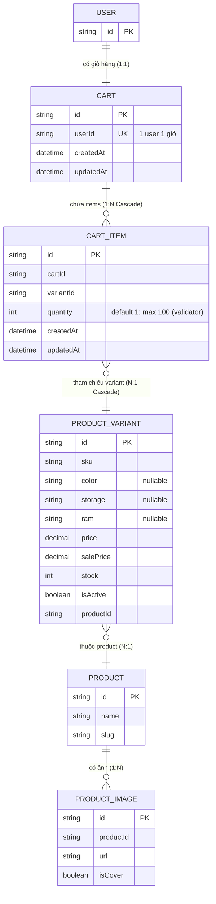

# ERD — Entity Relationship Diagram
## Module: Cart
### Dự án: Mobivexa E-Commerce Platform

> **Phiên bản:** 2.0 | **Ngày:** 2026-08-22

---

## 1. Sơ đồ ERD



---

## 2. Mô tả model

### Cart

| Cột | Ghi chú |
|---|---|
| `userId` | UNIQUE — 1 user chỉ có 1 giỏ; `upsert` tự tạo khi chưa có |

`onDelete: Cascade` từ User

### CartItem

| Cột | Ghi chú |
|---|---|
| `@@unique([cartId, variantId])` | Chặn trùng variant trong giỏ; dùng làm lookup key khi add |
| `onDelete: Cascade` từ Cart | Xóa Cart → xóa hết items |
| `onDelete: Cascade` từ ProductVariant | Xóa variant → xóa khỏi giỏ |

---

## 3. CART_INCLUDE (dùng cho GET /cart)

```
Cart {
  items (orderBy: createdAt ASC) {
    id, cartId, variantId, quantity, createdAt, updatedAt
    variant {
      id, sku, color, storage, ram, price, salePrice, stock, isActive, imageUrl
      product {
        id, name, slug
        images (where: isCover=true, take:1) { url }
      }
    }
  }
}
```

---

## 4. fetchCartSummary (dùng cho mutations)

```
cartItem.count WHERE cartId
→ { cartId, itemCount }
```

> Lean response sau mutations: FE chỉ cần `itemCount` để update badge đầu trang, không cần reload toàn bộ giỏ.
