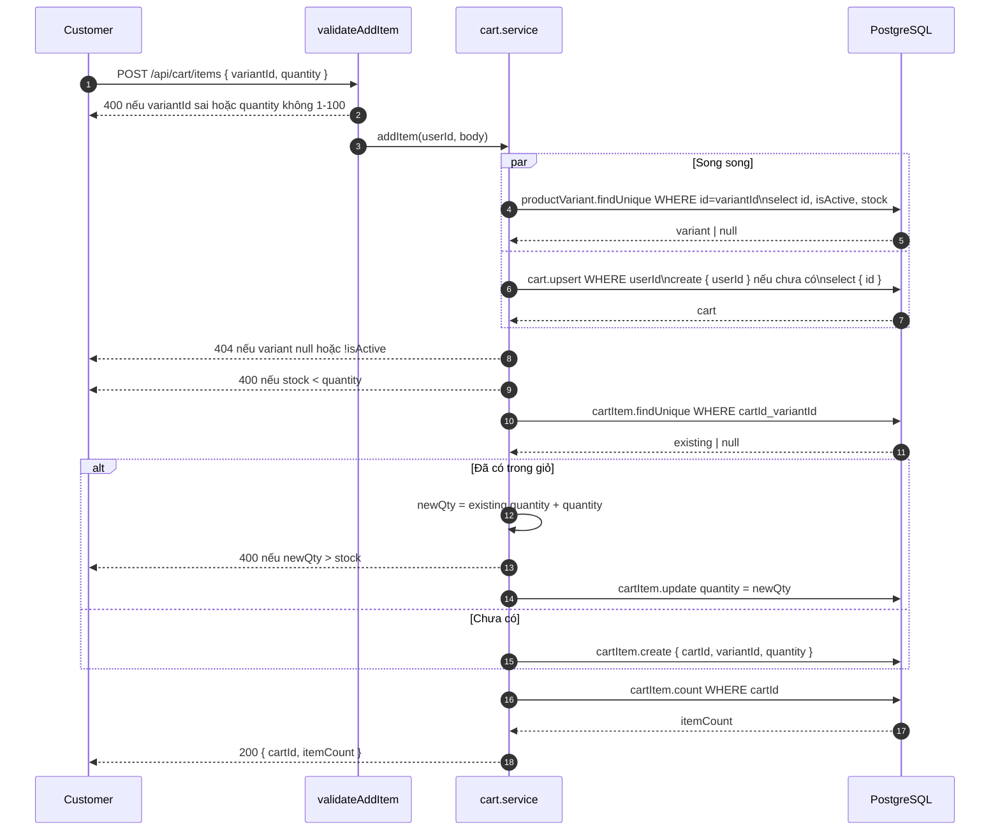
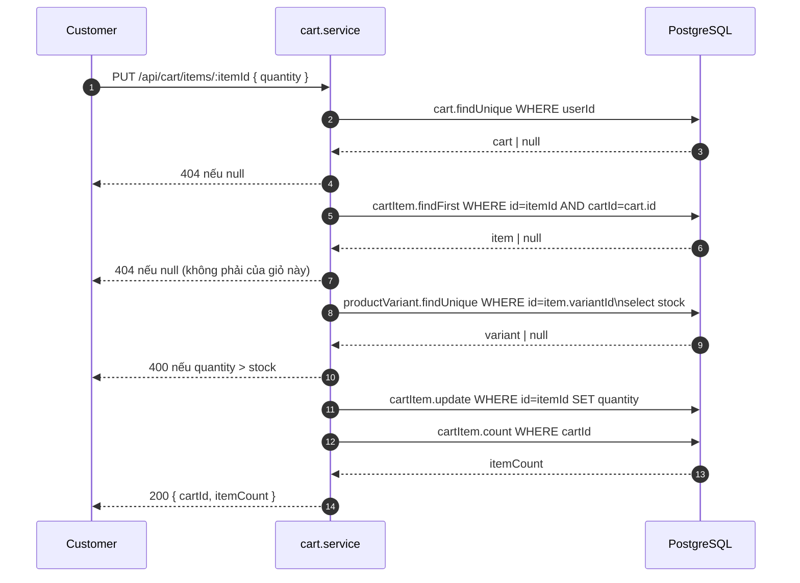

# Sequence Diagram — Luồng API
## Module: Cart
### Dự án: Mobivexa E-Commerce Platform

> **Phiên bản:** 2.0 | **Ngày:** 2026-08-22

---

## SD-01: Thêm sản phẩm vào giỏ



---

## SD-02: Xem giỏ hàng

```mermaid
sequenceDiagram
    autonumber
    participant C as Customer
    participant Svc as cart.service
    participant DB as PostgreSQL

    C->>Svc: GET /api/cart
    Svc->>DB: cart.upsert WHERE userId\ninclude items → variant → product + images
    Note over DB: Tạo giỏ mới nếu chưa có;\nkhông tạo khi đã có (update: {})
    DB-->>Svc: cart (items sắp xếp createdAt ASC)
    Svc-->>C: 200 Cart đầy đủ
```

---

## SD-03: Cập nhật số lượng


