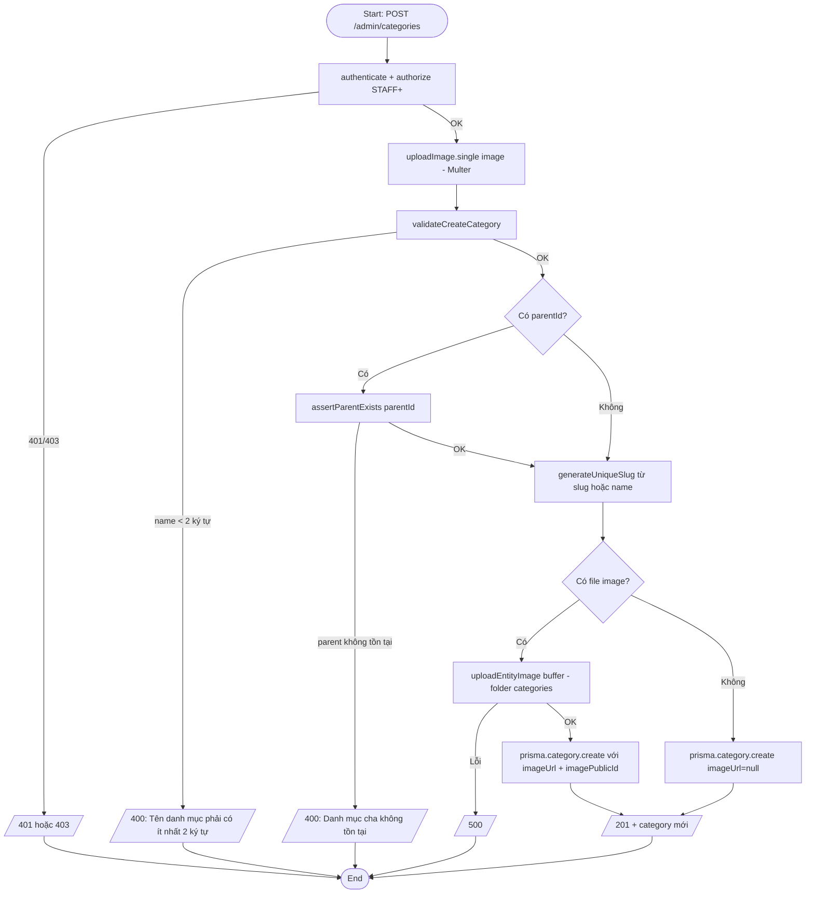
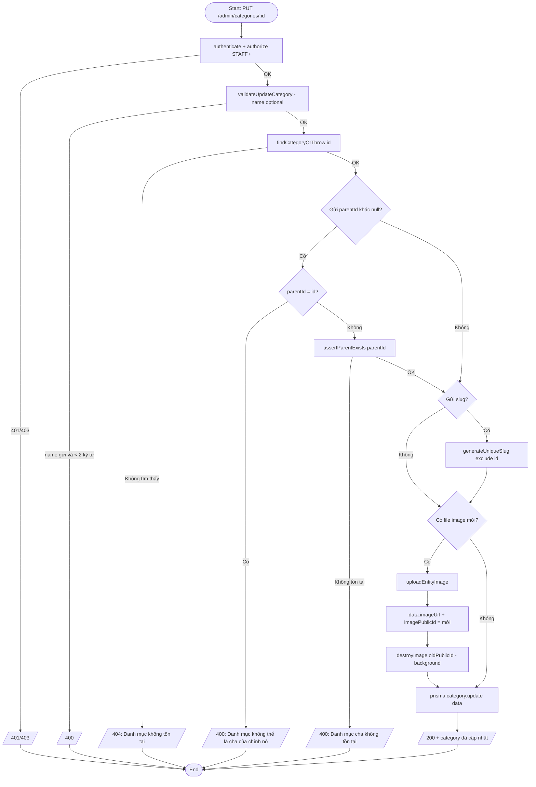
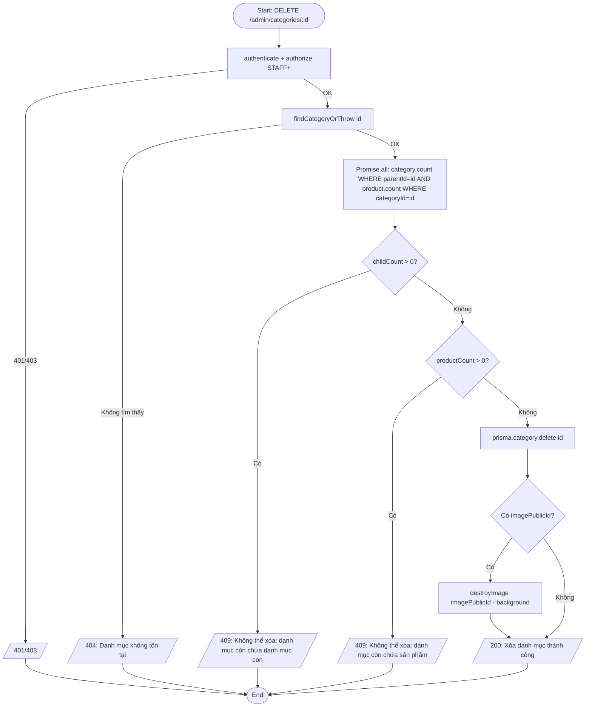
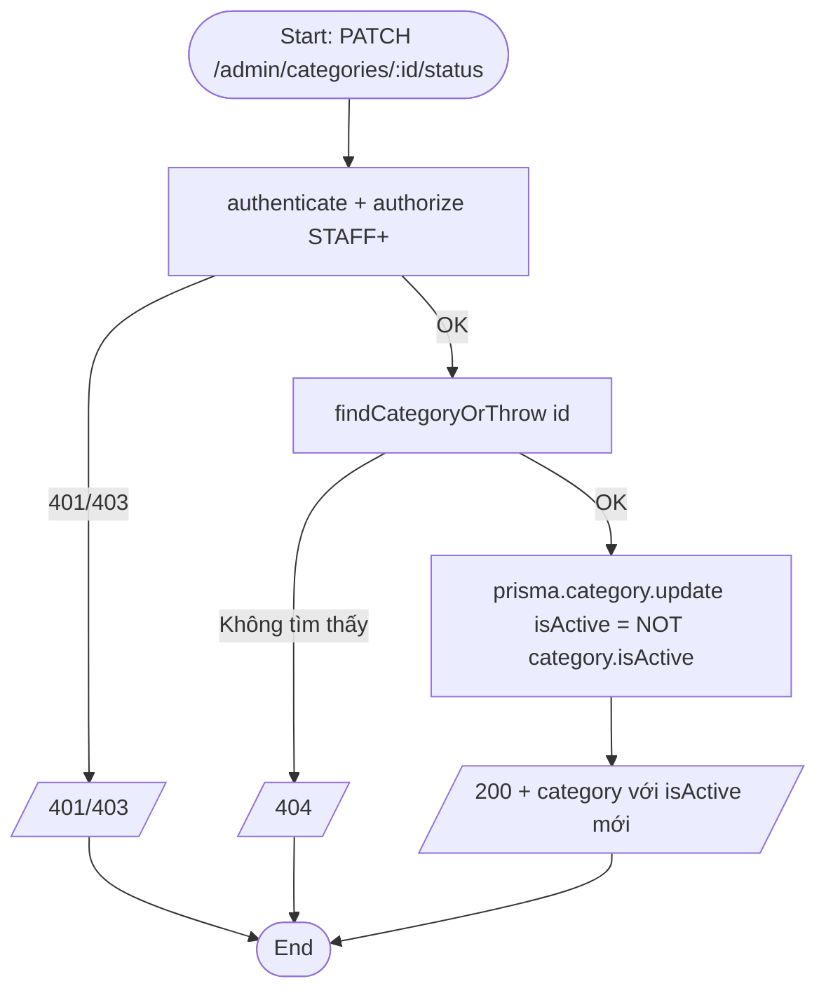
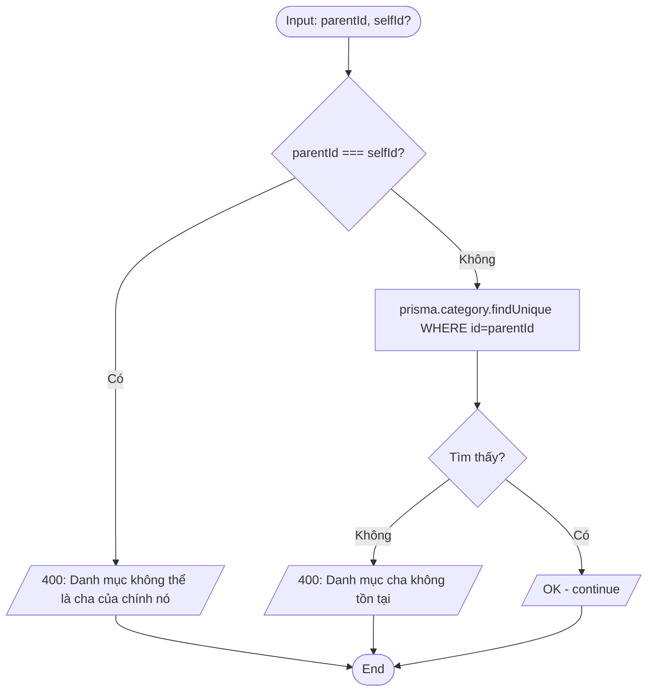
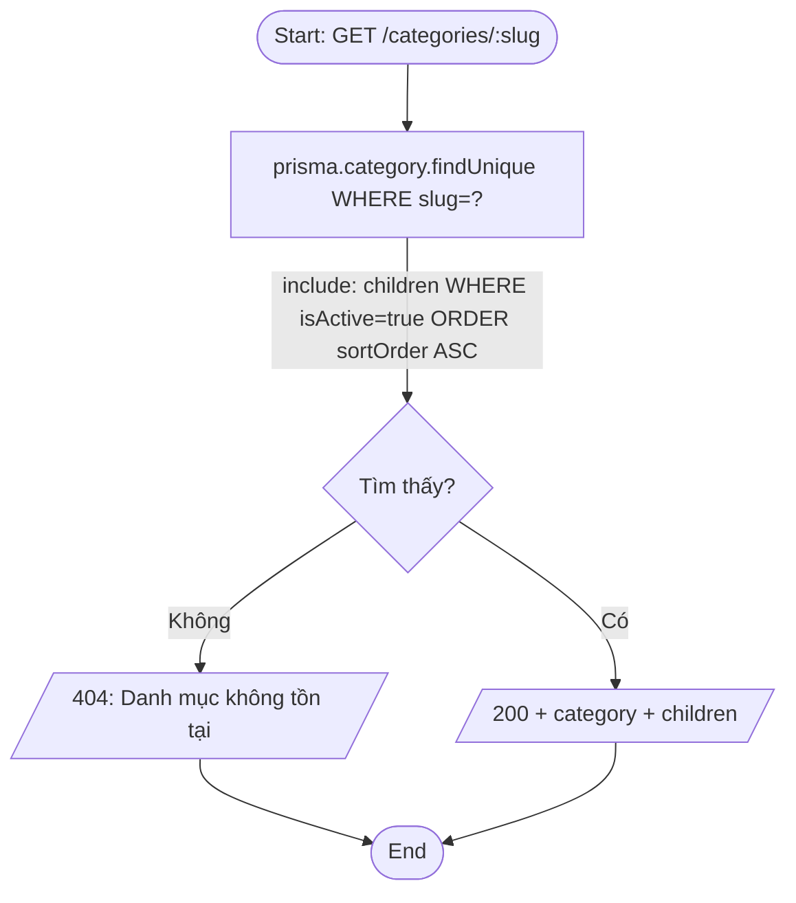

# Activity Diagram — Luồng xử lý
## Module: Category
### Dự án: Mobivexa E-Commerce Platform

> **Phiên bản:** 1.0 | **Ngày:** 2026-06-19

---

## AD-01: Tạo danh mục

---

## AD-02: Cập nhật danh mục

---

## AD-03: Xóa danh mục

---

## AD-04: Toggle trạng thái

---

## AD-05: Kiểm tra parent hợp lệ (assertParentExists)

---

## AD-06: Xem chi tiết theo slug (Public — bao gồm children)

