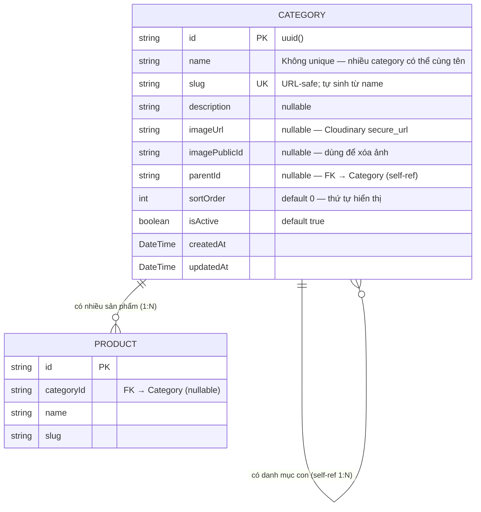

# ERD — Entity Relationship Diagram
## Module: Category
### Dự án: Mobivexa E-Commerce Platform

> **Phiên bản:** 1.0 | **Ngày:** 2026-06-19

---

## 1. Sơ đồ ERD



---

## 2. Quan hệ tự tham chiếu (Self-referential)

```
CATEGORY (parent)
    ├── id: "cat-dien-thoai"
    │   name: "Điện thoại"
    │   parentId: null         ← Root category
    │
    └── children:
        ├── id: "cat-iphone"
        │   name: "iPhone"
        │   parentId: "cat-dien-thoai"
        │
        └── id: "cat-samsung"
            name: "Samsung Galaxy"
            parentId: "cat-dien-thoai"
```

Prisma relation:
```prisma
parent   Category?  @relation("CategoryTree", fields: [parentId], references: [id])
children Category[] @relation("CategoryTree")
```

---

## 3. Mô tả chi tiết Entity Category

| Trường | Kiểu DB | Nullable | Unique | Ghi chú |
|---|---|---|---|---|
| `id` | VARCHAR (uuid) | No | PK | Auto-generated |
| `name` | VARCHAR | No | **No** | Không unique — khác Brand |
| `slug` | VARCHAR | No | Yes | Kết quả `slugify(name)`; thêm `-N` nếu trùng |
| `description` | TEXT | Yes | No | Mô tả tự do |
| `imageUrl` | TEXT | Yes | No | Cloudinary HTTPS URL |
| `imagePublicId` | TEXT | Yes | No | Dùng khi `destroyImage()` |
| `parentId` | VARCHAR | Yes | No | FK → Category.id; null = root |
| `sortOrder` | INT | No | No | Default 0; sắp thứ tự hiển thị |
| `isActive` | BOOLEAN | No | No | Default true |
| `createdAt` | TIMESTAMPTZ | No | No | Auto |
| `updatedAt` | TIMESTAMPTZ | No | No | Auto |

---

## 4. Ràng buộc xóa

| Quan hệ | Ràng buộc |
|---|---|
| Category → children | Không có `onDelete: Cascade` — kiểm tra app-level: `childCount > 0 → 409` |
| Category → Products | Không có `onDelete: Cascade` — kiểm tra app-level: `productCount > 0 → 409` |

Phải xử lý theo thứ tự:
1. Xóa/chuyển tất cả sản phẩm trong category con
2. Xóa category con
3. Sau đó mới xóa được category cha

---

## 5. So sánh Category vs Brand

| Tiêu chí | Category | Brand |
|---|---|---|
| Cấu trúc | Tree (self-ref, 2 cấp) | Flat list |
| Tên unique | ❌ (nhiều cùng tên OK) | ✅ (unique) |
| Có ảnh/logo | ✅ `imageUrl` | ✅ `logoUrl` |
| Có `sortOrder` | ✅ | ❌ |
| `parentId` | ✅ (tự tham chiếu) | ❌ |
| Xóa bị chặn | ✅ con hoặc sản phẩm | ✅ sản phẩm |
| GET chi tiết | Bao gồm `children[]` | Không có |

---

## 6. Index

| Index | Trường | Loại |
|---|---|---|
| PK | `id` | Primary |
| UK | `slug` | Unique |
| IDX | `parentId` | Foreign Key (nên có index) |
| IDX | `sortOrder` | Tối ưu ORDER BY |

---

## 7. Dữ liệu nhạy cảm

| Trường | Ghi chú |
|---|---|
| `imagePublicId` | Chỉ cần trong backend để xóa Cloudinary; không cần expose |
