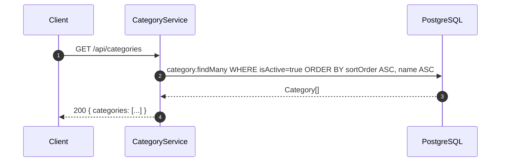
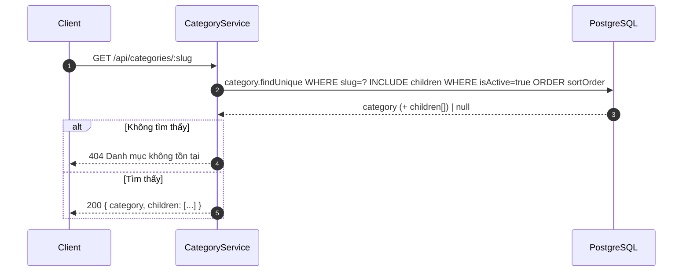
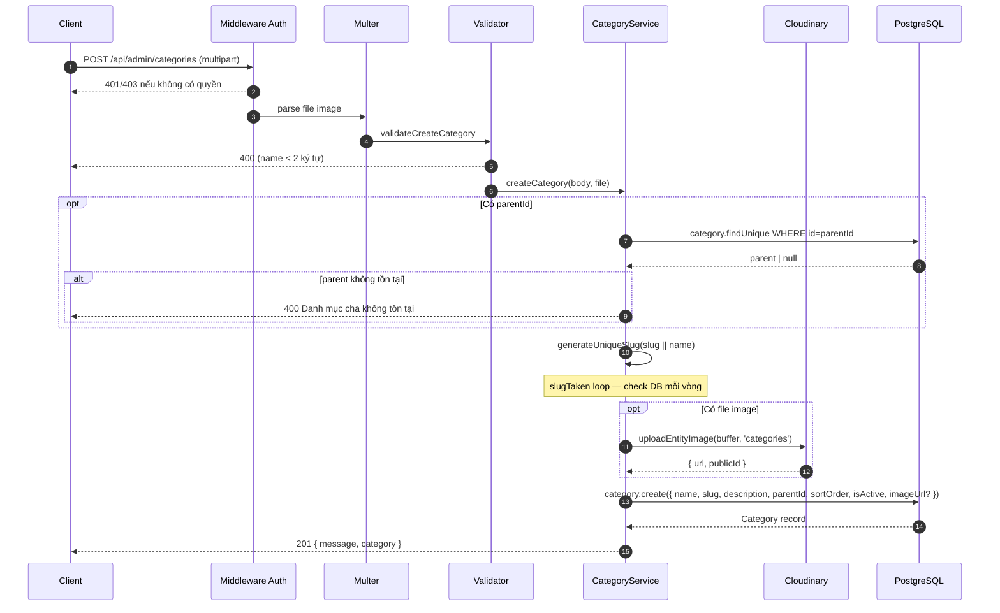
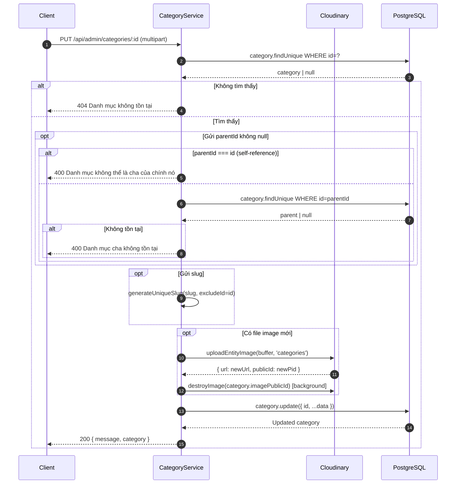
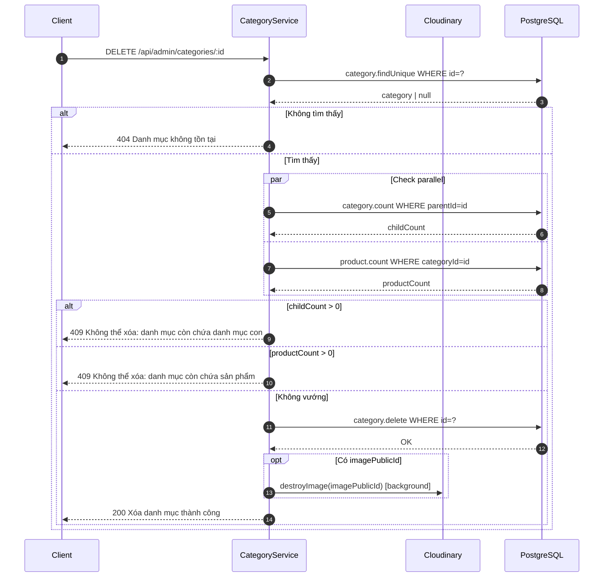
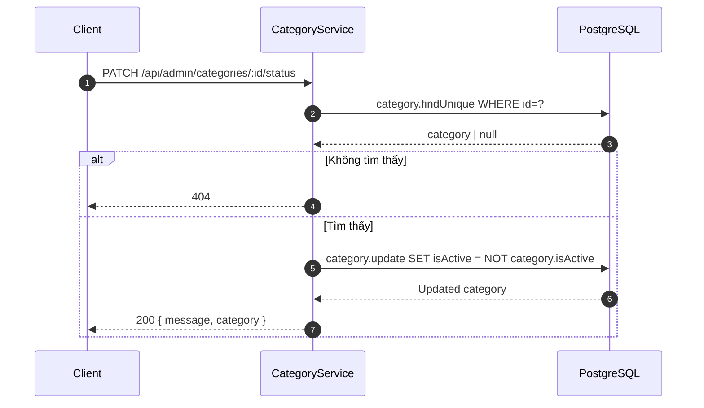

# Sequence Diagram — Luồng API
## Module: Category
### Dự án: Mobivexa E-Commerce Platform

> **Phiên bản:** 1.0 | **Ngày:** 2026-06-19

---

## SD-01: Xem danh sách danh mục (Public)

---

## SD-02: Xem chi tiết danh mục theo slug (có children)

---

## SD-03: Tạo danh mục

---

## SD-04: Cập nhật danh mục

---

## SD-05: Xóa danh mục

---

## SD-06: Toggle trạng thái

