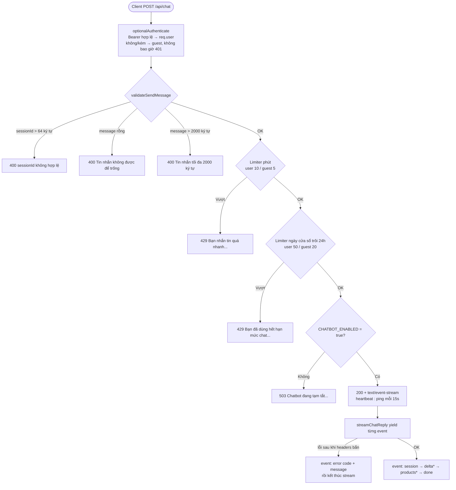
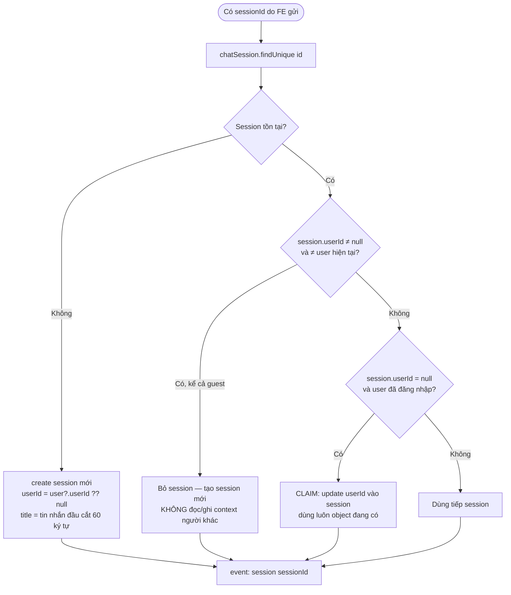
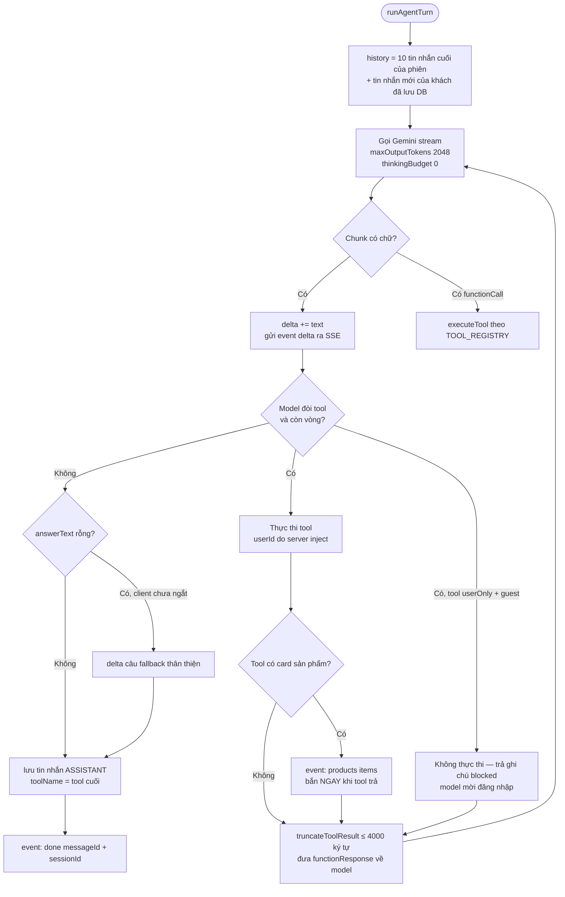
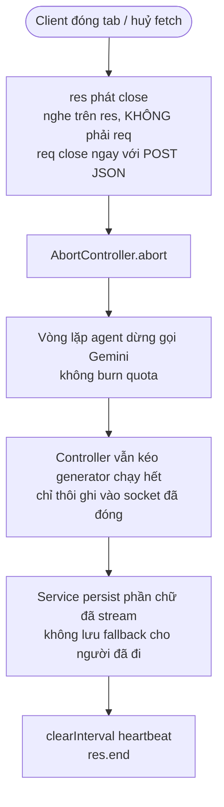

# Activity Diagram
## Module: Chat
### Dự án: Mobivexa E-Commerce Platform

> **Phiên bản:** 1.0 | **Ngày:** 2026-10-01

---

## AD-01: Luồng request POST /api/chat

> Validate đứng **trước** limiter: 400 không đốt hạn mức của guest (20/ngày).

---

## AD-02: Resolve session (ownership + claim)

---

## AD-03: Vòng agent tool-calling

> Tối đa 4 lượt gọi model / 3 vòng tool. Model 429/503 → rơi xuống model dự phòng trong chuỗi, chờ 1.2s. Lỗi cấu hình khác ném ngay, không che giấu.

---

## AD-04: Client ngắt kết nối giữa chừng

