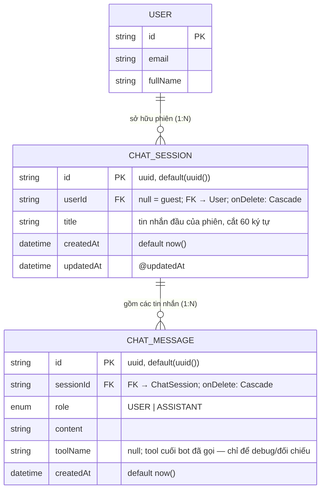

# ERD — Entity Relationship Diagram
## Module: Chat
### Dự án: Mobivexa E-Commerce Platform

> **Phiên bản:** 1.0 | **Ngày:** 2026-10-01

---

## 1. Sơ đồ ERD



---

## 2. Giải thích quan hệ

### User → ChatSession (1:N)
Một tài khoản có nhiều phiên chat.  
`userId` **nullable**: guest vẫn được chat — phiên của guest có `userId = null`, lịch sử đi theo `sessionId` do FE giữ. Đăng nhập giữa chừng → server **claim** (gắn `userId` vào session).  
`onDelete: Cascade` — xoá User → dọn toàn bộ phiên của user đó.

### ChatSession → ChatMessage (1:N)
Mỗi phiên chứa tin nhắn `USER` (khách gõ) và `ASSISTANT` (bot trả lời).  
`onDelete: Cascade` — xoá phiên → xoá hết tin nhắn trong phiên.

---

## 3. Mô tả chi tiết

### Bảng `chat_sessions` (ChatSession)

| Trường | Kiểu DB | Nullable | Ghi chú |
|---|---|---|---|
| `id` | VARCHAR(uuid) | No | PK, tự sinh |
| `userId` | VARCHAR(uuid) | **Yes** | FK → users; Cascade; null = guest |
| `title` | VARCHAR | No | Tin nhắn đầu của phiên, cắt 60 ký tự |
| `createdAt` | TIMESTAMPTZ | No | Default now() |
| `updatedAt` | TIMESTAMPTZ | No | @updatedAt — chạm mỗi lượt bot trả lời (đánh dấu phiên còn hoạt động) |

### Bảng `chat_messages` (ChatMessage)

| Trường | Kiểu DB | Nullable | Ghi chú |
|---|---|---|---|
| `id` | VARCHAR(uuid) | No | PK, tự sinh |
| `sessionId` | VARCHAR(uuid) | No | FK → chat_sessions; Cascade |
| `role` | ENUM `ChatRole` | No | `USER` = khách gõ, `ASSISTANT` = bot trả lời |
| `content` | TEXT | No | Nội dung tin nhắn |
| `toolName` | VARCHAR | Yes | Tool cuối bot đã gọi để trả lời tin này — chỉ để debug/đối chiếu |
| `createdAt` | TIMESTAMPTZ | No | Default now() |

> **Không có:** bảng quản trị riêng, đánh dấu đã đọc, đính kèm ảnh — module chat chỉ lưu hội thoại tối thiểu đủ dựng context.

---

## 4. Index

| Bảng | Index | Loại | Mục đích |
|---|---|---|---|
| `chat_sessions` | `(userId)` | B-tree | Liệt kê/tiếp tục phiên của chính mình sau khi claim |
| `chat_messages` | `(sessionId, createdAt)` | Composite | Context = N tin nhắn cuối của session: luôn đọc theo session rồi sort thời gian |

**Index `(sessionId, createdAt)` phục vụ câu query dựng context:**
```sql
SELECT * FROM chat_messages
WHERE sessionId = ?
ORDER BY createdAt DESC
LIMIT 10
```
DB seek trên `sessionId`, duyệt theo `createdAt` — ứng dụng đảo lại thành thứ tự thời gian sau khi lấy.

---

## 5. Ràng buộc Cascade

| Quan hệ | `onDelete` | Hành vi |
|---|---|---|
| User → ChatSession | Cascade | Xoá User → xoá hết phiên (kéo theo tin nhắn) |
| ChatSession → ChatMessage | Cascade | Xoá phiên → xoá hết tin nhắn trong phiên |
