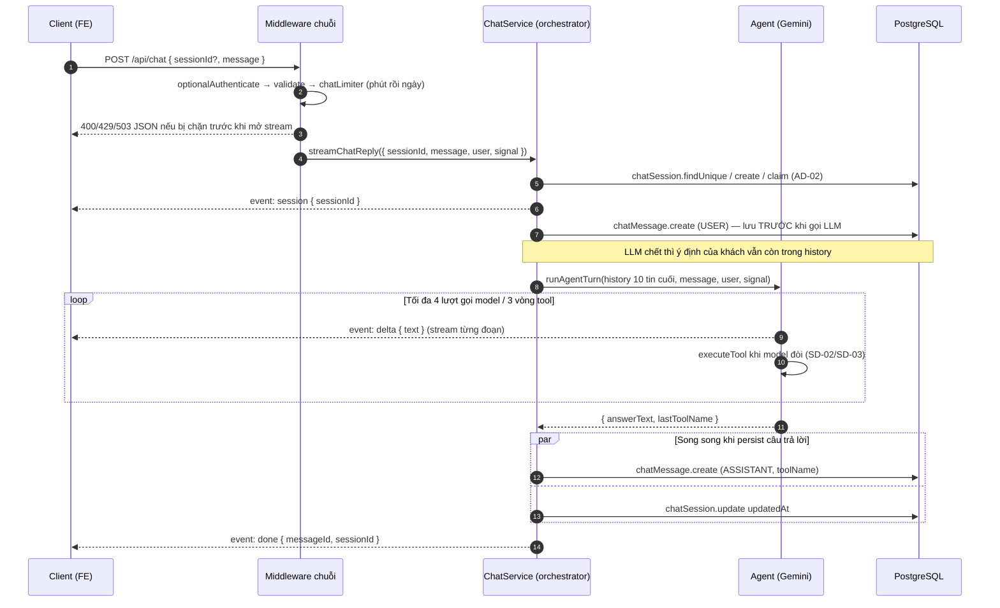
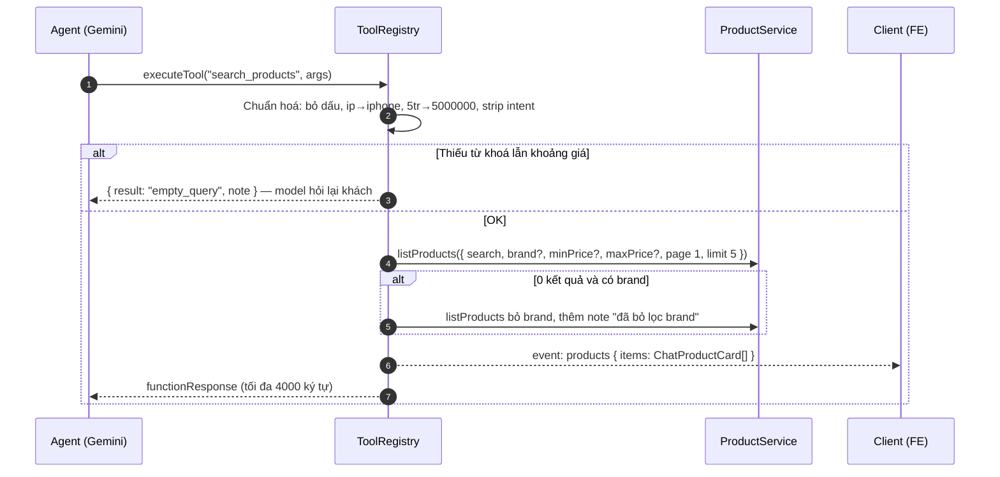
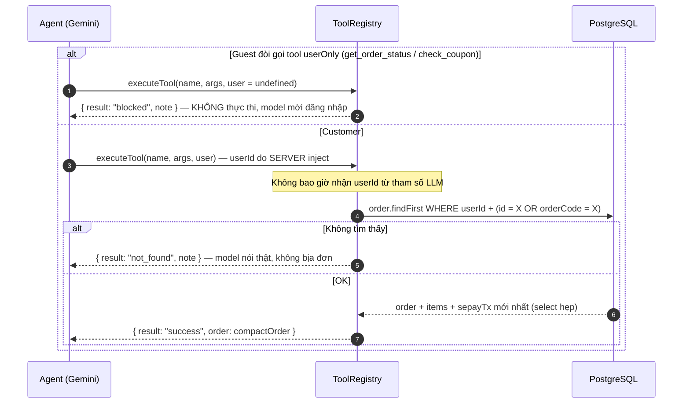
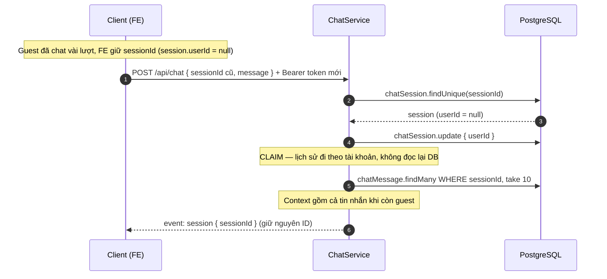
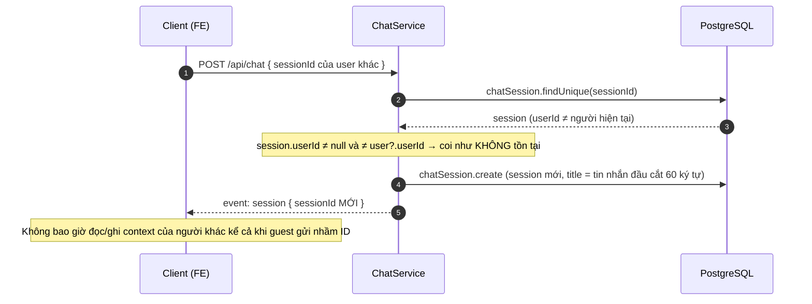

# Sequence Diagram — Luồng API
## Module: Chat
### Dự án: Mobivexa E-Commerce Platform

> **Phiên bản:** 1.0 | **Ngày:** 2026-10-01

---

## SD-01: Một lượt chat hoàn chỉnh

> Heartbeat `: ping` mỗi 15 giây trong suốt stream, chống proxy cắt kết nối tưởng chết.

---

## SD-02: Tool tìm sản phẩm — event products bắn ngay

> `ChatProductCard` = `{ id, slug, name, brand, salePrice, originalPrice, imageUrl }` — giá ưu tiên variant rẻ nhất **có giá > 0**.

---

## SD-03: Tool riêng tư — ownership bám server

> `compactOrder` trả nhãn trạng thái tiếng Việt (Chờ xác nhận / Đã xác nhận / Đang giao / Đã giao / Đã huỷ) kèm trạng thái thanh toán SePay.

---

## SD-04: Claim session — guest đăng nhập giữa chừng

---

## SD-05: Session của người khác — phủ nhận, không đọc

