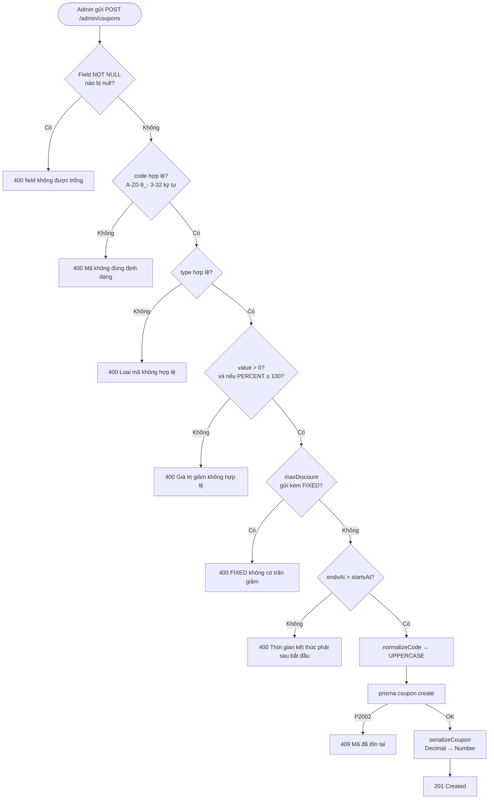
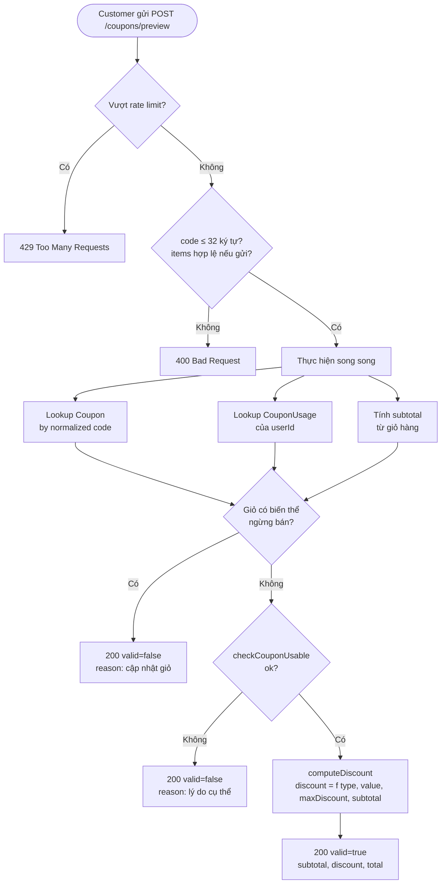
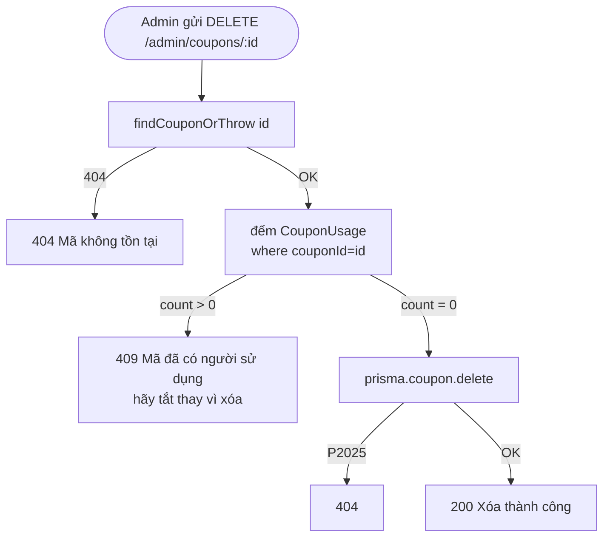
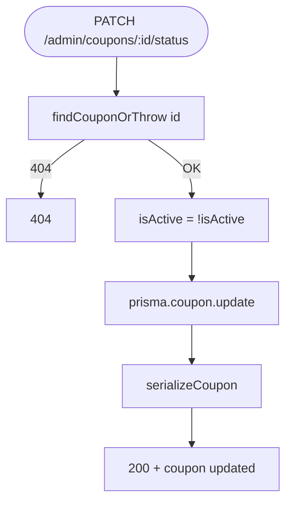
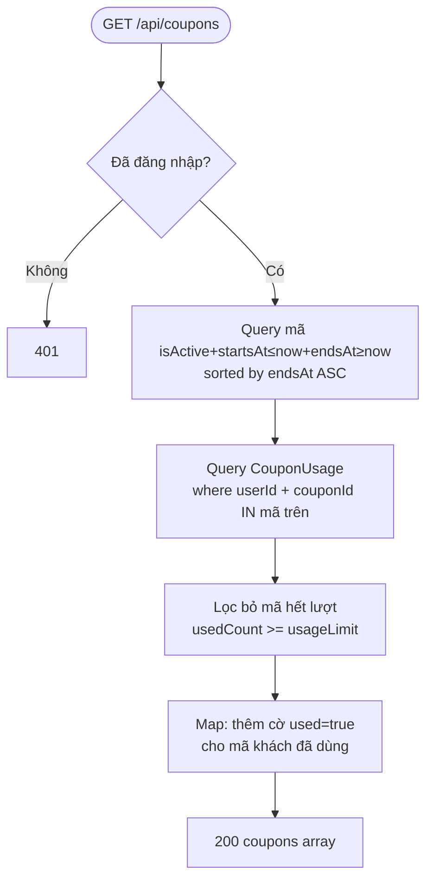

# Activity Diagram
## Module: Coupon
### Dự án: Mobivexa E-Commerce Platform

> **Phiên bản:** 1.0 | **Ngày:** 2026-08-22

---

## AD-01: Tạo mã giảm giá (Admin)

---

## AD-02: Preview mã giảm giá (Customer)

---

## AD-03: Xóa mã (Admin)

---

## AD-04: Bật / Tắt mã (Admin)

---

## AD-05: Xem danh sách mã (Customer)

