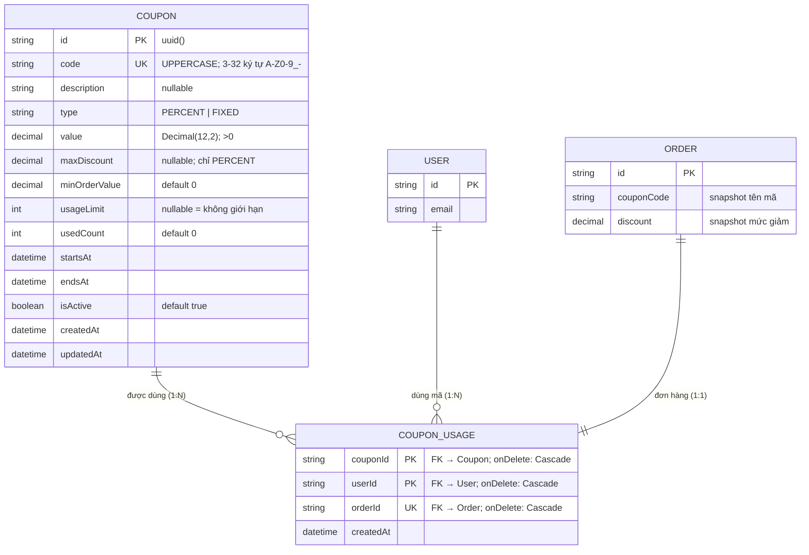

# ERD — Entity Relationship Diagram
## Module: Coupon
### Dự án: Mobivexa E-Commerce Platform

> **Phiên bản:** 1.0 | **Ngày:** 2026-08-22

---

## 1. Sơ đồ ERD

---

## 2. Giải thích quan hệ

### Coupon → CouponUsage (1:N)
Một mã có thể được nhiều khách sử dụng (mỗi người một lần).  
`onDelete: Cascade` — xóa mã → xóa toàn bộ usage.

> Nhưng app-level guard chặn xóa mã nếu đã có usage → Cascade chỉ là lưới cuối cùng.

### User → CouponUsage (1:N)
Một khách có thể dùng nhiều mã khác nhau.  
**Composite PK `(couponId, userId)`** — DB đảm bảo 1 khách chỉ dùng mỗi mã 1 lần, không thể có race condition.

### Order → CouponUsage (1:1)
`orderId UNIQUE` — một đơn dùng tối đa một mã.  
`onDelete: Cascade` — hủy đơn → xóa usage → mã khả dụng lại.

---

## 3. Mô tả chi tiết

### Bảng `Coupon`

| Trường | Kiểu DB | Nullable | Unique | Ghi chú |
|---|---|---|---|---|
| `id` | VARCHAR(uuid) | No | PK | Auto |
| `code` | VARCHAR | No | Yes | Luôn UPPERCASE |
| `description` | TEXT | Yes | No | Mô tả tuỳ chọn |
| `type` | ENUM | No | No | PERCENT \| FIXED |
| `value` | DECIMAL(12,2) | No | No | > 0 |
| `maxDiscount` | DECIMAL(12,2) | Yes | No | Chỉ có nghĩa với PERCENT |
| `minOrderValue` | DECIMAL(12,2) | No | No | Default 0 |
| `usageLimit` | INTEGER | Yes | No | null = vô hạn |
| `usedCount` | INTEGER | No | No | Default 0 |
| `startsAt` | TIMESTAMPTZ | No | No | |
| `endsAt` | TIMESTAMPTZ | No | No | |
| `isActive` | BOOLEAN | No | No | Default true |

### Bảng `CouponUsage`

| Trường | Kiểu DB | Nullable | Unique | Ghi chú |
|---|---|---|---|---|
| `couponId` | VARCHAR | No | PK part | FK → coupons |
| `userId` | VARCHAR | No | PK part | FK → users |
| `orderId` | VARCHAR | No | Yes | FK → orders; 1 đơn 1 mã |

---

## 4. Index

| Index | Trường | Loại | Mục đích |
|---|---|---|---|
| PK | `id` | Primary | Tra cứu theo id |
| UK | `code` | Unique | Tra cứu mã + tránh trùng |
| IDX | `(isActive, startsAt, endsAt)` | Composite | Query "mã đang chạy" |
| PK | `(couponId, userId)` | Primary (CouponUsage) | Ràng buộc 1 lượt/khách/mã |
| UK | `orderId` | Unique (CouponUsage) | 1 đơn 1 mã |
| IDX | `userId` | Index (CouponUsage) | Lookup usage theo user |

---

## 5. Luật nghiệp vụ thể hiện qua schema

| Luật | Cơ chế |
|---|---|
| 1 khách dùng mỗi mã 1 lần | Composite PK `(couponId, userId)` |
| 1 đơn dùng tối đa 1 mã | `orderId UNIQUE` trên CouponUsage |
| Hủy đơn → trả lại lượt mã | `orderId onDelete: Cascade` |
| Xóa mã → xóa usage | `couponId onDelete: Cascade` |
| Code case-insensitive | Lưu UPPERCASE, query UPPERCASE |
