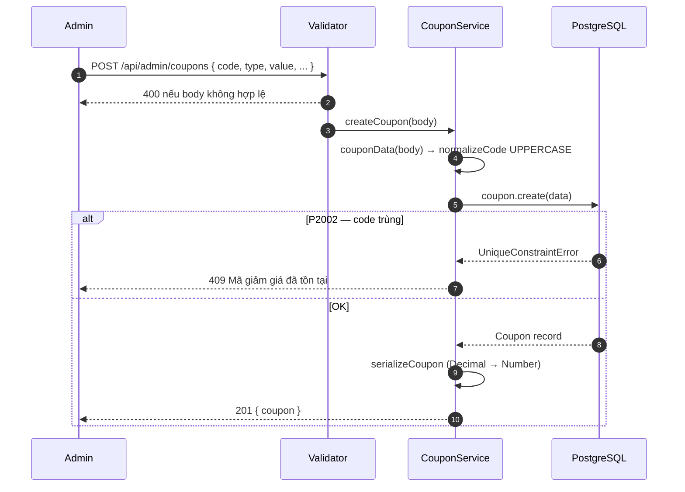
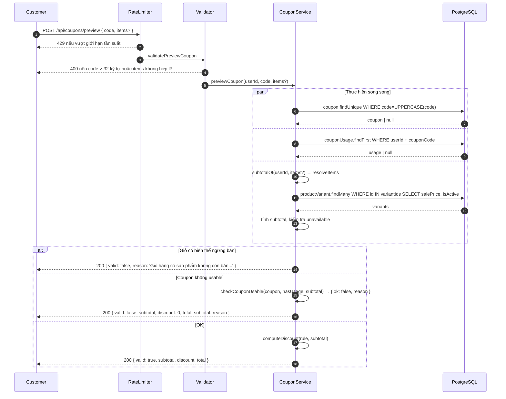
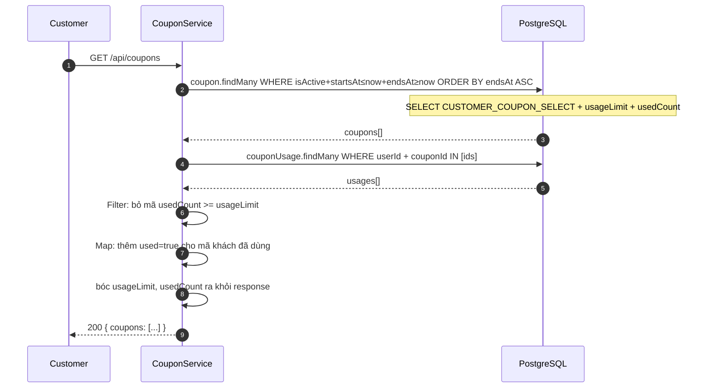
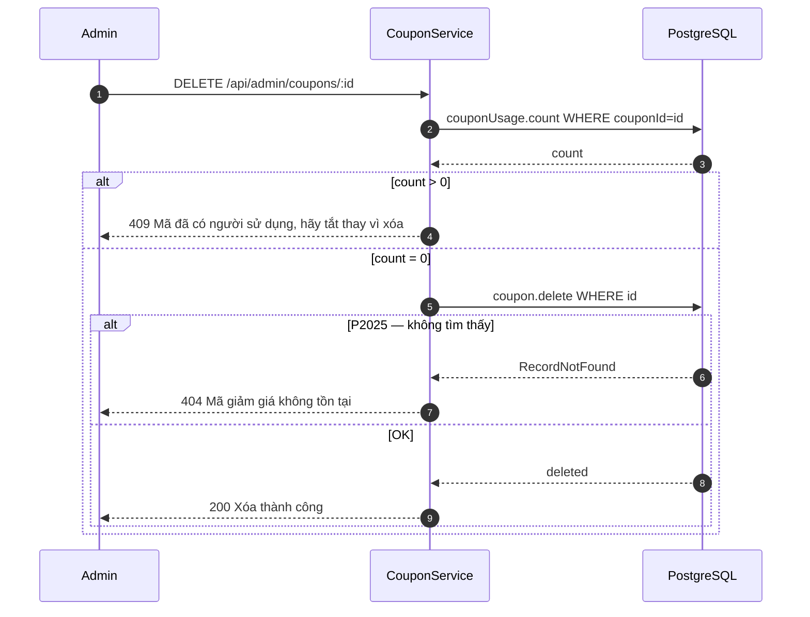
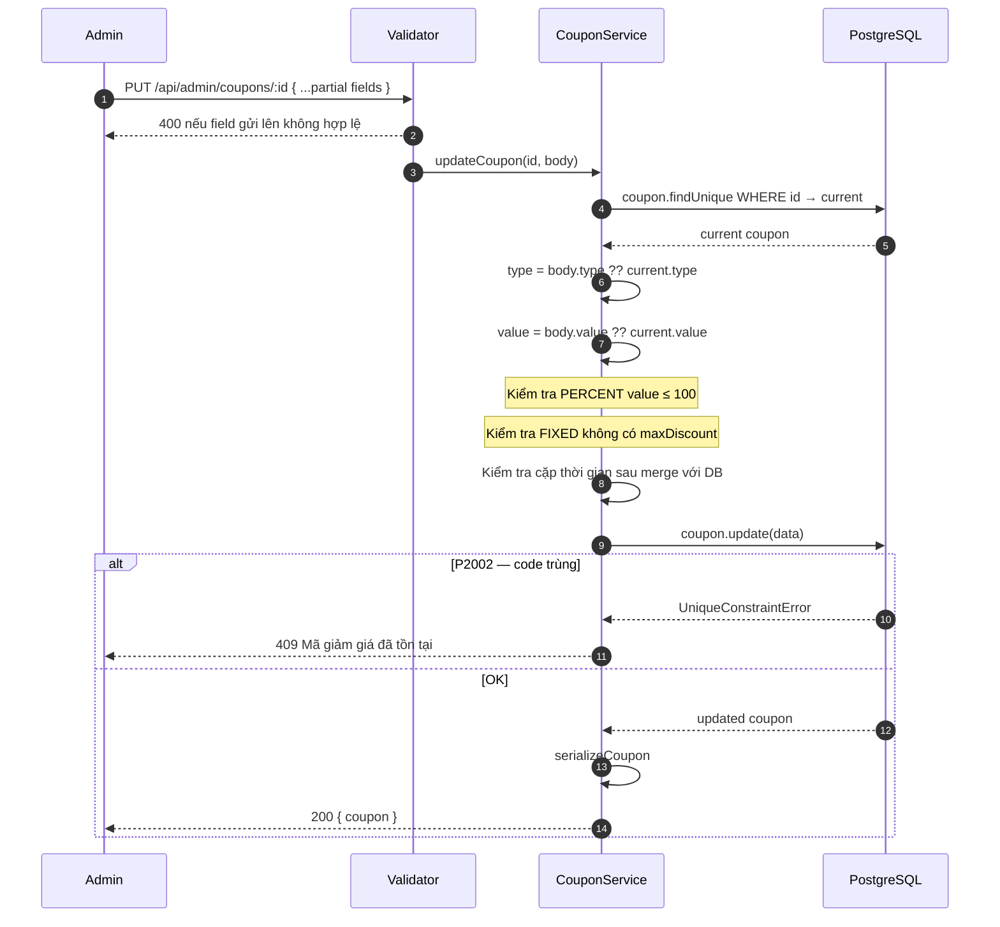

# Sequence Diagram — Luồng API
## Module: Coupon
### Dự án: Mobivexa E-Commerce Platform

> **Phiên bản:** 1.0 | **Ngày:** 2026-08-22

---

## SD-01: Tạo mã giảm giá (Admin)

---

## SD-02: Preview mã giảm giá (Customer)

---

## SD-03: Xem danh sách mã (Customer)

---

## SD-04: Xóa mã (Admin)

---

## SD-05: Cập nhật mã (Admin — partial update)

