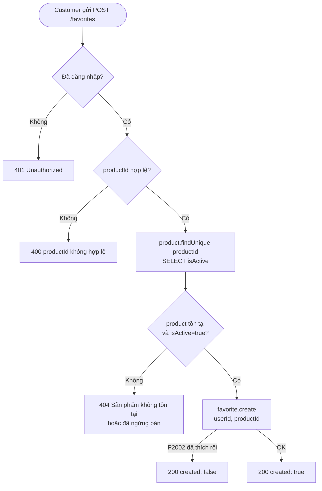
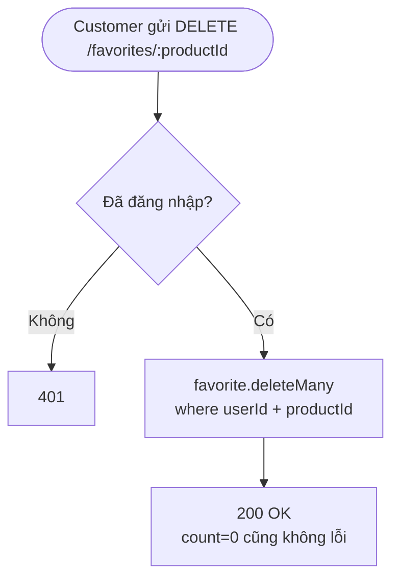
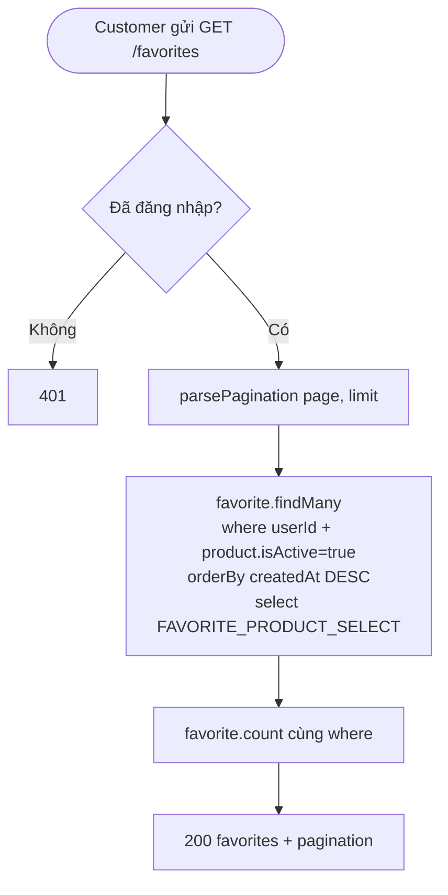
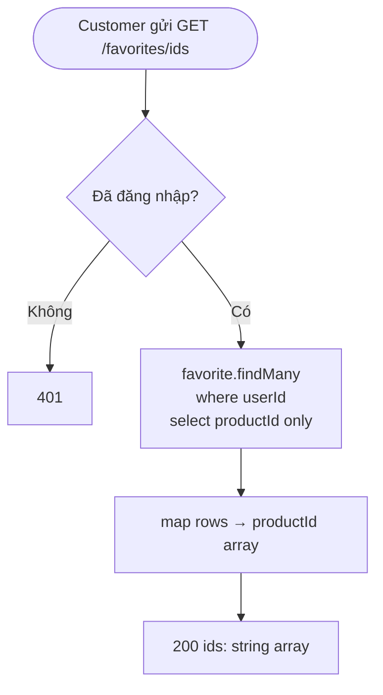
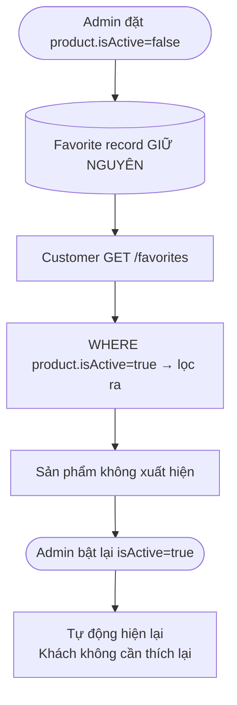

# Activity Diagram
## Module: Favorite
### Dự án: Mobivexa E-Commerce Platform

> **Phiên bản:** 1.0 | **Ngày:** 2026-08-22

---

## AD-01: Thêm yêu thích

---

## AD-02: Bỏ yêu thích

---

## AD-03: Xem danh sách yêu thích

---

## AD-04: Lấy danh sách ID yêu thích

---

## AD-05: Sản phẩm bị ẩn (Admin tắt)

