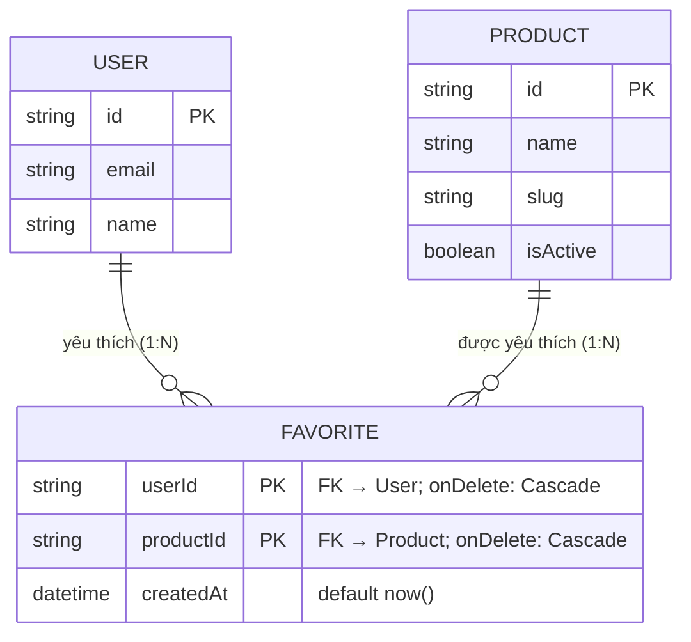

# ERD — Entity Relationship Diagram
## Module: Favorite
### Dự án: Mobivexa E-Commerce Platform

> **Phiên bản:** 1.0 | **Ngày:** 2026-08-22

---

## 1. Sơ đồ ERD



---

## 2. Giải thích quan hệ

### User → Favorite (1:N)
Một khách có thể thích nhiều sản phẩm.  
`onDelete: Cascade` — xóa User → xóa toàn bộ Favorite của user đó.

### Product → Favorite (1:N)
Một sản phẩm có thể được nhiều khách thích.  
`onDelete: Cascade` — xóa Product → xóa toàn bộ Favorite của sản phẩm đó.

### Composite PK `(userId, productId)`
- Ngăn thích trùng ở DB level
- P2002 = đã thích rồi → service trả `{created: false}` thay vì 409

---

## 3. Mô tả chi tiết

### Bảng `Favorite`

| Trường | Kiểu DB | Nullable | Unique | Ghi chú |
|---|---|---|---|---|
| `userId` | VARCHAR(uuid) | No | PK part | FK → users; Cascade |
| `productId` | VARCHAR(uuid) | No | PK part | FK → products; Cascade |
| `createdAt` | TIMESTAMPTZ | No | No | Tự gán |

> **Không có:** `id` riêng, `updatedAt`, `note`, `priority` — đơn giản tối đa.

---

## 4. Index

| Index | Trường | Loại | Mục đích |
|---|---|---|---|
| PK | `(userId, productId)` | Composite Primary | Tra cứu nhanh, tránh trùng |
| IDX | `(userId, createdAt)` | Composite | Phục vụ trọn query: lọc user + sort mới nhất |

**Index `(userId, createdAt)` phục vụ câu query:**
```sql
SELECT * FROM favorites
WHERE userId = ?
ORDER BY createdAt DESC
LIMIT 20 OFFSET 0
```
DB seek trên `userId`, duyệt theo `createdAt` — không sort lại sau khi lọc.

---

## 5. Ràng buộc Cascade

| Quan hệ | `onDelete` | Hành vi |
|---|---|---|
| User → Favorite | Cascade | Xóa User → xóa hết favorites của user |
| Product → Favorite | Cascade | Xóa Product → xóa hết favorites của sản phẩm |

---

## 6. Hành vi khi Product bị ẩn (isActive=false)

```
Admin: product.update(isActive=false)
         │
         ▼
  Favorite record GIỮ NGUYÊN trong DB
         │
  GET /favorites: WHERE product.isActive=true → lọc ra
         │
  Admin: product.update(isActive=true)
         │
  GET /favorites: Product xuất hiện lại tự động
```

**Thiết kế có chủ ý:** giữ bản ghi để không mất wishlist của khách khi sản phẩm tạm ẩn.

---

## 7. So sánh với các module tương tự

| Tiêu chí | Favorite | ReviewHelpful | ProductTag |
|---|---|---|---|
| Composite PK | `(userId, productId)` | `(userId, reviewId)` | `(productId, tagId)` |
| onDelete cả hai FK | Cascade | Cascade | Cascade |
| Có createdAt | ✅ | ❌ | ❌ |
| Thêm idempotent | P2002 → `{created:false}` | N/A | N/A |
| Xóa idempotent | deleteMany | N/A | N/A |
