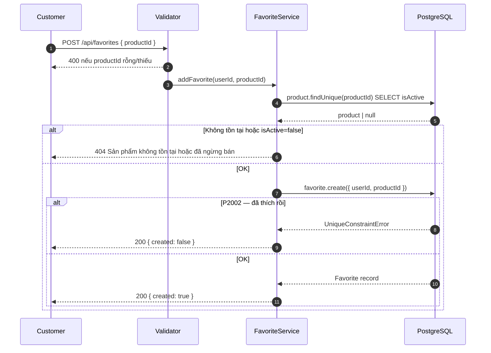
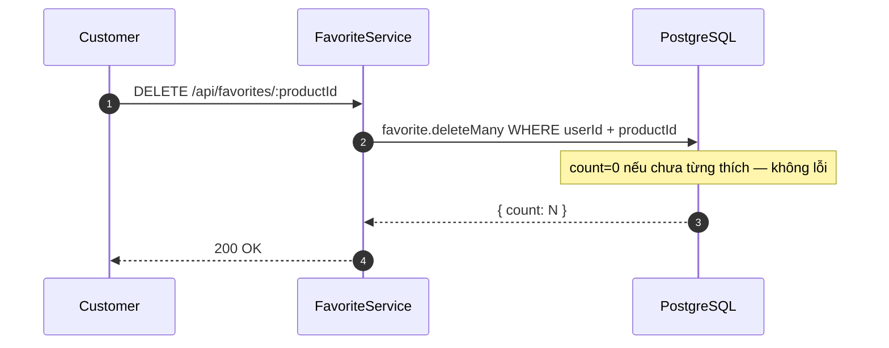
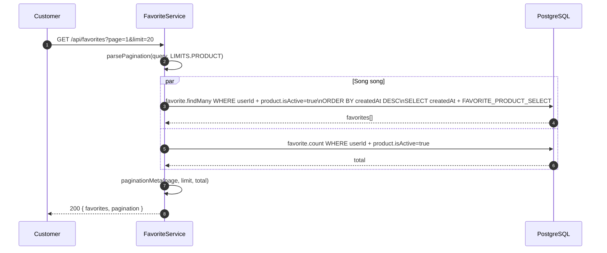
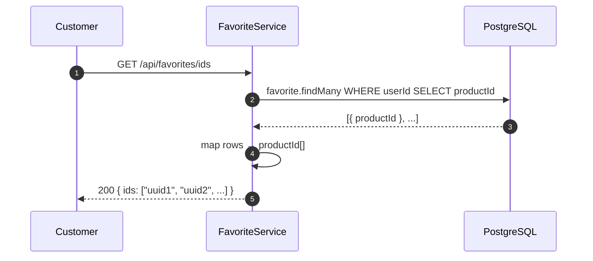
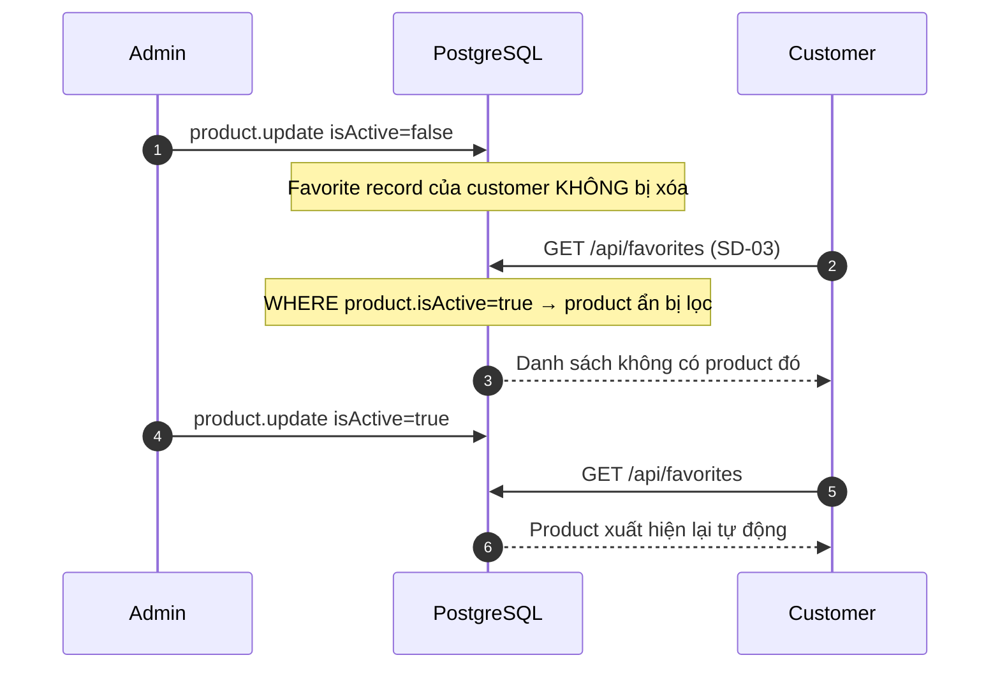

# Sequence Diagram — Luồng API
## Module: Favorite
### Dự án: Mobivexa E-Commerce Platform

> **Phiên bản:** 1.0 | **Ngày:** 2026-08-22

---

## SD-01: Thêm yêu thích

---

## SD-02: Bỏ yêu thích

---

## SD-03: Xem danh sách yêu thích

> `FAVORITE_PRODUCT_SELECT` = `{ id, name, slug, brand, variants(active, sortByPrice), images(cover) }` — khớp `listProducts`.

---

## SD-04: Lấy danh sách ID yêu thích

> Không phân trang. FE dùng mảng này để đối chiếu và tô tim trên mọi card.

---

## SD-05: Product bị ẩn — ảnh hưởng đến danh sách

