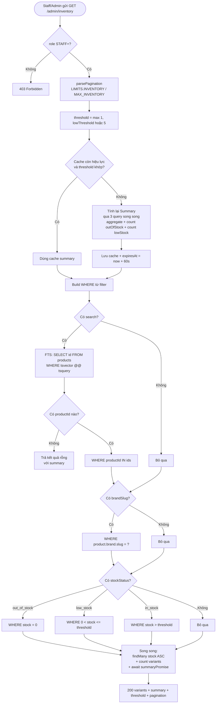
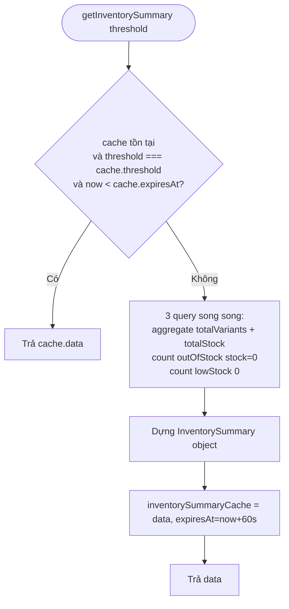

# Activity Diagram
## Module: Inventory
### Dự án: Mobivexa E-Commerce Platform

> **Phiên bản:** 1.0 | **Ngày:** 2026-08-22

---

## AD-01: Xem tồn kho (tổng quan)

---

## AD-02: In-memory Cache cho Summary

