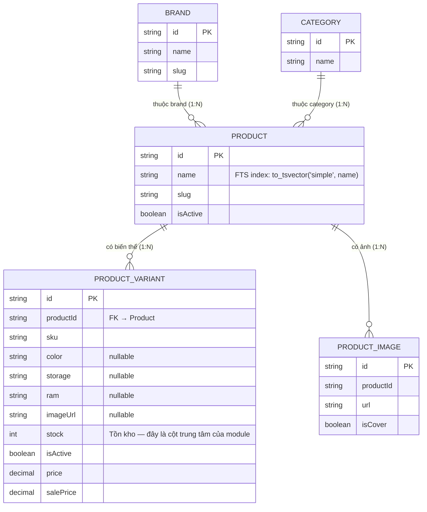

# ERD — Entity Relationship Diagram
## Module: Inventory
### Dự án: Mobivexa E-Commerce Platform

> **Phiên bản:** 1.0 | **Ngày:** 2026-08-22

---

## 1. Sơ đồ ERD



---

## 2. Cột tồn kho

| Cột | Bảng | Kiểu | Ghi chú |
|---|---|---|---|
| `stock` | `ProductVariant` | INTEGER | Số lượng tồn kho hiện tại |

**Cập nhật stock qua:**
- `Order.create` → giảm tồn khi đặt hàng
- `PATCH /api/admin/products/:id/variants/:variantId` → admin cập nhật trực tiếp
- Stock không âm được (DB constraint hoặc app-level check)

---

## 3. Phân loại tồn kho theo ngưỡng

```
stock = 0                  → out_of_stock
0 < stock <= threshold     → low_stock
stock > threshold          → in_stock

Mặc định: threshold = 5
```

---

## 4. Fields trả về trong Inventory

```
ProductVariant:
  id, sku, color, storage, ram
  imageUrl, stock, isActive, salePrice

  product: {
    id, name, slug
    category: { name }
    brand:    { name }
    images:   [{ url }]  -- isCover=true, take:1
  }
```

> Không trả `price` (chỉ `salePrice`) — inventory không cần giá gốc.

---

## 5. Index liên quan

| Index | Bảng | Mục đích |
|---|---|---|
| FTS index | `products.name` | `to_tsvector('simple', name)` — tìm theo tên |
| IDX `stock` | `product_variants` | Sort `stock ASC`, filter `stock = 0` / range |
| IDX `productId` | `product_variants` | Join lên products |

---

## 6. Summary Cache (in-memory, không phải DB)

| Thuộc tính | Giá trị |
|---|---|
| Kiểu | In-process module-level variable |
| TTL | 60 giây |
| Key | `threshold` (mỗi ngưỡng cache riêng) |
| Invalidation | Hết TTL — không invalidate khi stock thay đổi |
| Scope | Per process — không share giữa nhiều instance |
