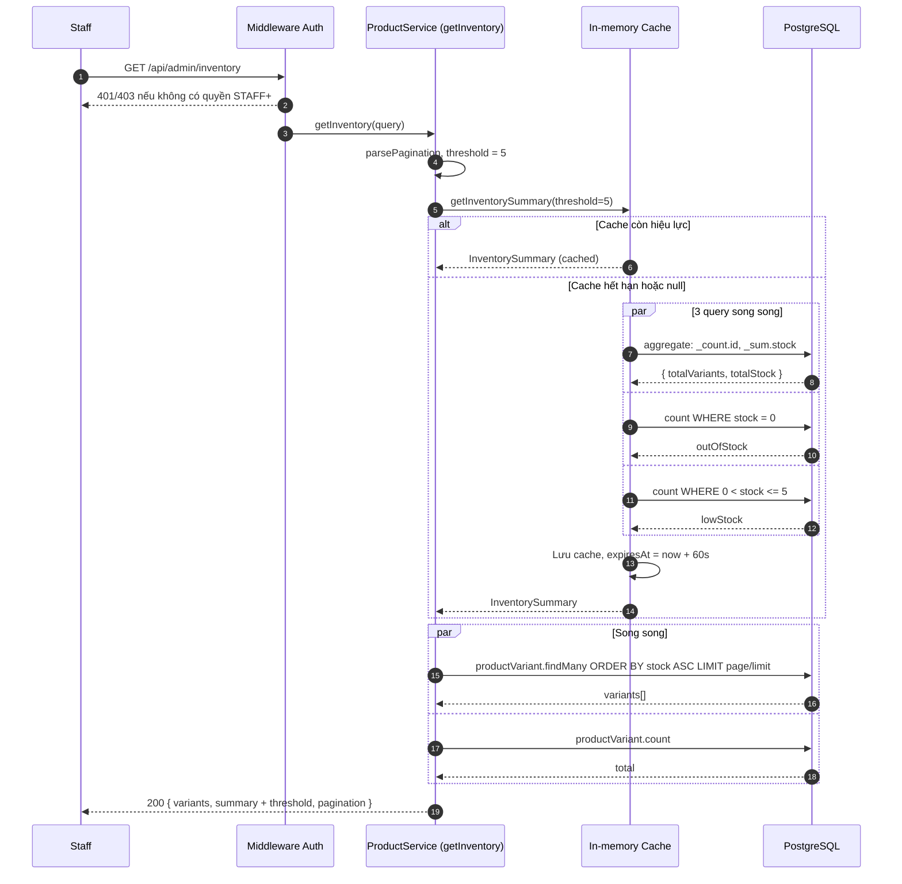
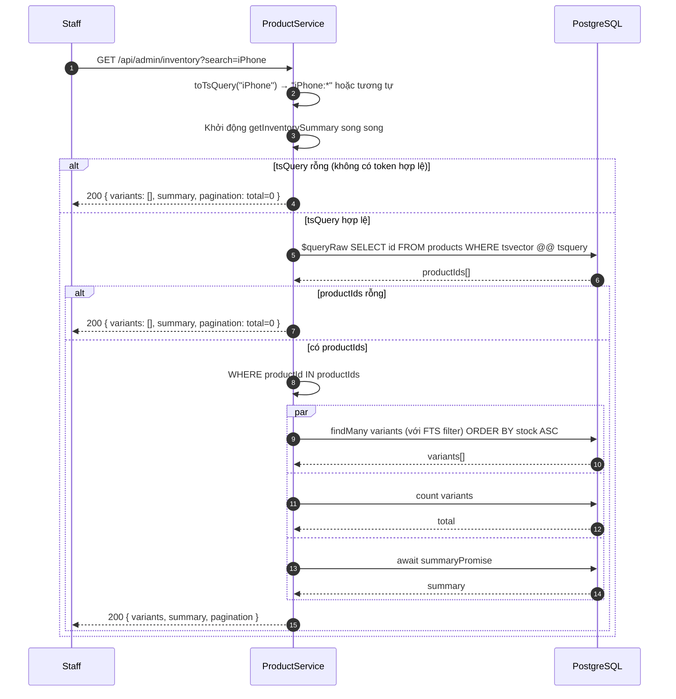
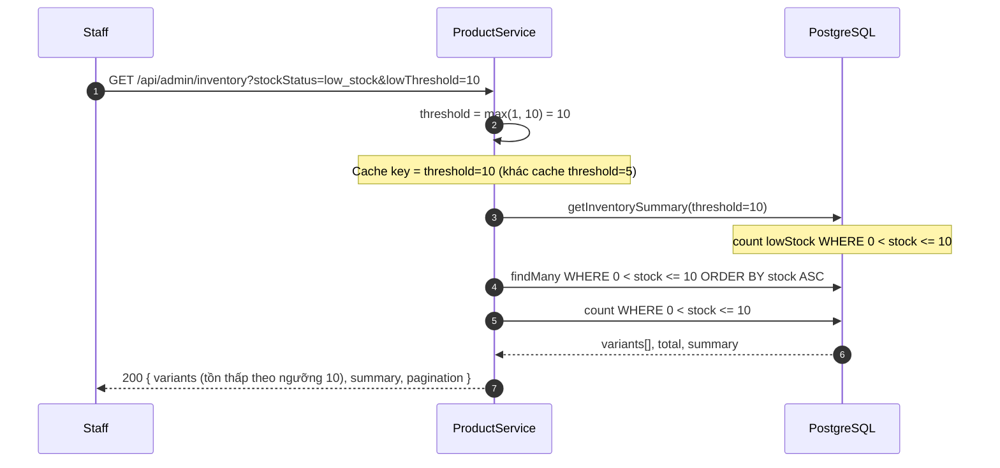

# Sequence Diagram — Luồng API
## Module: Inventory
### Dự án: Mobivexa E-Commerce Platform

> **Phiên bản:** 1.0 | **Ngày:** 2026-08-22

---

## SD-01: Xem tồn kho (không có filter)

---

## SD-02: Xem tồn kho với Full Text Search

---

## SD-03: Lọc low_stock với ngưỡng tùy chỉnh

