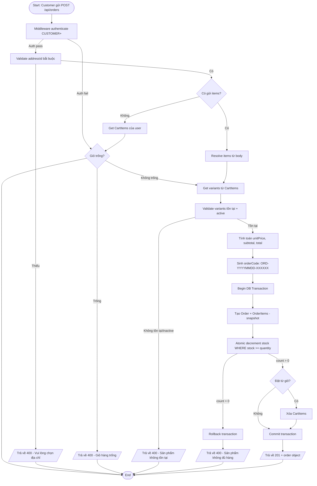
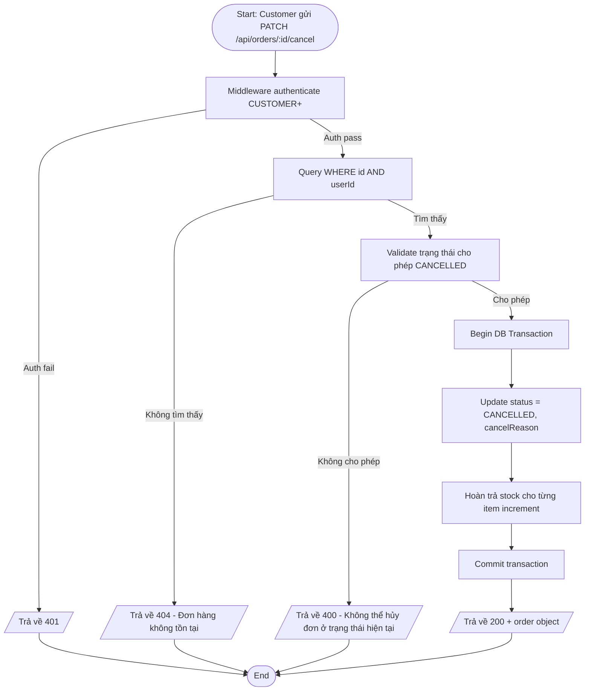
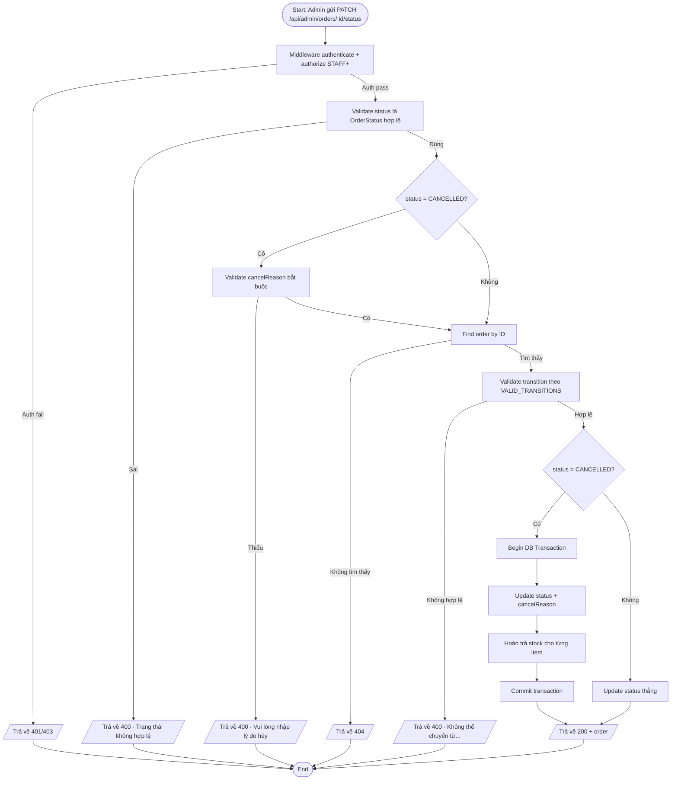
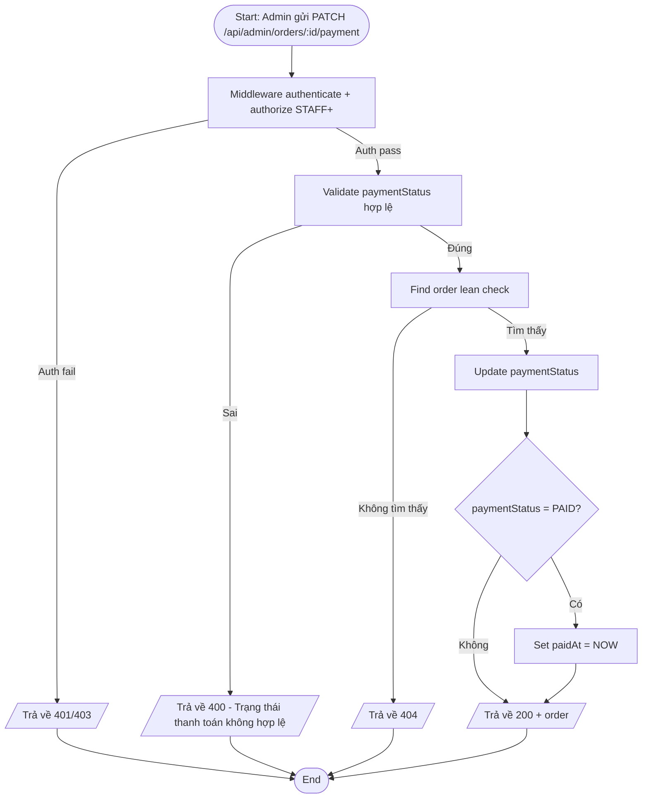
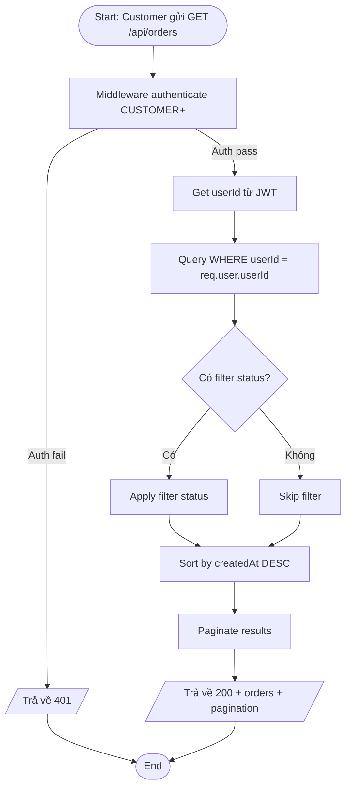
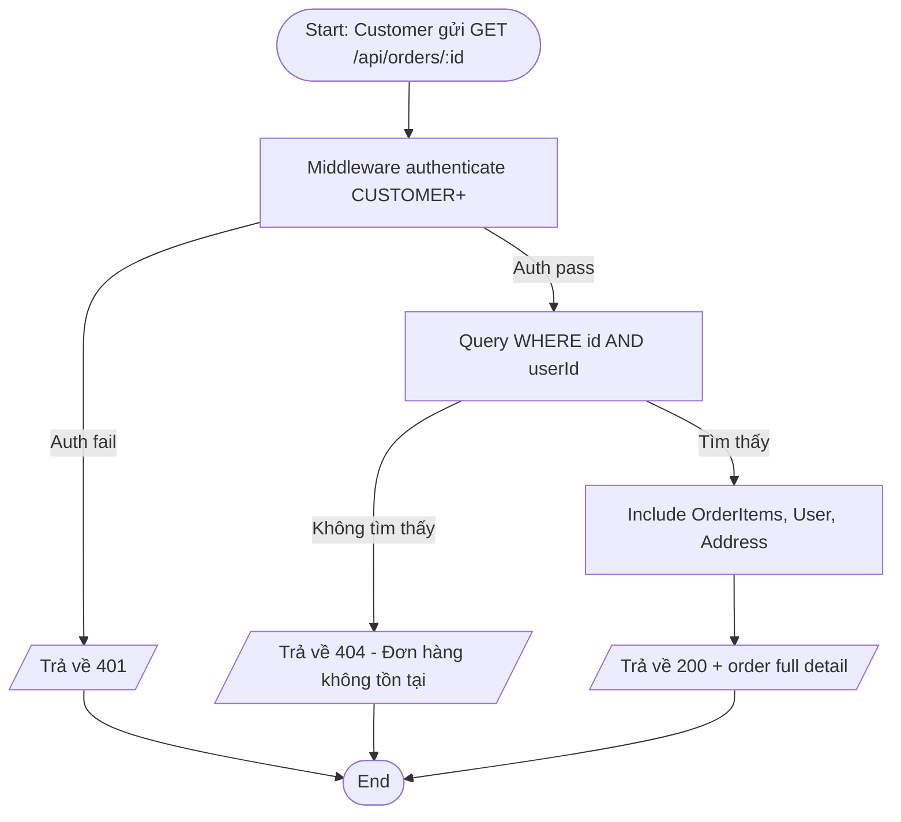
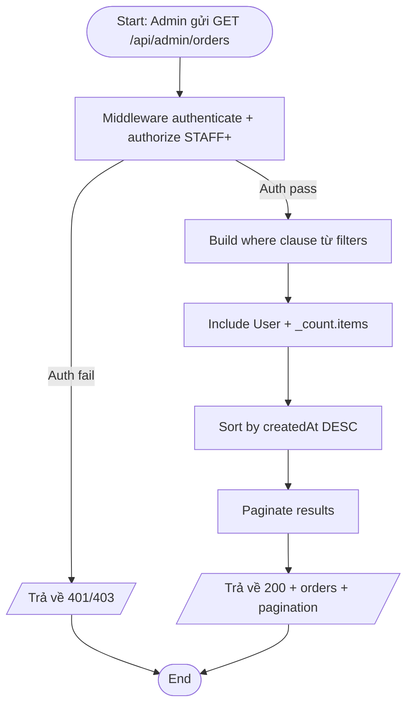
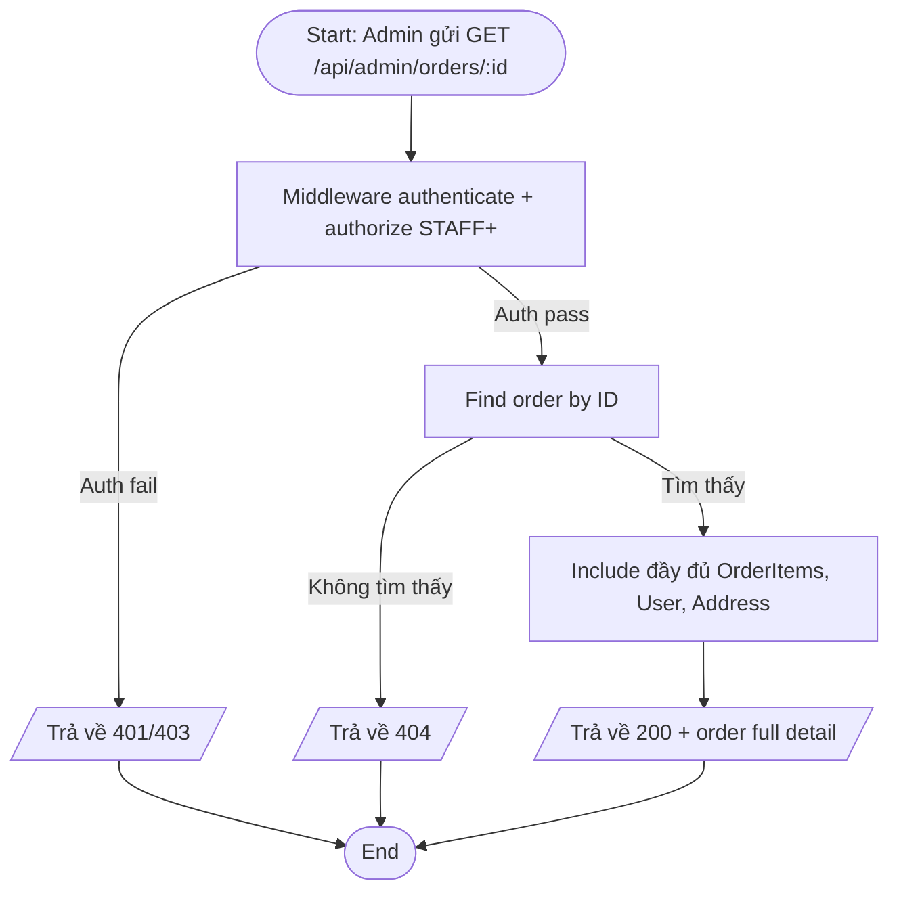
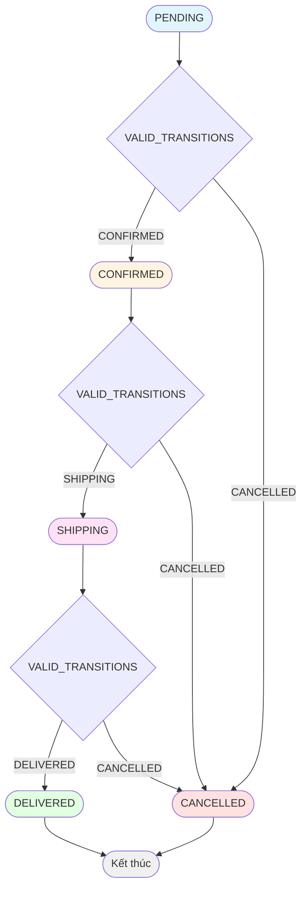

# Activity Diagram — Luồng xử lý
## Module: Order (Đơn hàng)
### Dự án: Mobivexa E-Commerce Platform

> **Phiên bản:** 1.0  
> **Ngày:** 2026-06-19  
> **Ghi chú:** Sử dụng cú pháp Mermaid — render trên GitHub, GitLab, Obsidian, VSCode

---

## AD-01: Đặt hàng từ giỏ hàng

---

## AD-02: Hủy đơn hàng (Customer)

---

## AD-03: Admin cập nhật trạng thái đơn hàng

---

## AD-04: Admin cập nhật thanh toán

---

## AD-05: Xem danh sách đơn của tôi

---

## AD-06: Xem chi tiết đơn hàng của tôi

---

## AD-07: Admin xem danh sách tất cả đơn

---

## AD-08: Admin xem chi tiết đơn hàng bất kỳ

---

## AD-09: State Machine - Trạng thái đơn hàng

---

> **Document Status:** Draft  
> **Last Updated:** 2026-06-19  
> **Total Diagrams:** 9  
> **Next Review:** After implementation complete
