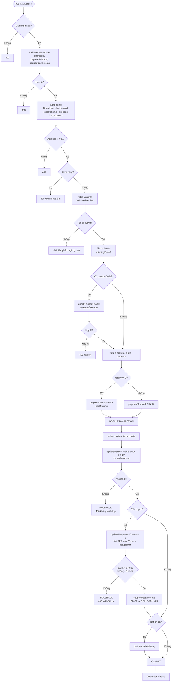
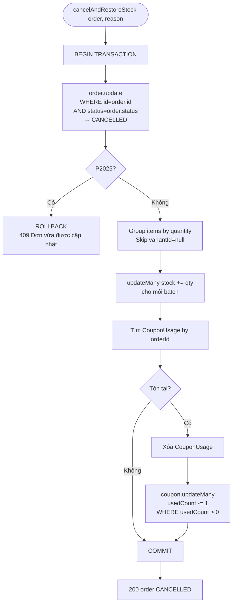
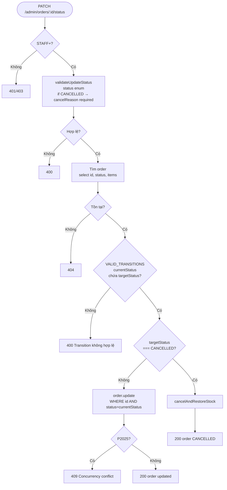

# Activity Diagram
## Module: Order
### Dự án: Mobivexa E-Commerce Platform

> **Phiên bản:** 2.0 | **Ngày:** 2026-08-22

---

## AD-01: Tạo đơn hàng

---

## AD-02: Hủy đơn (cancelAndRestoreStock)

---

## AD-03: Admin chuyển trạng thái

