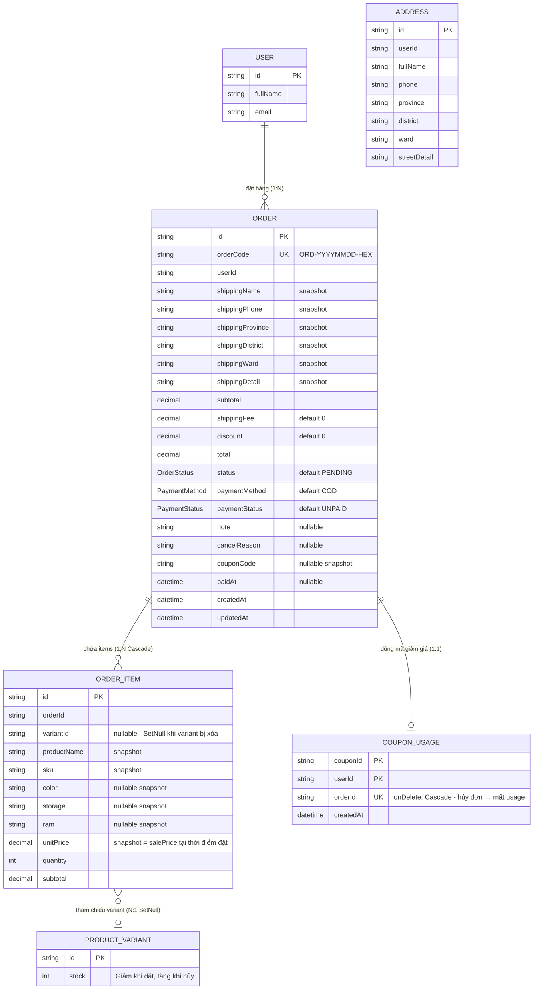

# ERD — Entity Relationship Diagram
## Module: Order
### Dự án: Mobivexa E-Commerce Platform

> **Phiên bản:** 2.0 | **Ngày:** 2026-08-22

---

## 1. Sơ đồ ERD



---

## 2. Mô tả các model

### Order

| Cột | Ghi chú |
|---|---|
| `orderCode` | Unique; format `ORD-{YYYYMMDD}-{6HEX}` |
| `shippingX` | Snapshot địa chỉ tại thời điểm đặt hàng; không FK tới Address |
| `couponCode` | Snapshot mã đã dùng; đơn cũ không đổi khi mã bị sửa/xóa |
| `paidAt` | Chỉ set khi `total = 0` hoặc qua webhook SePay |

**Index:** `@@index([userId])`

### OrderItem

| Cột | Ghi chú |
|---|---|
| `variantId` | Nullable; `onDelete: SetNull` — variant xóa không mất đơn |
| `unitPrice` | Snapshot `salePrice` tại thời điểm đặt |
| `productName`, `sku` | Snapshot — hiển thị đúng dù sản phẩm bị đổi tên/xóa |

**Index:** `@@index([orderId])`

### CouponUsage

| Cột | Ghi chú |
|---|---|
| `@@id([couponId, userId])` | 1 user chỉ dùng 1 mã 1 lần |
| `orderId` | Unique — 1 đơn chỉ gắn 1 usage; `onDelete: Cascade` — hủy đơn tự xóa usage |

---

## 3. Luồng trạng thái

### OrderStatus
```
PENDING → CONFIRMED → SHIPPING → DELIVERED (terminal)
         ↘           ↘          ↘
                   CANCELLED (terminal)
PENDING → CANCELLED
```

### PaymentStatus
```
UNPAID → PAID → REFUNDED
```

---

## 4. Quan hệ stock

```
Đặt hàng:   ProductVariant.stock -= quantity (atomic, rollback nếu count=0)
Hủy đơn:    ProductVariant.stock += quantity (batch theo quantity, skip null variantId)
```
