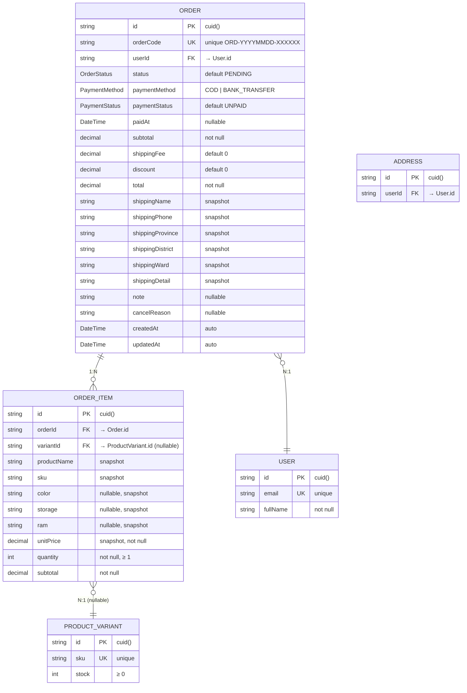

# ERD — Entity Relationship Diagram
## Module: Order (Đơn hàng)
### Dự án: Mobivexa E-Commerce Platform

> **Phiên bản:** 1.0  
> **Ngày:** 2026-06-19  
> **Nguồn:** `be_mobivexa/prisma/schema.prisma`

---

## 1. Sơ đồ ERD (Mermaid)



---

## 2. Mô tả chi tiết các Entity

### 2.1 Entity: Order

| Trường | Kiểu DB | Nullable | Mô tả |
|---|---|---|---|
| `id` | `VARCHAR` (cuid) | No | Primary Key, tự sinh |
| `orderCode` | `VARCHAR` | No | Unique — format `ORD-YYYYMMDD-XXXXXX` |
| `userId` | `VARCHAR` | No | FK → `User.id`, cascade delete |
| `status` | `OrderStatus` | No | Trạng thái đơn — default `PENDING` |
| `paymentMethod` | `PaymentMethod` | No | `COD` hoặc `BANK_TRANSFER` |
| `paymentStatus` | `PaymentStatus` | No | Trạng thái thanh toán — default `UNPAID` |
| `paidAt` | `TIMESTAMPTZ` | Yes | Thời điểm thanh toán — set khi `paymentStatus = PAID` |
| `subtotal` | `DECIMAL(12,2)` | No | Tổng tiền hàng |
| `shippingFee` | `DECIMAL(12,2)` | No | Phí vận chuyển — default 0 (miễn phí) |
| `discount` | `DECIMAL(12,2)` | No | Giảm giá — default 0 (chưa có coupon) |
| `total` | `DECIMAL(12,2)` | No | `subtotal + shippingFee - discount` |
| `shippingName` | `VARCHAR` | No | Snapshot tên người nhận |
| `shippingPhone` | `VARCHAR` | No | Snapshot SĐT người nhận |
| `shippingProvince` | `VARCHAR` | No | Snapshot tỉnh/thành |
| `shippingDistrict` | `VARCHAR` | No | Snapshot quận/huyện |
| `shippingWard` | `VARCHAR` | No | Snapshot phường/xã |
| `shippingDetail` | `VARCHAR` | No | Snapshot địa chỉ chi tiết |
| `note` | `TEXT` | Yes | Ghi chú của khách |
| `cancelReason` | `TEXT` | Yes | Lý do hủy |
| `createdAt` | `TIMESTAMPTZ` | No | Tự gán khi insert |
| `updatedAt` | `TIMESTAMPTZ` | No | Tự cập nhật khi update |

**Indexes:**
- `PRIMARY KEY (id)`
- `UNIQUE (orderCode)`
- `INDEX (userId)` — cho lookup đơn của user
- `INDEX (status)` — cho filter trạng thái
- `INDEX (paymentStatus)` — cho filter thanh toán
- `INDEX (paymentMethod)` — cho filter phương thức
- `INDEX (createdAt)` — cho sort theo thời gian

**Cascade:**
- Khi xóa `User` → toàn bộ `Order` của user bị xóa theo

---

### 2.2 Entity: OrderItem

| Trường | Kiểu DB | Nullable | Mô tả |
|---|---|---|---|
| `id` | `VARCHAR` (cuid) | No | Primary Key |
| `orderId` | `VARCHAR` | No | FK → `Order.id`, cascade delete |
| `variantId` | `VARCHAR` | Yes | FK → `ProductVariant.id` (nullable để防 deletion) |
| `productName` | `VARCHAR` | No | **Snapshot** tên sản phẩm tại thời điểm đặt |
| `sku` | `VARCHAR` | No | **Snapshot** SKU |
| `color` | `VARCHAR` | Yes | **Snapshot** màu sắc |
| `storage` | `VARCHAR` | Yes | **Snapshot** bộ nhớ |
| `ram` | `VARCHAR` | Yes | **Snapshot** RAM |
| `unitPrice` | `DECIMAL(12,2)` | No | **Snapshot** giá bán tại thời điểm đặt |
| `quantity` | `INTEGER` | No | Số lượng — ≥ 1 |
| `subtotal` | `DECIMAL(12,2)` | No | `unitPrice × quantity` |

**Indexes:**
- `PRIMARY KEY (id)`
- `INDEX (orderId)` — cho lookup items của order
- `INDEX (variantId)` — cho lookup variant

**Cascade:**
- Khi xóa `Order` → toàn bộ `OrderItem` bị xóa theo

**Ràng buộc nghiệp vụ:**
- `variantId` nullable để防 trường hợp ProductVariant bị xóa sau khi đã đặt hàng
- Snapshot fields (`productName`, `sku`, `color`, `storage`, `ram`, `unitPrice`) không được cập nhật sau khi tạo — lưu nguyên trạng thái tại thời điểm đặt

---

## 3. Quan hệ giữa các Entity

| Từ | Đến | Kiểu quan hệ | Mô tả |
|---|---|---|---|
| `Order` | `User` | N : 1 | Nhiều đơn hàng của 1 user |
| `Order` | `OrderItem` | 1 : N | 1 đơn hàng có nhiều items |
| `OrderItem` | `ProductVariant` | N : 1 (Optional) | Item tham chiếu variant (nullable) |

**Ghi chú:**
- `Address` không có FK trong `Order` — thông tin địa chỉ được snapshot vào Order (để防 trường hợp address bị sửa/xóa sau khi đã đặt)
- Khi tạo đơn, hệ thống validate `addressId` thuộc về user, nhưng không lưu FK

---

## 4. Schema Tables (PostgreSQL)

### 4.1 Table: orders

```sql
CREATE TABLE "orders" (
    "id" TEXT PRIMARY KEY,
    "orderCode" TEXT UNIQUE NOT NULL,
    "userId" TEXT NOT NULL,
    "status" TEXT NOT NULL, -- OrderStatus enum
    "paymentMethod" TEXT NOT NULL, -- PaymentMethod enum
    "paymentStatus" TEXT NOT NULL, -- PaymentStatus enum
    "paidAt" TIMESTAMPTZ,
    "subtotal" DECIMAL(12,2) NOT NULL,
    "shippingFee" DECIMAL(12,2) NOT NULL DEFAULT 0,
    "discount" DECIMAL(12,2) NOT NULL DEFAULT 0,
    "total" DECIMAL(12,2) NOT NULL,
    "shippingName" TEXT NOT NULL,
    "shippingPhone" TEXT NOT NULL,
    "shippingProvince" TEXT NOT NULL,
    "shippingDistrict" TEXT NOT NULL,
    "shippingWard" TEXT NOT NULL,
    "shippingDetail" TEXT NOT NULL,
    "note" TEXT,
    "cancelReason" TEXT,
    "createdAt" TIMESTAMPTZ NOT NULL DEFAULT NOW(),
    "updatedAt" TIMESTAMPTZ NOT NULL DEFAULT NOW()
);

-- Indexes
CREATE UNIQUE INDEX "orders_orderCode_key" ON "orders"("orderCode");
CREATE INDEX "orders_userId_idx" ON "orders"("userId");
CREATE INDEX "orders_status_idx" ON "orders"("status");
CREATE INDEX "orders_paymentStatus_idx" ON "orders"("paymentStatus");
CREATE INDEX "orders_paymentMethod_idx" ON "orders"("paymentMethod");
CREATE INDEX "orders_createdAt_idx" ON "orders"("createdAt");

-- Foreign Key
ALTER TABLE "orders" ADD CONSTRAINT "orders_userId_fkey" 
    FOREIGN KEY ("userId") REFERENCES "users"("id") ON DELETE CASCADE ON UPDATE CASCADE;
```

---

### 4.2 Table: order_items

```sql
CREATE TABLE "order_items" (
    "id" TEXT PRIMARY KEY,
    "orderId" TEXT NOT NULL,
    "variantId" TEXT,
    "productName" TEXT NOT NULL,
    "sku" TEXT NOT NULL,
    "color" TEXT,
    "storage" TEXT,
    "ram" TEXT,
    "unitPrice" DECIMAL(12,2) NOT NULL,
    "quantity" INTEGER NOT NULL,
    "subtotal" DECIMAL(12,2) NOT NULL
);

-- Indexes
CREATE INDEX "order_items_orderId_idx" ON "order_items"("orderId");
CREATE INDEX "order_items_variantId_idx" ON "order_items"("variantId");

-- Foreign Key
ALTER TABLE "order_items" ADD CONSTRAINT "order_items_orderId_fkey" 
    FOREIGN KEY ("orderId") REFERENCES "orders"("id") ON DELETE CASCADE ON UPDATE CASCADE;
ALTER TABLE "order_items" ADD CONSTRAINT "order_items_variantId_fkey" 
    FOREIGN KEY ("variantId") REFERENCES "product_variants"("id") ON DELETE SET NULL ON UPDATE CASCADE;
```

---

## 5. Enum Definitions

### 5.1 OrderStatus

```sql
CREATE TYPE "OrderStatus" AS ENUM ('PENDING', 'CONFIRMED', 'SHIPPING', 'DELIVERED', 'CANCELLED');
```

| Giá trị | Mô tả |
|---|---|
| `PENDING` | Chờ xác nhận |
| `CONFIRMED` | Đã xác nhận |
| `SHIPPING` | Đang giao hàng |
| `DELIVERED` | Đã giao thành công (kết thúc) |
| `CANCELLED` | Đã hủy (kết thúc) |

---

### 5.2 PaymentStatus

```sql
CREATE TYPE "PaymentStatus" AS ENUM ('UNPAID', 'PAID', 'REFUNDED');
```

| Giá trị | Mô tả |
|---|---|
| `UNPAID` | Chưa thanh toán |
| `PAID` | Đã thanh toán |
| `REFUNDED` | Đã hoàn tiền |

---

### 5.3 PaymentMethod

```sql
CREATE TYPE "PaymentMethod" AS ENUM ('COD', 'BANK_TRANSFER');
```

| Giá trị | Mô tả |
|---|---|
| `COD` | Thanh toán khi nhận hàng |
| `BANK_TRANSFER` | Chuyển khoản ngân hàng |

---

## 6. State Machine - VALID_TRANSITIONS

**Business Rule (implemented in code, not DB):**

```javascript
const VALID_TRANSITIONS = {
  PENDING: ['CONFIRMED', 'CANCELLED'],
  CONFIRMED: ['SHIPPING', 'CANCELLED'],
  SHIPPING: ['DELIVERED', 'CANCELLED'],
  DELIVERED: [], // Terminal state
  CANCELLED: []  // Terminal state
};
```

**Visual Flow:**

```
PENDING ────► CONFIRMED ────► SHIPPING ────► DELIVERED (End)
   │               │               │
   └───────────────┴───────────────┴──────────────► CANCELLED (End)
```

---

## 7. Snapshot Strategy

**Tại sao cần snapshot?**

Khi sản phẩm hoặc giá thay đổi sau khi khách đã đặt hàng:
- ❌ Nếu không có snapshot → OrderItem sẽ hiển thị thông tin mới (sai)
- ✅ Nếu có snapshot → OrderItem giữ nguyên thông tin tại thời điểm đặt (đúng)

**Các field được snapshot:**

### OrderItem snapshot:
- `productName` — Tên sản phẩm
- `sku` — Mã variant
- `color` — Màu sắc
- `storage` — Bộ nhớ
- `ram` — RAM
- `unitPrice` — Giá bán tại thời điểm đặt

### Order snapshot:
- `shippingName`, `shippingPhone`, `shippingProvince`, `shippingDistrict`, `shippingWard`, `shippingDetail` — Địa chỉ giao hàng
- `subtotal`, `shippingFee`, `discount`, `total` — Giá trị tính toán tại thời điểm đặt

**Không snapshot:**
- `Order.userId` — FK, có reference
- `OrderItem.variantId` — Nullable FK, có thể null nếu variant bị xóa

---

## 8. Atomic Stock Check-and-Decrement

**Race Condition Prevention:**

Khi nhiều customer đặt hàng cùng một lúc:

```sql
-- ✅ Đúng (Atomic):
UPDATE "product_variants"
SET stock = stock - 5
WHERE id = ? AND stock >= 5
RETURNING count;

-- Nếu count = 0 → không đủ hàng → rollback transaction
-- Nếu count = 1 → thành công → stock được trừ
```

```sql
-- ❌ Sai (TOCTOU - Race Condition):
SELECT stock FROM "product_variants" WHERE id = ?;  -- Step 1
-- Check in app: if stock >= 5
UPDATE "product_variants" SET stock = stock - 5 WHERE id = ?;  -- Step 2
-- Giữa step 1 và 2, request khác có thể trừ stock → stock âm
```

**Why WHERE clause?**
- `WHERE stock >= quantity` đảm bảo chỉ update khi đủ hàng
- Database guarantee atomicity — không race condition
- Nếu `count = 0` → transaction rollback → error `400` "Sản phẩm không đủ hàng"

---

## 9. Stock Restoration on Cancel

**Khi hủy đơn (Customer hoặc Admin):**

```sql
BEGIN;

-- Cập nhật trạng thái đơn
UPDATE "orders"
SET status = 'CANCELLED', cancelReason = '...'
WHERE id = ?;

-- Hoàn trả stock cho từng item
UPDATE "product_variants"
SET stock = stock + 10
WHERE id = 'var_123';

UPDATE "product_variants"
SET stock = stock + 5
WHERE id = 'var_456';

COMMIT;
```

**Atomic transaction:**
- Hoàn stock phải atomic với update status
- Nếu fail → rollback toàn bộ
- Đảm bảo stock được hoàn chính xác hoặc không hoàn

---

## 10. Order Code Generation

**Format:** `ORD-{YYYYMMDD}-{6 ký tự hex ngẫu nhiên viết hoa}`

**Algorithm:**

```javascript
function generateOrderCode() {
  const date = new Date().toISOString().slice(0, 10).replace(/-/g, ''); // YYYYMMDD
  const randomBytes = crypto.randomBytes(3); // 3 bytes = 6 hex chars
  const randomHex = randomBytes.toString('hex').toUpperCase();
  return `ORD-${date}-${randomHex}`;
}
```

**Examples:**
- `ORD-20240619-A3F9C2`
- `ORD-20240619-B7E8D1`
- `ORD-20240620-C12F4A`

**Uniqueness:**
- Date component + random hex → gần như không thể trùng
- DB constraint `UNIQUE (orderCode)` làm double-check

---

## 11. Performance Considerations

### 11.1 Index Strategy

| Query | Index được dùng |
|---|---|
| `WHERE userId = ?` | `orders_userId_idx` |
| `WHERE status = ?` | `orders_status_idx` |
| `WHERE paymentStatus = ?` | `orders_paymentStatus_idx` |
| `WHERE paymentMethod = ?` | `orders_paymentMethod_idx` |
| `ORDER BY createdAt DESC` | `orders_createdAt_idx` |
| `WHERE orderId = ?` (OrderItem) | `order_items_orderId_idx` |

---

### 11.2 N+1 Query Prevention

**Sai (N+1):**

```typescript
const orders = await db.order.findMany();
for (const order of orders) {
  const items = await db.orderItem.findMany({ where: { orderId: order.id } });
  // N+1 queries!
}
```

**Đúng (Eager loading):**

```typescript
const orders = await db.order.findMany({
  include: {
    items: true,
    user: { select: { id: true, fullName: true, email } }
  }
});
// 1 query với JOINs
```

---

## 12. Backup & Restore

### 12.1 Backup

```bash
# Backup toàn bộ DB
pg_dump -U postgres -d mobivexa > backup_$(date +%Y%m%d).sql

# Backup chỉ Order-related tables
pg_dump -U postgres -d mobivexa -t orders -t order_items > order_backup.sql
```

### 12.2 Restore

```bash
# Restore từ backup
psql -U postgres -d mobivexa < backup_20260619.sql
```

---

> **Document Status:** Draft  
> **Last Updated:** 2026-06-19  
> **Next Review:** After schema changes
