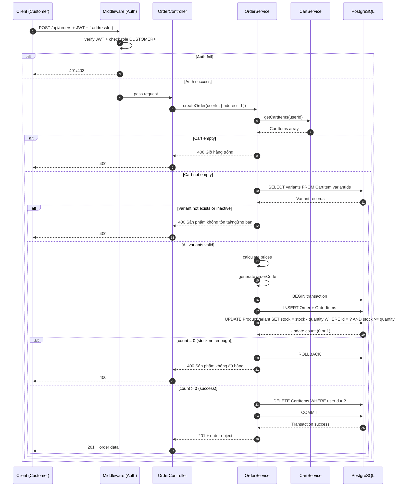
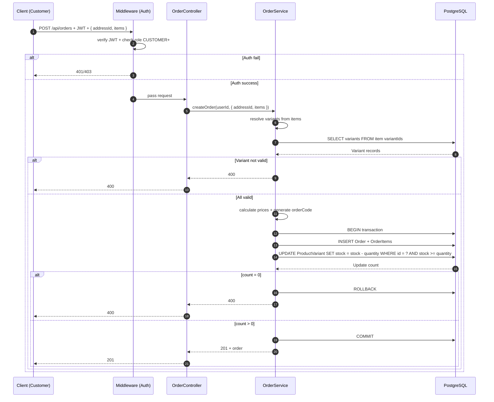
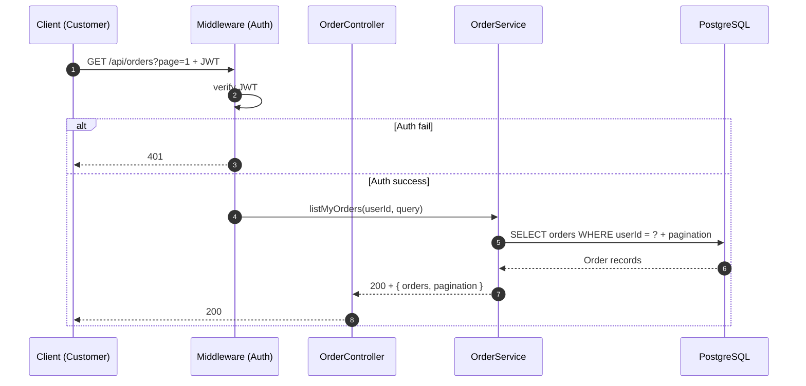
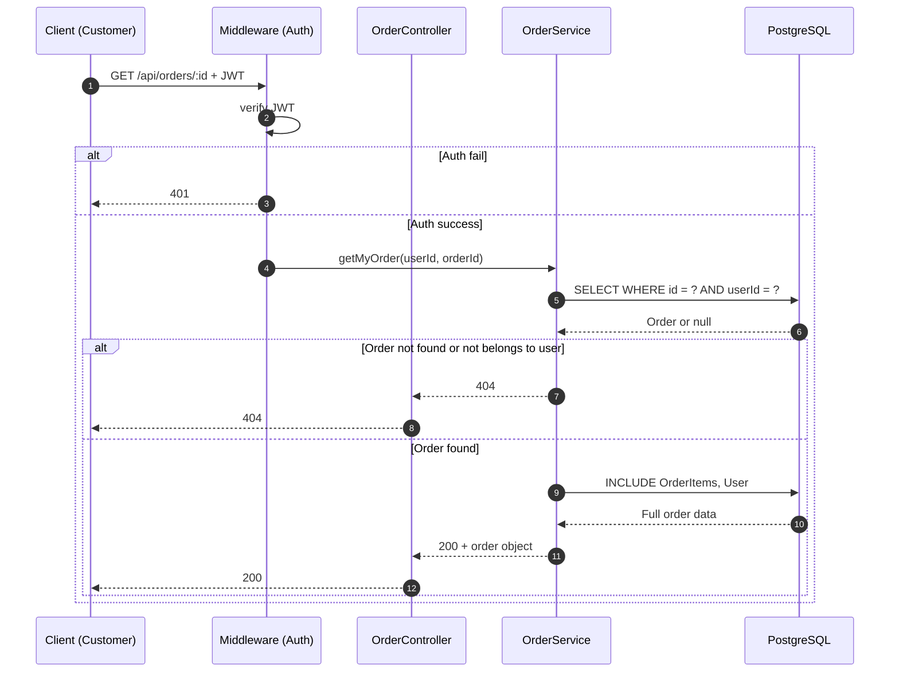
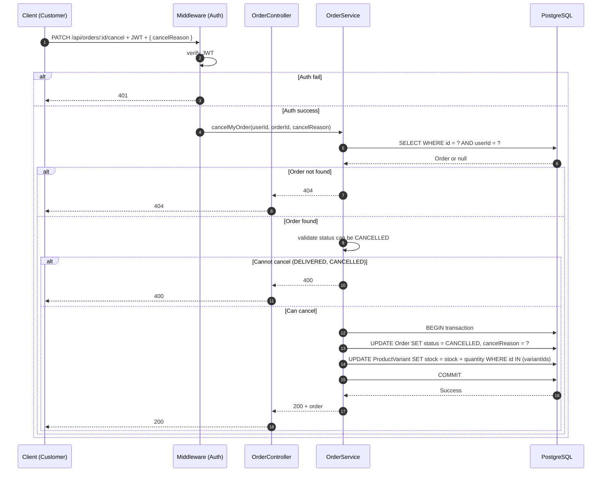
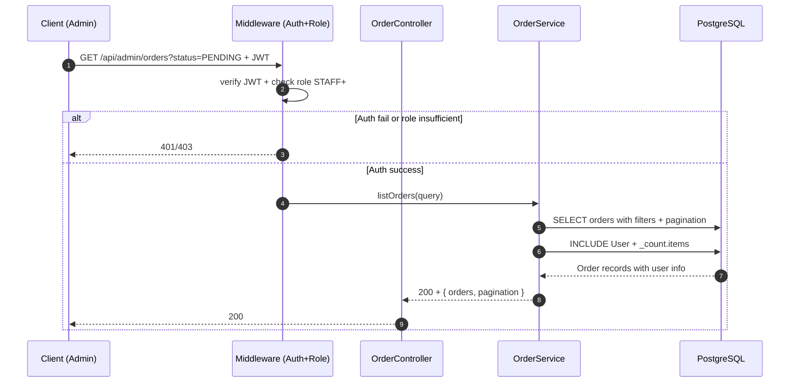
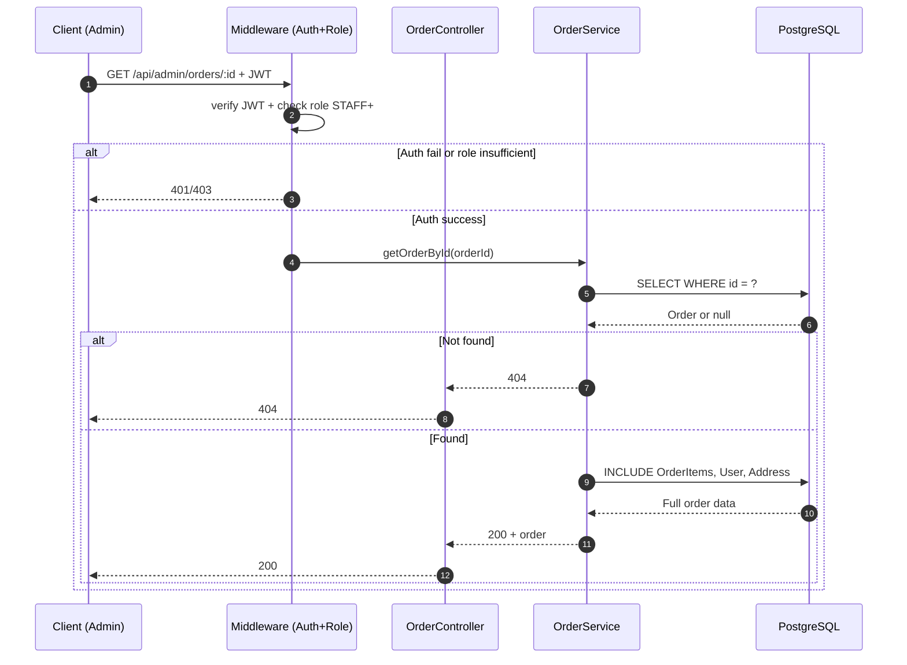
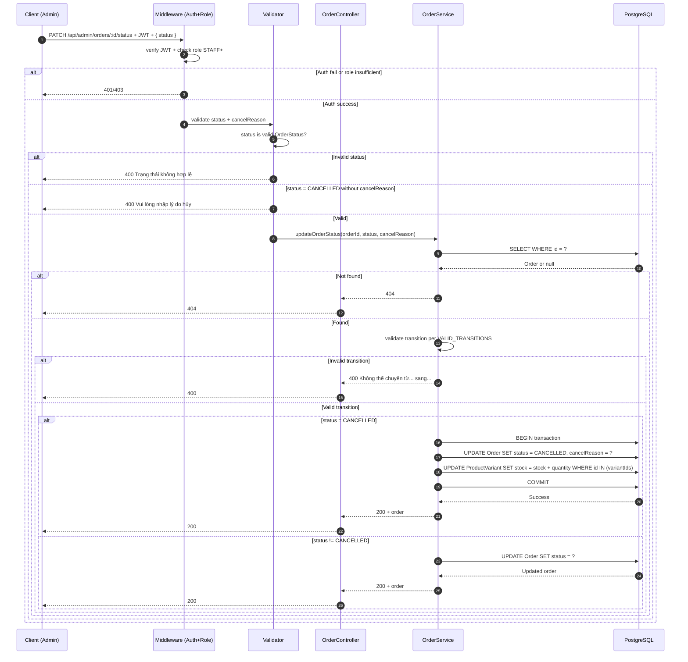
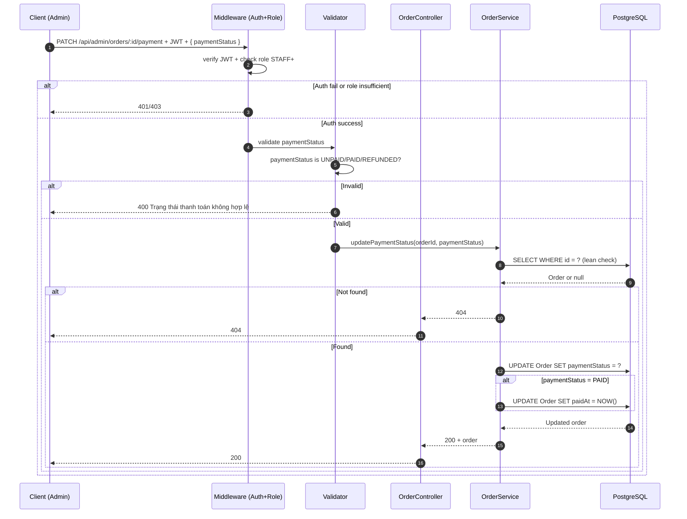
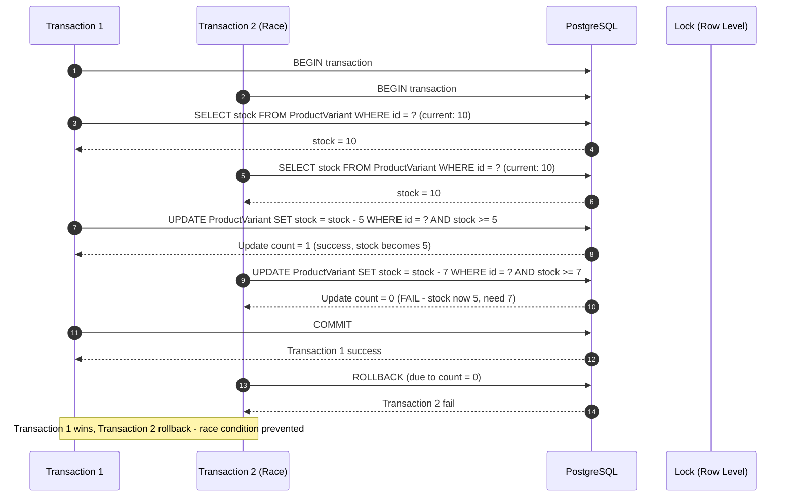

# Sequence Diagram — Luồng API
## Module: Order (Đơn hàng)
### Dự án: Mobivexa E-Commerce Platform

> **Phiên bản:** 1.0  
> **Ngày:** 2026-06-19  
> **Ghi chú:** Sử dụng cú pháp Mermaid sequenceDiagram

---

## SD-01: Đặt hàng từ giỏ hàng

---

## SD-02: Đặt hàng mua ngay (bypass giỏ)

---

## SD-03: Xem danh sách đơn của tôi

---

## SD-04: Xem chi tiết đơn hàng của tôi

---

## SD-05: Hủy đơn hàng (Customer)

---

## SD-06: Admin xem danh sách tất cả đơn

---

## SD-07: Admin xem chi tiết đơn hàng bất kỳ

---

## SD-08: Admin cập nhật trạng thái đơn hàng

---

## SD-09: Admin cập nhật thanh toán

---

## SD-10: Atomic Stock Check-and-Decrement

---

> **Document Status:** Draft  
> **Last Updated:** 2026-06-19  
> **Total Diagrams:** 10  
> **Next Review:** After implementation complete
