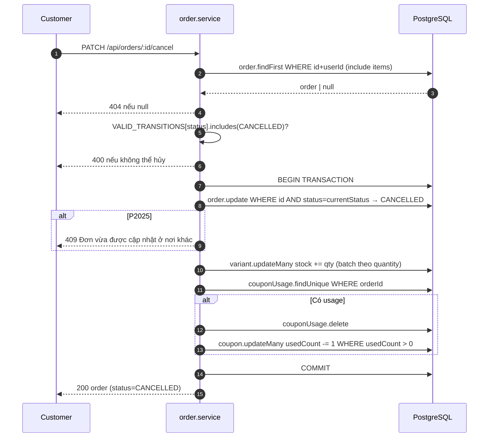
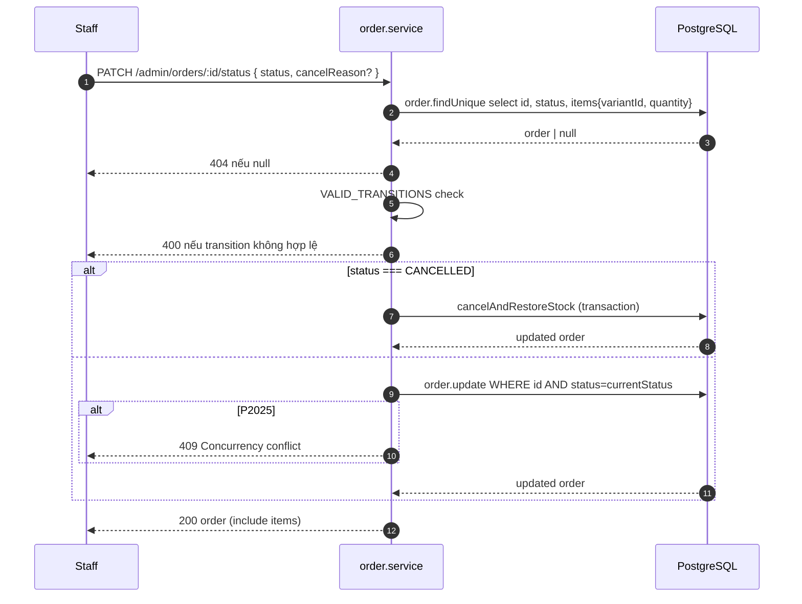

# Sequence Diagram — Luồng API
## Module: Order
### Dự án: Mobivexa E-Commerce Platform

> **Phiên bản:** 2.0 | **Ngày:** 2026-08-22

---

## SD-01: Tạo đơn hàng (có coupon)

```mermaid
sequenceDiagram
    autonumber
    participant C as Customer
    participant Val as validateCreateOrder
    participant Svc as order.service
    participant DB as PostgreSQL

    C->>Val: POST /api/orders { addressId, couponCode, items? }
    Val-->>C: 400 nếu validation lỗi
    Val->>Svc: createOrder(userId, body)

    par Song song
        Svc->>DB: address.findFirst WHERE id+userId
        DB-->>Svc: address | null
    and
        Svc->>Svc: resolveItems(userId, itemsInput)
        Note over Svc: Nếu itemsInput rỗng → lấy từ Cart
    end
    Svc-->>C: 404 nếu address null

    Svc->>DB: variant.findMany WHERE id IN variantIds
    DB-->>Svc: variants[]
    Svc->>Svc: validate isActive; build orderItems; tính subtotal

    par Song song (nếu có couponCode)
        Svc->>DB: coupon.findUnique WHERE code=normalized
        DB-->>Svc: coupon
    and
        Svc->>DB: couponUsage.findFirst WHERE userId+code
        DB-->>Svc: usage | null
    end
    Svc->>Svc: checkCouponUsable → computeDiscount
    Svc-->>C: 400 nếu coupon không dùng được

    Svc->>Svc: total = subtotal - discount; settled = total===0

    Svc->>DB: BEGIN TRANSACTION
    Svc->>DB: order.create + items.create[]
    DB-->>Svc: order

    loop Mỗi variant song song
        Svc->>DB: variant.updateMany WHERE id AND stock >= qty → stock -= qty
        DB-->>Svc: { count }
        alt count === 0
            Svc->>DB: ROLLBACK
            Svc-->>C: 400 không đủ hàng
        end
    end

    alt Có coupon + có usageLimit
        Svc->>DB: coupon.updateMany WHERE usedCount < usageLimit → usedCount += 1
        DB-->>Svc: { count }
        alt count === 0
            Svc->>DB: ROLLBACK
            Svc-->>C: 409 mã hết lượt
        end
    end

    Svc->>DB: couponUsage.create
    Note over DB: P2002 → ROLLBACK → 409 Đã dùng mã này rồi

    alt Đặt từ giỏ
        Svc->>DB: cartItem.deleteMany WHERE cart.userId=userId
    end

    Svc->>DB: COMMIT
    Svc-->>C: 201 order (include items)
```

---

## SD-02: Khách hủy đơn



---

## SD-03: Admin chuyển trạng thái


