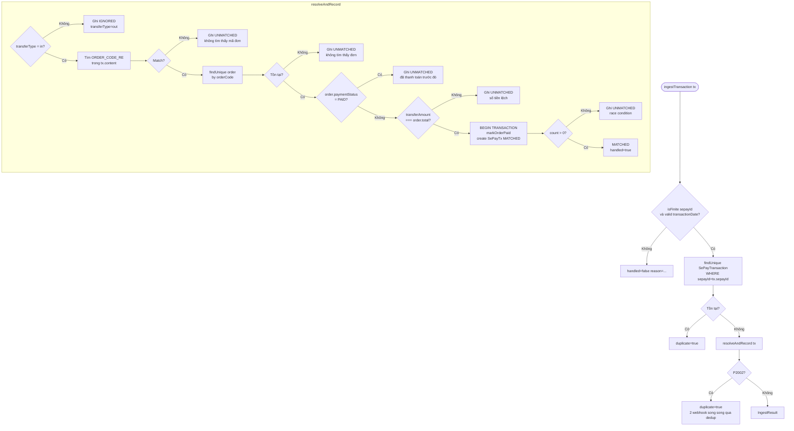
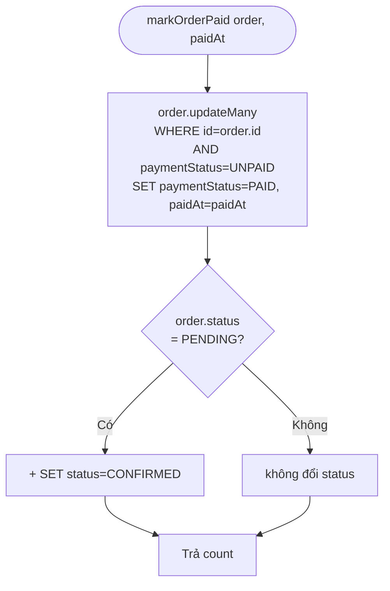
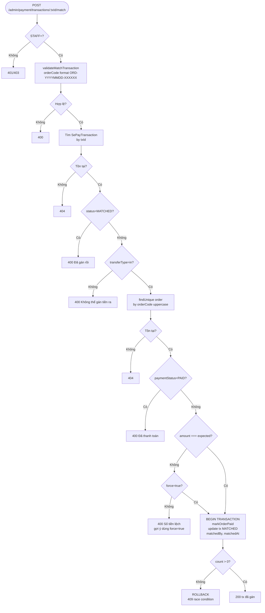
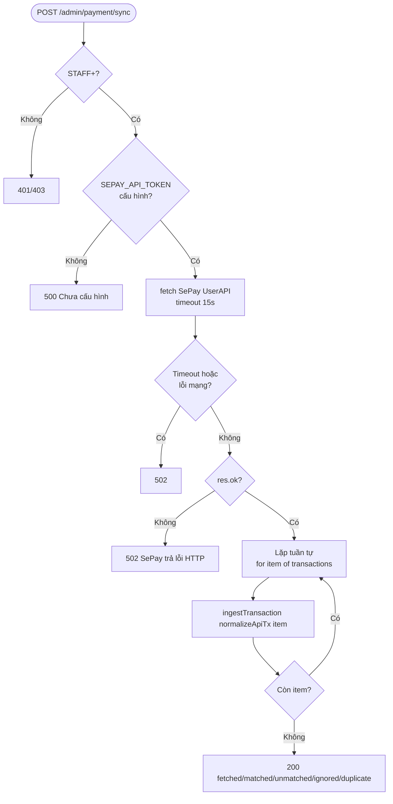

# Activity Diagram
## Module: Payment
### Dự án: Mobivexa E-Commerce Platform

> **Phiên bản:** 2.0 | **Ngày:** 2026-08-22

---

## AD-01: ingestTransaction — Core xử lý giao dịch

---

## AD-02: markOrderPaid

---

## AD-03: Admin gán tay (matchTransaction)

---

## AD-04: Sync từ SePay API

