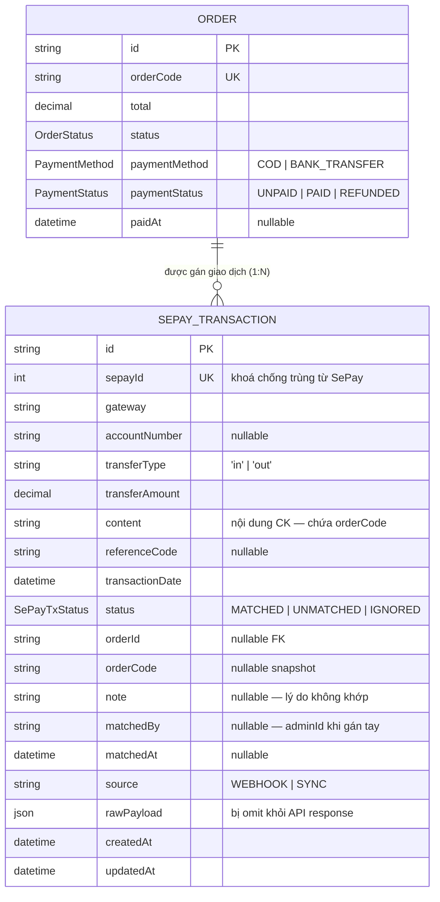

# ERD — Entity Relationship Diagram
## Module: Payment
### Dự án: Mobivexa E-Commerce Platform

> **Phiên bản:** 2.0 | **Ngày:** 2026-08-22

---

## 1. Sơ đồ ERD

---

## 2. SePayTxStatus

| Value | Ý nghĩa |
|---|---|
| `MATCHED` | Đã khớp đơn; `order.paymentStatus = PAID` |
| `UNMATCHED` | Tiền đã về nhưng chưa/không gán được đơn — admin xử lý tay |
| `IGNORED` | Giao dịch không liên quan (tiền ra, CK nội bộ...) |

---

## 3. Các trường quan trọng

### SePayTransaction

| Cột | Ghi chú |
|---|---|
| `sepayId` | UNIQUE — `payload.id` từ SePay; chặn xử lý trùng (retry webhook) |
| `orderId` | Nullable FK; chỉ set khi MATCHED |
| `orderCode` | Snapshot mã đơn tìm được; tồn tại cả khi UNMATCHED (để admin tra) |
| `note` | Lý do UNMATCHED: "số tiền lệch", "không tìm thấy mã đơn", v.v. |
| `matchedBy` | userId admin đã gán tay |
| `source` | `WEBHOOK` (SePay gọi vào) hoặc `SYNC` (admin trigger kéo API) |
| `rawPayload` | JSON thô toàn bộ payload SePay; lưu để debug nhưng **bị omit khỏi API** |

### Order (các cột liên quan đến Payment)

| Cột | Ghi chú |
|---|---|
| `paymentMethod` | COD: không cần đối soát; BANK_TRANSFER: cần VietQR + webhook |
| `paymentStatus` | UNPAID → PAID qua webhook/gán tay; REFUNDED qua admin thủ công |
| `paidAt` | Set khi PAID; null khi UNPAID/REFUNDED |

---

## 4. Index

| Index | Bảng | Mục đích |
|---|---|---|
| UNIQUE `sepayId` | `sepay_transactions` | Dedup webhook/sync |
| IDX `status` | `sepay_transactions` | Filter UNMATCHED nhanh |
| IDX `orderId` | `sepay_transactions` | Join lên orders |
| IDX `transactionDate` | `sepay_transactions` | Filter theo ngày |
| IDX `paymentStatus` | `orders` | Filter UNPAID/PAID |
| IDX `paymentMethod` | `orders` | Filter BANK_TRANSFER |
