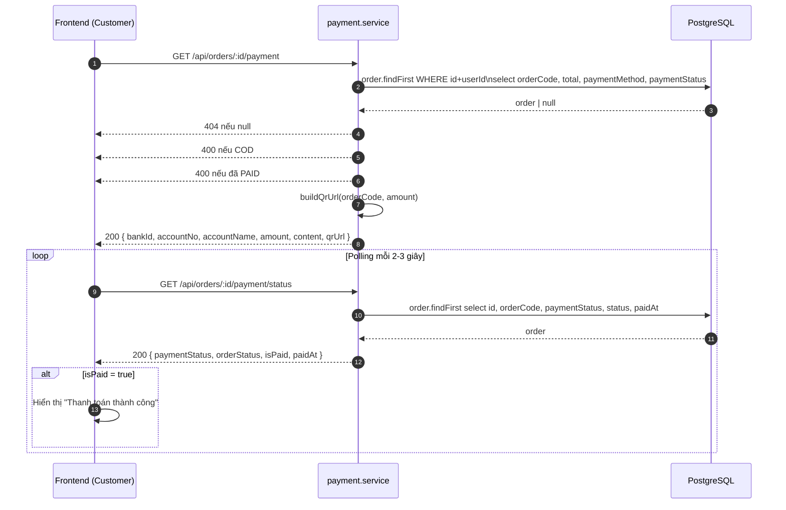
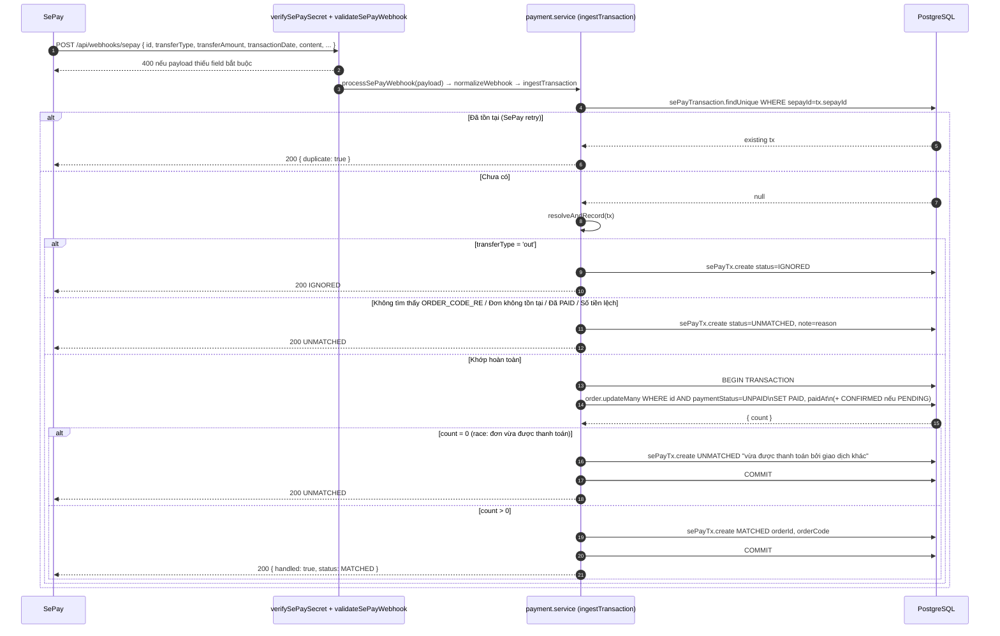
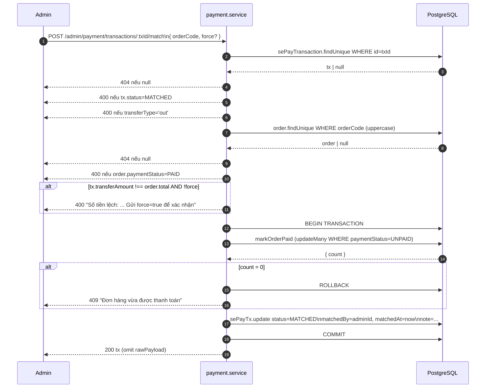
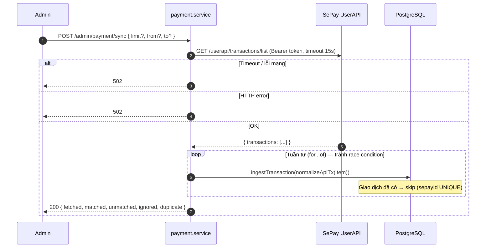

# Sequence Diagram — Luồng API
## Module: Payment
### Dự án: Mobivexa E-Commerce Platform

> **Phiên bản:** 2.0 | **Ngày:** 2026-08-22

---

## SD-01: Khách lấy QR và polling trạng thái

---

## SD-02: Webhook SePay — tự động đối soát

---

## SD-03: Admin gán tay giao dịch

---

## SD-04: Admin sync từ SePay API

