# Activity Diagram — Luồng xử lý
## Module: Product (Sản phẩm)
### Dự án: Mobivexa E-Commerce Platform

> **Phiên bản:** 1.0  
> **Ngày:** 2026-06-19  
> **Ghi chú:** Sử dụng cú pháp Mermaid — render trên GitHub, GitLab, Obsidian, VSCode (Markdown Preview Mermaid)

---

## AD-01: Danh sách sản phẩm (Public)

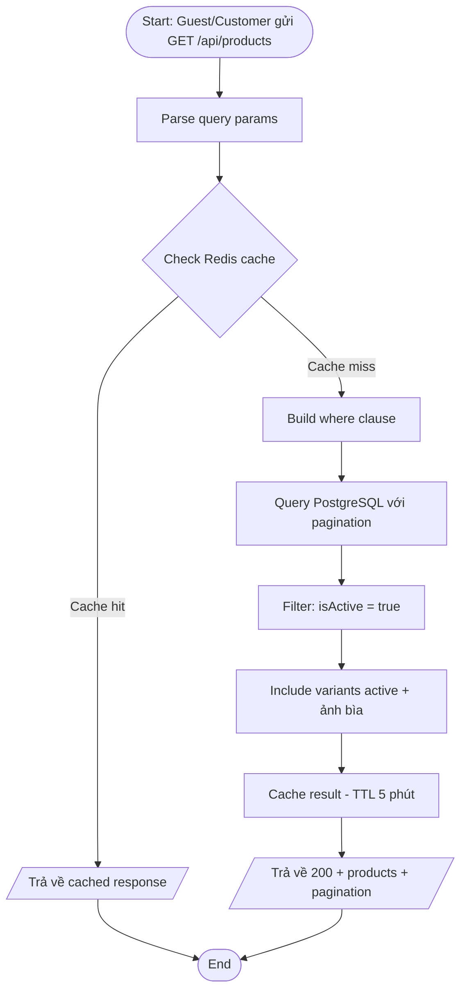

---

## AD-02: Chi tiết sản phẩm (Public - theo slug)

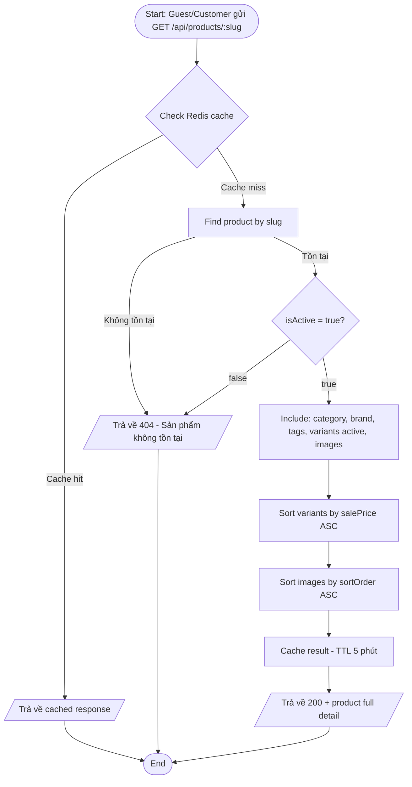

---

## AD-03: Tạo sản phẩm (Admin)

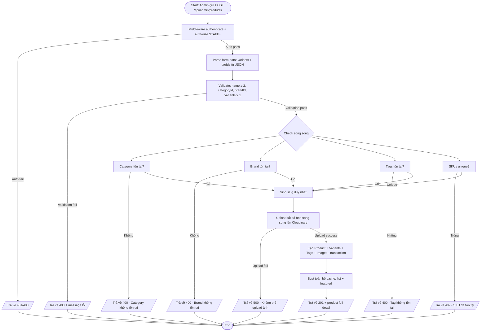

---

## AD-04: Cập nhật sản phẩm (Admin)

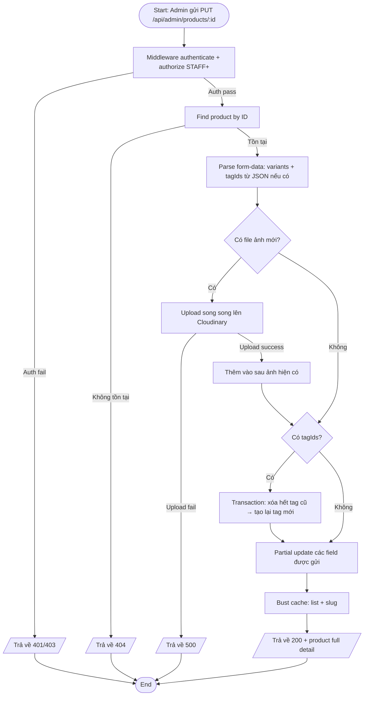

---

## AD-05: Xóa sản phẩm (Admin)

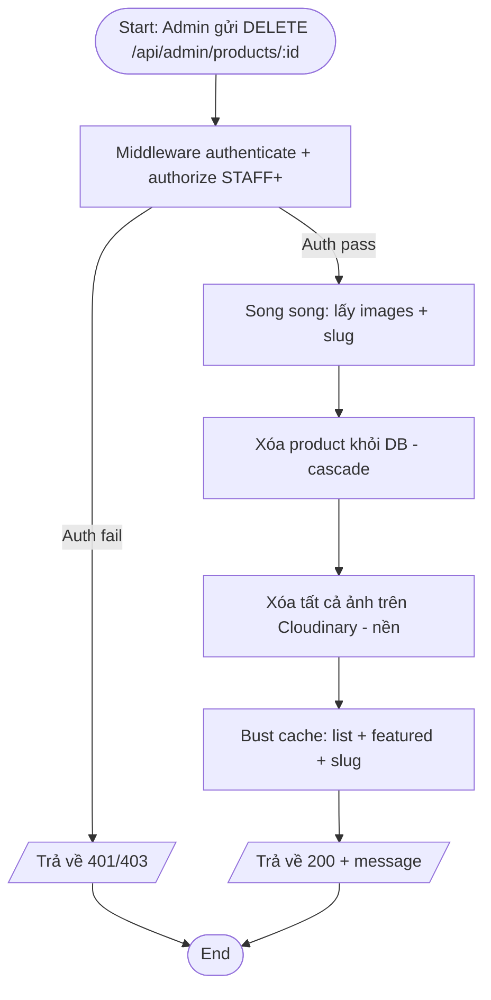

---

## AD-06: Thêm variant vào sản phẩm (Admin)

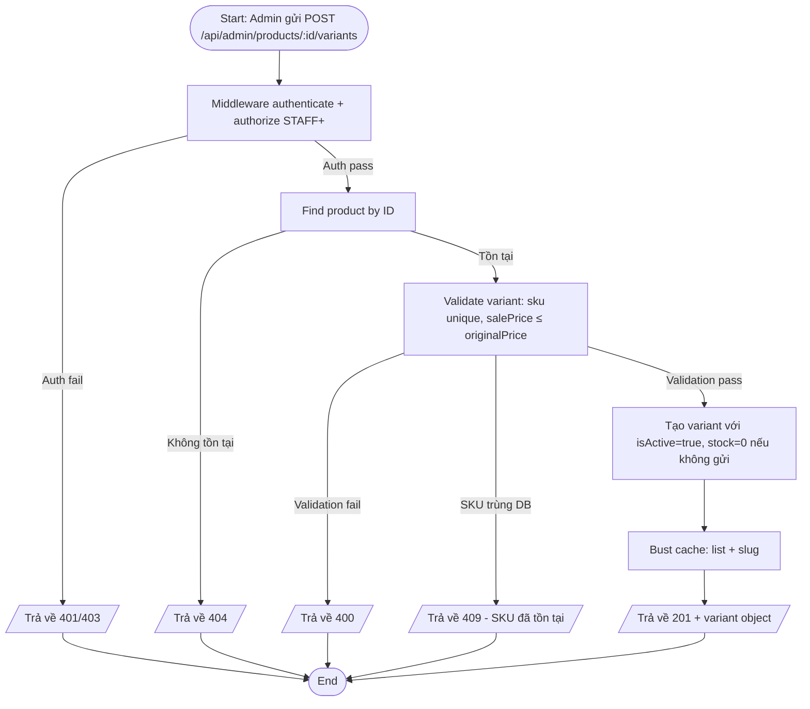

---

## AD-07: Xóa variant (Admin)

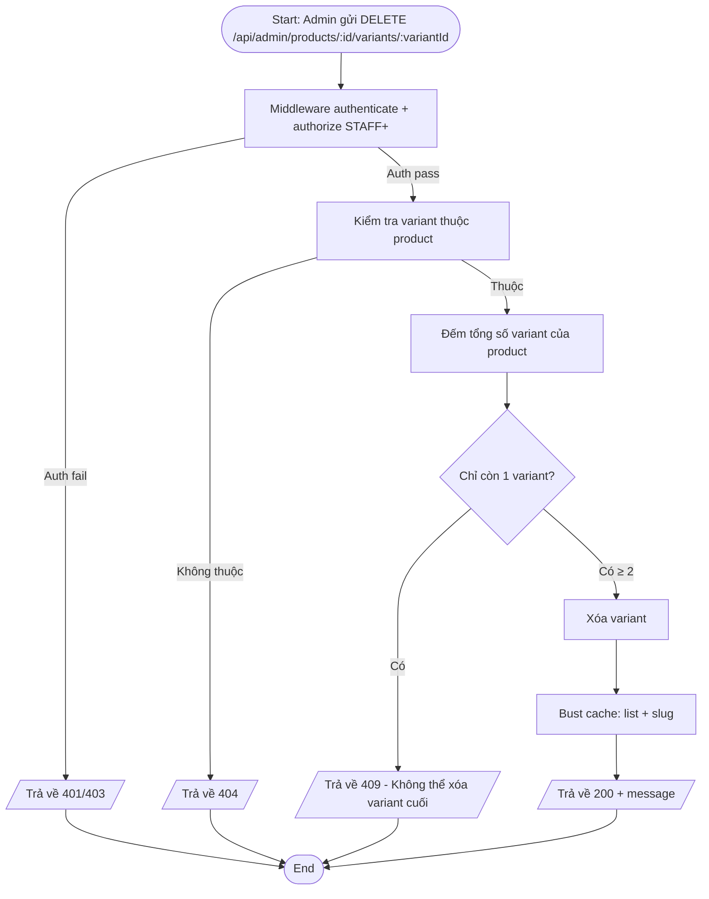

---

## AD-08: Cập nhật tồn kho nhanh (Admin)

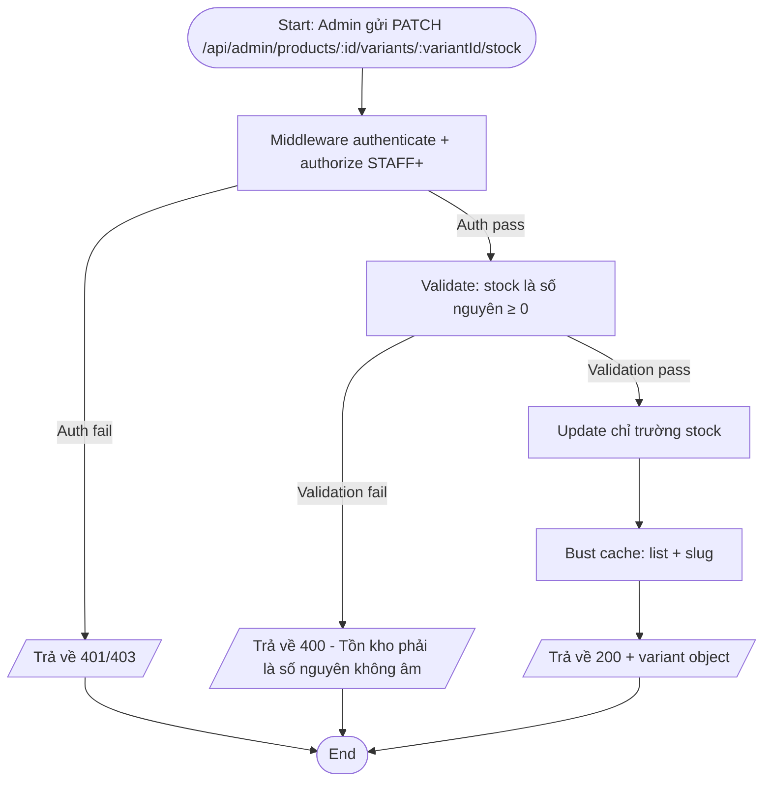

---

## AD-09: Thêm ảnh vào sản phẩm (Admin)

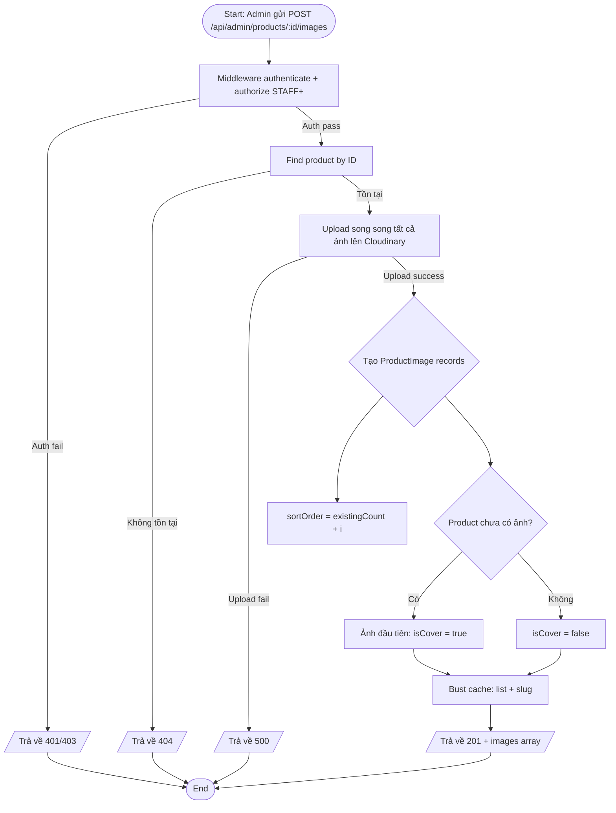

---

## AD-10: Xóa ảnh khỏi sản phẩm (Admin)

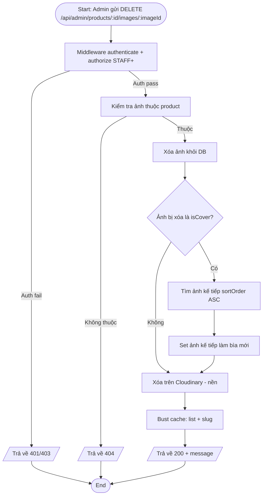

---

## AD-11: Đặt ảnh bìa (Admin)

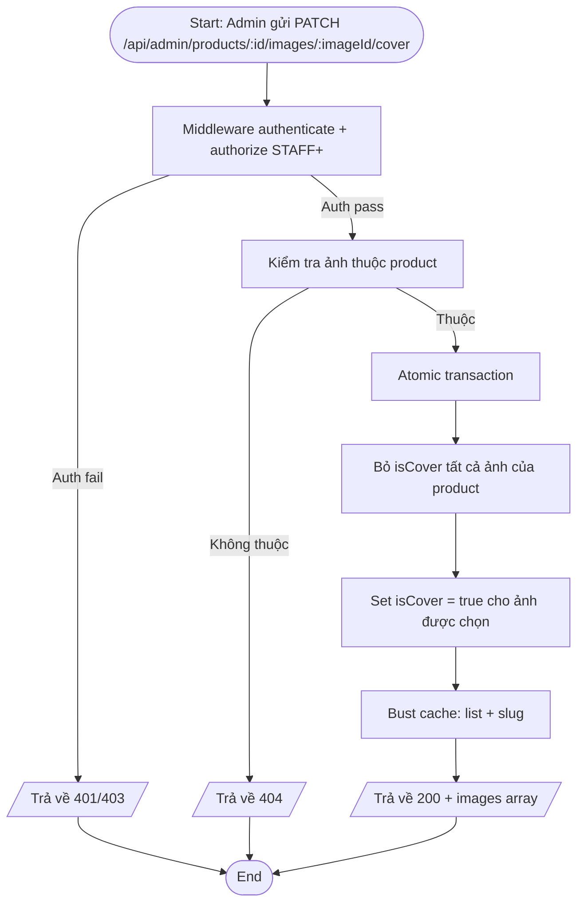

---

## AD-12: Báo cáo tồn kho (Admin)

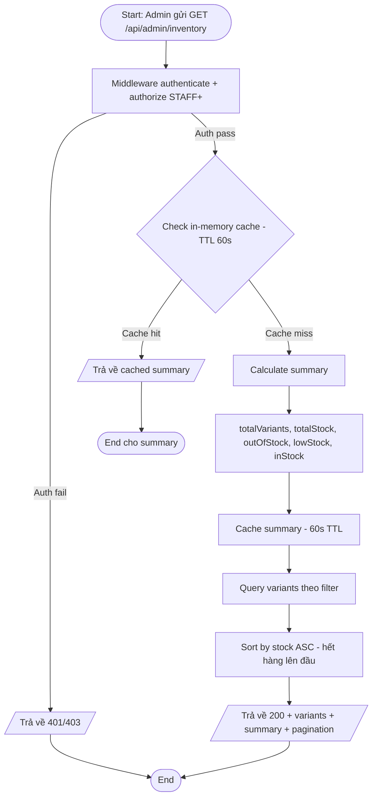

---

## AD-13: Bật/tắt hiển thị sản phẩm (Admin)

---

## AD-14: Bật/tắt nổi bật sản phẩm (Admin)

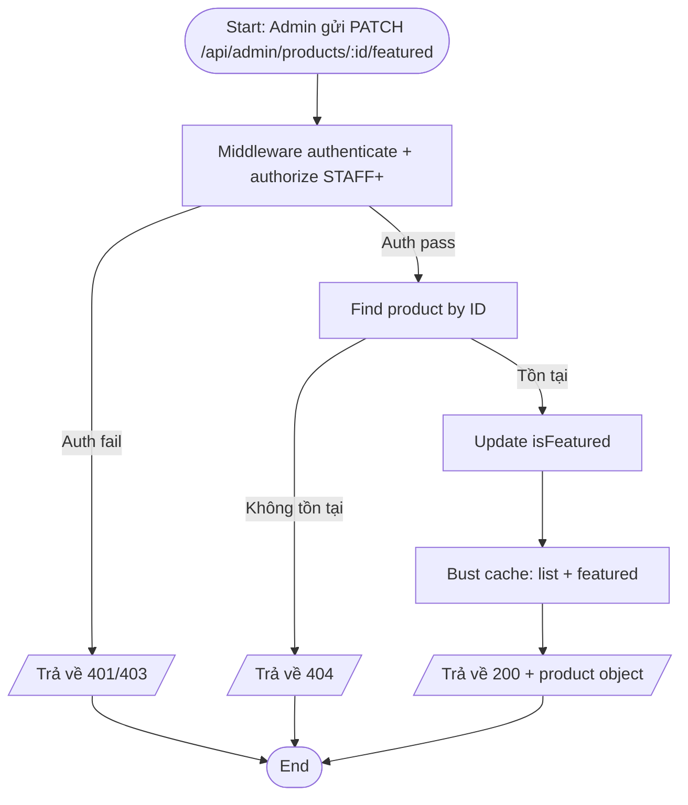

---

## AD-15: Full-text Search (Public)

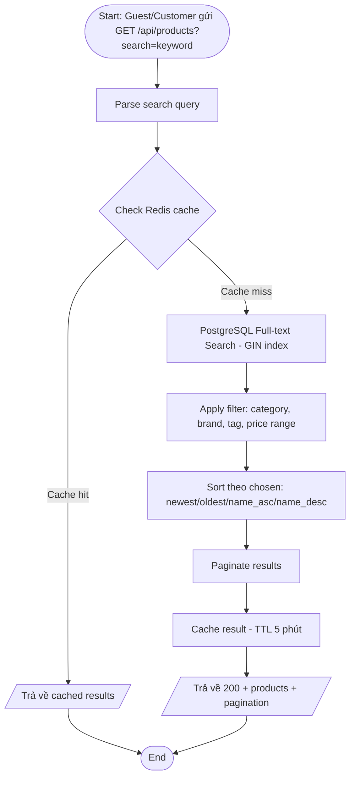

---

## AD-16: Cache Bust Flow

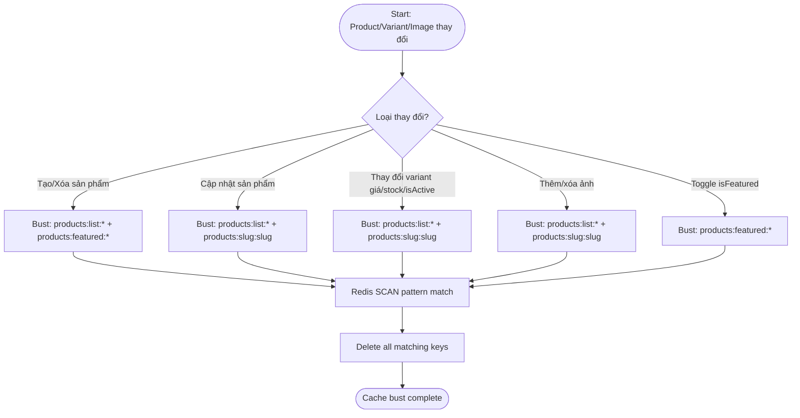

---

> **Document Status:** Draft  
> **Last Updated:** 2026-06-19  
> **Total Diagrams:** 16  
> **Next Review:** After implementation complete
