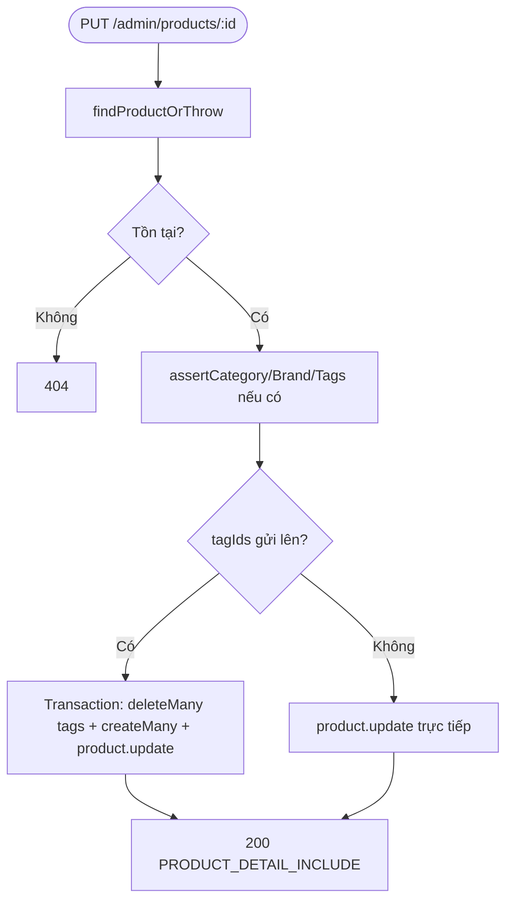
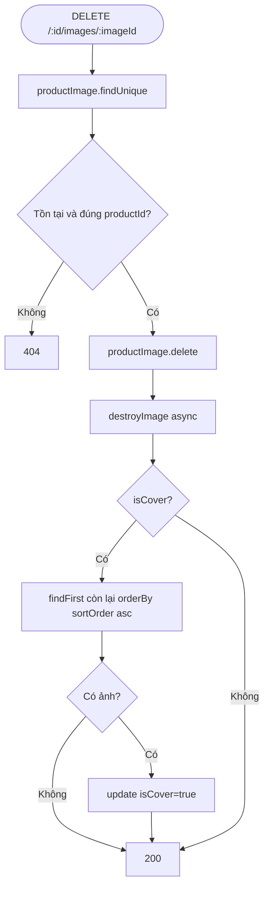
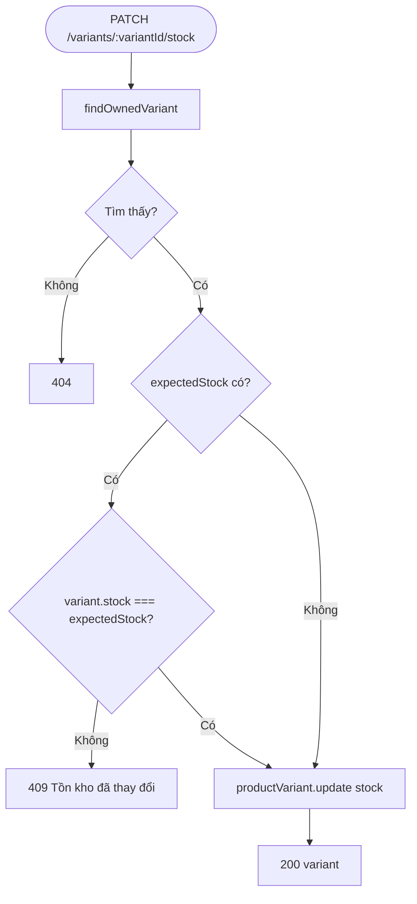
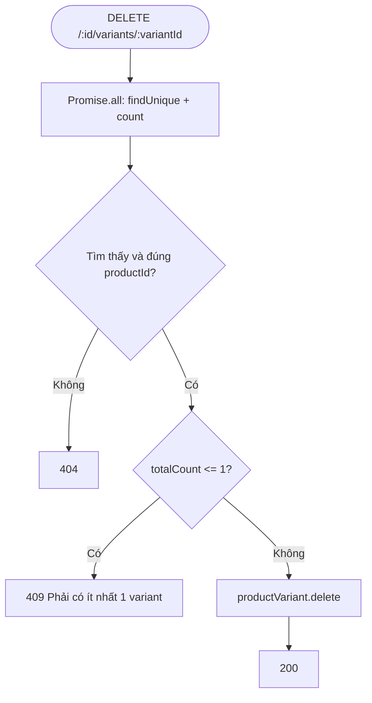
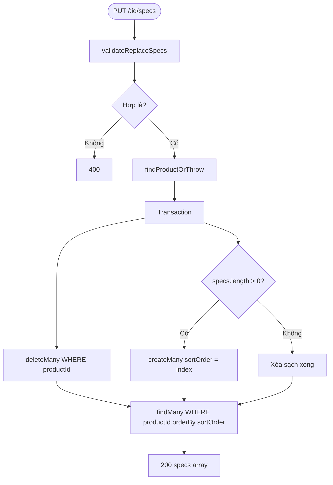

# Activity Diagram — Luồng xử lý
## Module: Product
### Dự án: Mobivexa E-Commerce Platform

> **Phiên bản:** 2.0 | **Ngày:** 2026-08-22

---

## 1. Listing sản phẩm (public)

```mermaid
flowchart TD
    A([GET /products]) --> B{search param?}
    B -- Có --> C[toTsQuery — FTS GIN index]
    C --> D{Kết quả?}
    D -- Rỗng --> Z1[Trả products=[] pagination]
    D -- Có --> E[where.id = in ids]
    B -- Không --> E2[where = isActive:true]
    E --> F[Áp filter: category/brand/tag/price]
    E2 --> F
    F --> G{minPrice & maxPrice?}
    G -- minPrice > maxPrice --> ERR1[400]
    G -- OK --> H[parsePriceParam validate]
    H --> I[Promise.all: findMany + count]
    I --> J[200 products + pagination]
```

---

## 2. Tạo sản phẩm (admin)

```mermaid
flowchart TD
    A([POST /admin/products]) --> B[validateCreateProduct — parse JSON fields]
    B --> C{Hợp lệ?}
    C -- Không --> ERR1[400]
    C -- Có --> D[Promise.all: assertCategory + assertBrand + assertTags + assertSkusAvailable]
    D --> E{Mọi check pass?}
    E -- Không --> ERR2[400/409]
    E -- Có --> F[generateUniqueSlug slug||name]
    F --> G{Files?}
    G -- Có --> H[uploadEntityImage parallel]
    G -- Không --> I
    H --> I[product.create variants+specs+tags+images]
    I --> J[Ảnh đầu tiên isCover=true]
    J --> K[201 PRODUCT_DETAIL_INCLUDE]
```

---

## 3. Cập nhật sản phẩm (admin)



---

## 4. Xóa ảnh sản phẩm



---

## 5. Cập nhật tồn kho (optimistic lock)



---

## 6. Xóa variant (guard variant cuối)



---

## 7. Thay thế specs (replace-all)


