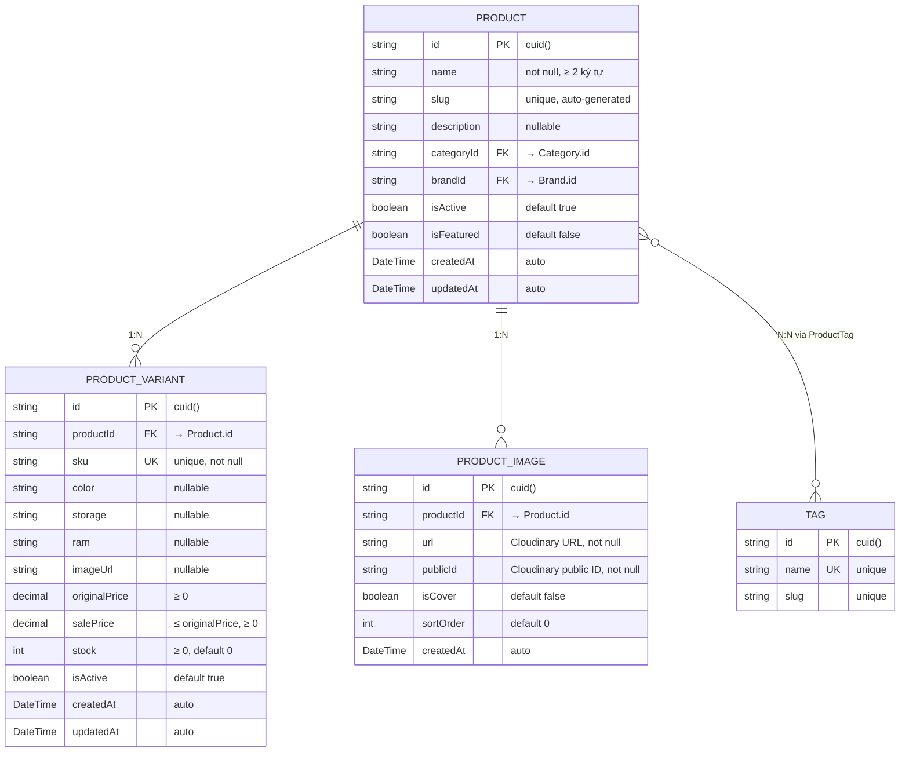

# ERD — Entity Relationship Diagram
## Module: Product (Sản phẩm)
### Dự án: Mobivexa E-Commerce Platform

> **Phiên bản:** 1.0  
> **Ngày:** 2026-06-19  
> **Nguồn:** `be_mobivexa/prisma/schema.prisma`

---

## 1. Sơ đồ ERD (Mermaid)



---

## 2. Mô tả chi tiết các Entity

### 2.1 Entity: Product

| Trường | Kiểu DB | Nullable | Mô tả |
|---|---|---|---|
| `id` | `VARCHAR` (cuid) | No | Primary Key, tự sinh |
| `name` | `VARCHAR` | No | Tên sản phẩm, ≥ 2 ký tự |
| `slug` | `VARCHAR` | No | URL-friendly identifier, unique |
| `description` | `TEXT` | Yes | Mô tả sản phẩm |
| `categoryId` | `VARCHAR` | No | FK → `Category.id` |
| `brandId` | `VARCHAR` | No | FK → `Brand.id` |
| `isActive` | `BOOLEAN` | No | Hiển thị cho khách — default `true` |
| `isFeatured` | `BOOLEAN` | No | Sản phẩm nổi bật — default `false` |
| `createdAt` | `TIMESTAMPTZ` | No | Tự gán khi insert |
| `updatedAt` | `TIMESTAMPTZ` | No | Tự cập nhật khi update |

**Indexes:**
- `PRIMARY KEY (id)`
- `UNIQUE (slug)`
- `INDEX (categoryId)` — cho filter theo category
- `INDEX (brandId)` — cho filter theo brand
- `INDEX (isActive, isFeatured)` — cho featured products
- `INDEX (createdAt)` — cho sort theo thời gian

---

### 2.2 Entity: ProductVariant

| Trường | Kiểu DB | Nullable | Mô tả |
|---|---|---|
| `id` | `VARCHAR` (cuid) | No | Primary Key |
| `productId` | `VARCHAR` | No | FK → `Product.id`, cascade delete |
| `sku` | `VARCHAR` | No | Unique toàn hệ thống — not null |
| `color` | `VARCHAR` | Yes | Màu sắc (VD: "Đen", "Trắng") |
| `storage` | `VARCHAR` | Yes | Dung lượng (VD: "128GB", "256GB") |
| `ram` | `VARCHAR` | Yes | RAM (VD: "4GB", "8GB") |
| `imageUrl` | `TEXT` | Yes | URL ảnh variant (optional) |
| `originalPrice` | `DECIMAL(12,2)` | No | Giá gốc — ≥ 0 |
| `salePrice` | `DECIMAL(12,2)` | No | Giá bán — ≤ originalPrice, ≥ 0 |
| `stock` | `INTEGER` | No | Tồn kho — ≥ 0, default 0 |
| `isActive` | `BOOLEAN` | No | Hiển thị variant — default `true` |
| `createdAt` | `TIMESTAMPTZ` | No | Tự gán khi insert |
| `updatedAt` | `TIMESTAMPTZ` | No | Tự cập nhật khi update |

**Indexes:**
- `PRIMARY KEY (id)`
- `UNIQUE (sku)` — SKU unique toàn hệ thống
- `INDEX (productId)` — cho join
- `INDEX (stock)` — cho inventory report
- `INDEX (isActive)` — cho filter
- `INDEX (isActive, salePrice)` — cho filter + sort

**Ràng buộc:**
- `salePrice` phải ≤ `originalPrice`
- `stock` phải ≥ 0
- `sku` không được trùng trong cả payload và DB

**Cascade:**
- Khi xóa `Product` → toàn bộ `ProductVariant` bị xóa theo

---

### 2.3 Entity: ProductImage

| Trường | Kiểu DB | Nullable | Mô tả |
|---|---|---|
| `id` | `VARCHAR` (cuid) | No | Primary Key |
| `productId` | `VARCHAR` | No | FK → `Product.id`, cascade delete |
| `url` | `TEXT` | No | Cloudinary URL — not null |
| `publicId` | `VARCHAR` | No | Cloudinary public ID — dùng để xóa |
| `isCover` | `BOOLEAN` | No | Ảnh bìa — chỉ 1 per product, default `false` |
| `sortOrder` | `INTEGER` | No | Thứ tự hiển thị — default 0 |
| `createdAt` | `TIMESTAMPTZ` | No | Tự gán khi insert |

**Indexes:**
- `PRIMARY KEY (id)`
- `INDEX (productId, isCover)` — cho lấy ảnh bìa nhanh

**Ràng buộc nghiệp vụ:**
- Chỉ 1 ảnh có `isCover = true` per product
- `sortOrder` tăng dần theo thứ tự upload
- Ảnh đầu tiên khi tạo sản phẩm tự thành `isCover = true`

**Cascade:**
- Khi xóa `Product` → toàn bộ `ProductImage` bị xóa theo

---

### 2.4 Entity: Tag

| Trường | Kiểu DB | Nullable | Mô tả |
|---|---|---|
| `id` | `VARCHAR` (cuid) | No | Primary Key |
| `name` | `VARCHAR` | No | Tên tag — unique |
| `slug` | `VARCHAR` | No | URL-friendly identifier — unique |

**Indexes:**
- `PRIMARY KEY (id)`
- `UNIQUE (name)`
- `UNIQUE (slug)`

---

### 2.5 Entity: ProductTag (Many-to-Many)

| Trường | Kiểu DB | Nullable | Mô tả |
|---|---|---|
| `productId` | `VARCHAR` | No | FK → `Product.id`, PK part |
| `tagId` | `VARCHAR` | No | FK → `Tag.id`, PK part |

**Primary Key:** `(productId, tagId)` — Composite PK

**Indexes:**
- `PRIMARY KEY (productId, tagId)`
- `INDEX (productId)` — cho lookup tags của product
- `INDEX (tagId)` — cho lookup products của tag

**Cascade:**
- Khi xóa `Product` → `ProductTag` bị xóa theo
- Khi xóa `Tag` → `ProductTag` bị xóa theo

---

## 3. Quan hệ giữa các Entity

| Từ | Đến | Kiểu quan hệ | Mô tả |
|---|---|---|---|
| `Product` | `ProductVariant` | 1 : N | 1 sản phẩm có nhiều variant (phiên bản) |
| `Product` | `ProductImage` | 1 : N | 1 sản phẩm có nhiều ảnh (tối đa 10) |
| `Product` | `Tag` | N : N | Sản phẩm có nhiều tag qua `ProductTag` |
| `Product` | `Category` | N : 1 | Nhiều sản phẩm thuộc 1 category (FK bên Product) |
| `Product` | `Brand` | N : 1 | Nhiều sản phẩm thuộc 1 brand (FK bên Product) |

**Ghi chú:**
- `Category` và `Brand` không thuộc module Product — chúng là module riêng
- FK `categoryId` và `brandId` trong `Product` là các quan hệ N:1

---

## 4. Schema Tables (PostgreSQL)

### 4.1 Table: products

```sql
CREATE TABLE "products" (
    "id" TEXT PRIMARY KEY,
    "name" TEXT NOT NULL,
    "slug" TEXT UNIQUE NOT NULL,
    "description" TEXT,
    "categoryId" TEXT NOT NULL,
    "brandId" TEXT NOT NULL,
    "isActive" BOOLEAN DEFAULT true NOT NULL,
    "isFeatured" BOOLEAN DEFAULT false NOT NULL,
    "createdAt" TIMESTAMPTZ DEFAULT NOW() NOT NULL,
    "updatedAt" TIMESTAMPTZ DEFAULT NOW() NOT NULL
);

-- Indexes
CREATE INDEX "products_categoryId_idx" ON "products"("categoryId");
CREATE INDEX "products_brandId_idx" ON "products"("brandId");
CREATE INDEX "products_isActive_isFeatured_idx" ON "products"("isActive", "isFeatured");
CREATE INDEX "products_createdAt_idx" ON "products"("createdAt");

-- Foreign Keys
ALTER TABLE "products" ADD CONSTRAINT "products_categoryId_fkey" 
    FOREIGN KEY ("categoryId") REFERENCES "categories"("id") ON DELETE RESTRICT ON UPDATE CASCADE;
ALTER TABLE "products" ADD CONSTRAINT "products_brandId_fkey" 
    FOREIGN KEY ("brandId") REFERENCES "brands"("id") ON DELETE RESTRICT ON UPDATE CASCADE;
```

---

### 4.2 Table: product_variants

```sql
CREATE TABLE "product_variants" (
    "id" TEXT PRIMARY KEY,
    "productId" TEXT NOT NULL,
    "sku" TEXT UNIQUE NOT NULL,
    "color" TEXT,
    "storage" TEXT,
    "ram" TEXT,
    "imageUrl" TEXT,
    "originalPrice" DECIMAL(12,2) NOT NULL,
    "salePrice" DECIMAL(12,2) NOT NULL,
    "stock" INTEGER DEFAULT 0 NOT NULL,
    "isActive" BOOLEAN DEFAULT true NOT NULL,
    "createdAt" TIMESTAMPTZ DEFAULT NOW() NOT NULL,
    "updatedAt" TIMESTAMPTZ DEFAULT NOW() NOT NULL
);

-- Indexes
CREATE UNIQUE INDEX "product_variants_sku_key" ON "product_variants"("sku");
CREATE INDEX "product_variants_productId_idx" ON "product_variants"("productId");
CREATE INDEX "product_variants_stock_idx" ON "product_variants"("stock");
CREATE INDEX "product_variants_isActive_idx" ON "product_variants"("isActive");
CREATE INDEX "product_variants_isActive_salePrice_idx" ON "product_variants"("isActive", "salePrice");

-- Foreign Key
ALTER TABLE "product_variants" ADD CONSTRAINT "product_variants_productId_fkey" 
    FOREIGN KEY ("productId") REFERENCES "products"("id") ON DELETE CASCADE ON UPDATE CASCADE;

-- Check constraints (thường validate ở tầng app, không có trong DB)
-- salePrice <= originalPrice
-- stock >= 0
```

---

### 4.3 Table: product_images

```sql
CREATE TABLE "product_images" (
    "id" TEXT PRIMARY KEY,
    "productId" TEXT NOT NULL,
    "url" TEXT NOT NULL,
    "publicId" TEXT NOT NULL,
    "isCover" BOOLEAN DEFAULT false NOT NULL,
    "sortOrder" INTEGER DEFAULT 0 NOT NULL,
    "createdAt" TIMESTAMPTZ DEFAULT NOW() NOT NULL
);

-- Indexes
CREATE INDEX "product_images_productId_isCover_idx" ON "product_images"("productId", "isCover");

-- Foreign Key
ALTER TABLE "product_images" ADD CONSTRAINT "product_images_productId_fkey" 
    FOREIGN KEY ("productId") REFERENCES "products"("id") ON DELETE CASCADE ON UPDATE CASCADE;
```

---

### 4.4 Table: tags

```sql
CREATE TABLE "tags" (
    "id" TEXT PRIMARY KEY,
    "name" TEXT UNIQUE NOT NULL,
    "slug" TEXT UNIQUE NOT NULL
);
```

---

### 4.5 Table: product_tags (Many-to-Many)

```sql
CREATE TABLE "product_tags" (
    "productId" TEXT NOT NULL,
    "tagId" TEXT NOT NULL,
    PRIMARY KEY ("productId", "tagId")
);

-- Indexes
CREATE INDEX "product_tags_productId_idx" ON "product_tags"("productId");
CREATE INDEX "product_tags_tagId_idx" ON "product_tags"("tagId");

-- Foreign Keys
ALTER TABLE "product_tags" ADD CONSTRAINT "product_tags_productId_fkey" 
    FOREIGN KEY ("productId") REFERENCES "products"("id") ON DELETE CASCADE ON UPDATE CASCADE;
ALTER TABLE "product_tags" ADD CONSTRAINT "product_tags_tagId_fkey" 
    FOREIGN KEY ("tagId") REFERENCES "tags"("id") ON DELETE CASCADE ON UPDATE CASCADE;
```

---

## 5. Full-Text Search Index

```sql
-- Tạo GIN index cho full-text search trên tên sản phẩm
CREATE INDEX "products_name_fts_idx" ON "products" 
    USING GIN (to_tsvector('simple', "name"));

-- Query sử dụng:
-- SELECT * FROM "products" 
-- WHERE to_tsvector('simple', "name") @@ to_tsquery('simple', 'iphone')
-- AND "isActive" = true;
```

---

## 6. Chiến lược Cascade Delete

| Entity | Khi xóa | Tác động |
|---|---|---|
| `Product` | CASCADE | Tất cả `ProductVariant`, `ProductImage`, `ProductTag` bị xóa |
| `ProductVariant` | CASCADE | `CartItem`, `OrderItem` references → SetNull hoặc CASCADE |
| `ProductImage` | CASCADE | Không có entity khác reference — an toàn |
| `Tag` | CASCADE | `ProductTag` bị xóa theo — Products không bị ảnh hưởng |

**Ghi chú:**
- `CartItem` và `OrderItem` có FK vào `ProductVariant` → cần strategy ở tầng Order/Cart module
- Không xóa `Category` hoặc `Brand` khi còn Product reference → RESTRICT on delete

---

## 7. Dữ liệu mẫu (Seed Data)

### Product mẫu

```json
{
  "id": "clxxx123",
  "name": "iPhone 15 Pro Max",
  "slug": "iphone-15-pro-max",
  "description": "iPhone 15 Pro Max với chip A17 Pro",
  "categoryId": "cat_smartphones",
  "brandId": "brand_apple",
  "isActive": true,
  "isFeatured": true
}
```

### ProductVariant mẫu

```json
{
  "id": "varxxx123",
  "productId": "clxxx123",
  "sku": "IP15PM-256-TITAN",
  "color": "Titan Natural",
  "storage": "256GB",
  "ram": null,
  "originalPrice": 34990000,
  "salePrice": 32990000,
  "stock": 15,
  "isActive": true
}
```

### ProductImage mẫu

```json
{
  "id": "imgxxx123",
  "productId": "clxxx123",
  "url": "https://res.cloudinary.com/xxx/image.jpg",
  "publicId": "products/iphone-15-pro-max/cover",
  "isCover": true,
  "sortOrder": 0
}
```

---

## 8. Performance Considerations

### 8.1 Index Strategy

| Query | Index được dùng |
|---|---|
| `WHERE isActive = true` | `products_isActive_isFeatured_idx` |
| `WHERE isActive = true AND isFeatured = true` | `products_isActive_isFeatured_idx` |
| `WHERE categoryId = ?` | `products_categoryId_idx` |
| `WHERE brandId = ?` | `products_brandId_idx` |
| `ORDER BY createdAt DESC` | `products_createdAt_idx` |
| Full-text search | `products_name_fts_idx` (GIN) |
| `WHERE stock = 0` | `product_variants_stock_idx` |
| `WHERE isActive = true ORDER BY salePrice` | `product_variants_isActive_salePrice_idx` |

---

### 8.2 N+1 Query Prevention

**Sai (N+1):**
```typescript
const products = await db.product.findMany();
for (const product of products) {
  const variants = await db.productVariant.findMany({ where: { productId: product.id } });
  // N+1 queries!
}
```

**Đúng (eager loading):**
```typescript
const products = await db.product.findMany({
  include: {
    variants: true,
    images: true,
    category: true,
    brand: true,
    tags: true
  }
});
// 1 query với JOINs
```

---

## 9. Backup & Restore

### 9.1 Backup

```bash
# Backup toàn bộ DB
pg_dump -U postgres -d mobivexa > backup_$(date +%Y%m%d).sql

# Backup chỉ Product-related tables
pg_dump -U postgres -d mobivexa -t products -t product_variants -t product_images -t product_tags -t tags > product_backup.sql
```

### 9.2 Restore

```bash
# Restore từ backup
psql -U postgres -d mobivexa < backup_20260619.sql
```

---

> **Document Status:** Draft  
> **Last Updated:** 2026-06-19  
> **Next Review:** After schema changes
