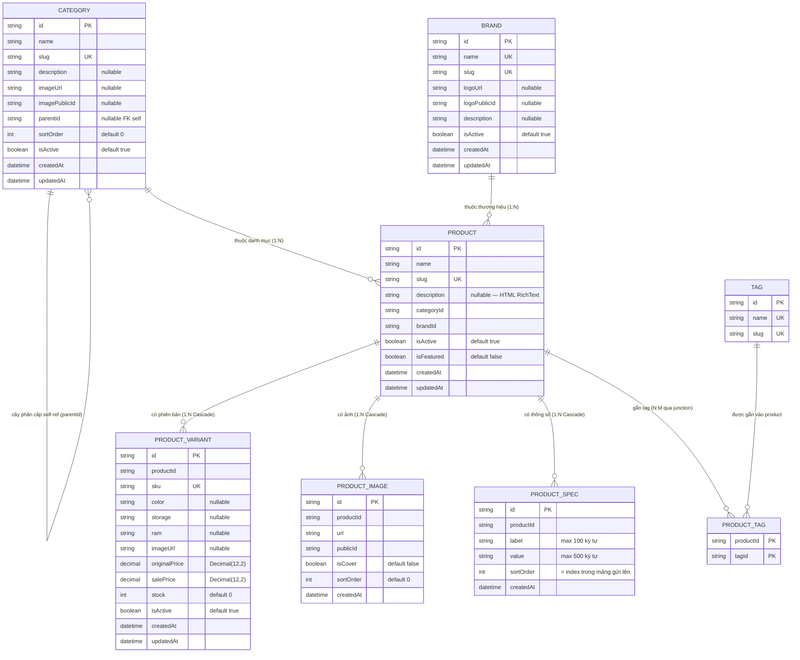

# ERD — Entity Relationship Diagram
## Module: Product
### Dự án: Mobivexa E-Commerce Platform

> **Phiên bản:** 2.0 | **Ngày:** 2026-08-22

---

## 1. Sơ đồ ERD



---

## 2. Mô tả model

### Product

| Cột | Ghi chú |
|---|---|
| `slug` | UNIQUE; tự sinh nếu không truyền; slug rỗng khi update → sinh lại từ `name` |
| `description` | HTML từ RichText; có thể là vài MB (ảnh base64 nhúng); bị omit trong listing |
| `isActive` | `false` → ẩn khỏi public listing và GET /products/:slug |
| `isFeatured` | Hiện ở `/products/featured` |
| Index | `(isActive, isFeatured)`, `categoryId`, `brandId`, `createdAt` |

### ProductVariant

| Cột | Ghi chú |
|---|---|
| `sku` | UNIQUE toàn hệ thống; trim khi lưu |
| `originalPrice` | Integer VND > 0 (validator: `Number.isInteger && > 0`) |
| `salePrice` | Integer VND >= 0; `salePrice <= originalPrice` |
| `stock` | Integer >= 0; optimistic lock qua `expectedStock` khi ghi đè |
| `isActive` | `false` → ẩn khỏi public listing |
| Index | `productId`, `stock`, `isActive`, `(isActive, salePrice)` |

### ProductImage

| Cột | Ghi chú |
|---|---|
| `publicId` | ID Cloudinary; dùng để xóa ảnh |
| `isCover` | Ảnh đại diện; set đầu tiên khi tạo; tự thay khi xóa cover |
| `sortOrder` | `= existingCount + i` khi thêm mới |
| `onDelete: Cascade` từ Product | Xóa product → cascade xóa ảnh → cần lấy publicId trước |

### ProductSpec

| Cột | Ghi chú |
|---|---|
| `sortOrder` | `= index` trong mảng gửi lên; thứ tự mảng = thứ tự hiển thị |
| Không CRUD từng dòng | Thay toàn bộ trong 1 transaction (replaceProductSpecs) |
| Index gộp | `(productId, sortOrder)` — phục vụ trọn câu truy vấn |

### Category

| Cột | Ghi chú |
|---|---|
| `parentId` | Self-referencing FK; `null` = danh mục gốc |
| `sortOrder` | Dùng để sắp xếp trong cùng level |

### ProductTag (Junction)

| Cột | Ghi chú |
|---|---|
| `@@id([productId, tagId])` | Composite PK chặn trùng |
| Khi update tags | Transaction: deleteMany cũ + createMany mới |

---

## 3. PRODUCT_DETAIL_INCLUDE

```
Product {
  category: true,
  brand: true,
  variants: { orderBy: { salePrice: 'asc' } },
  productTags: { include: { tag: true } },
  images: { orderBy: { sortOrder: 'asc' } },
  specs: { orderBy: { sortOrder: 'asc' } }
}
```
